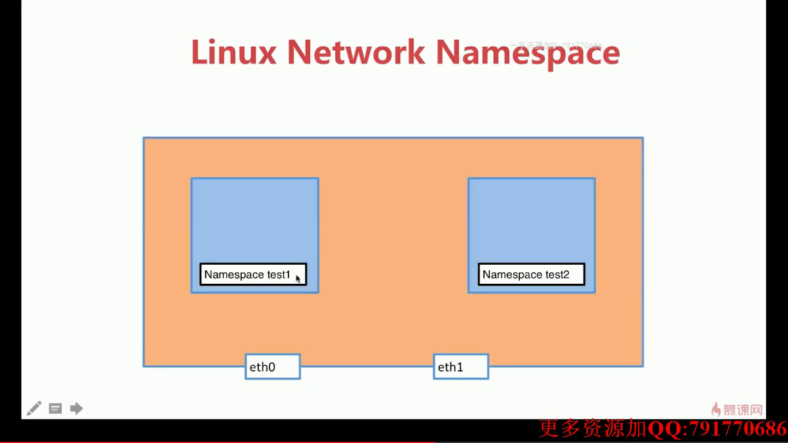
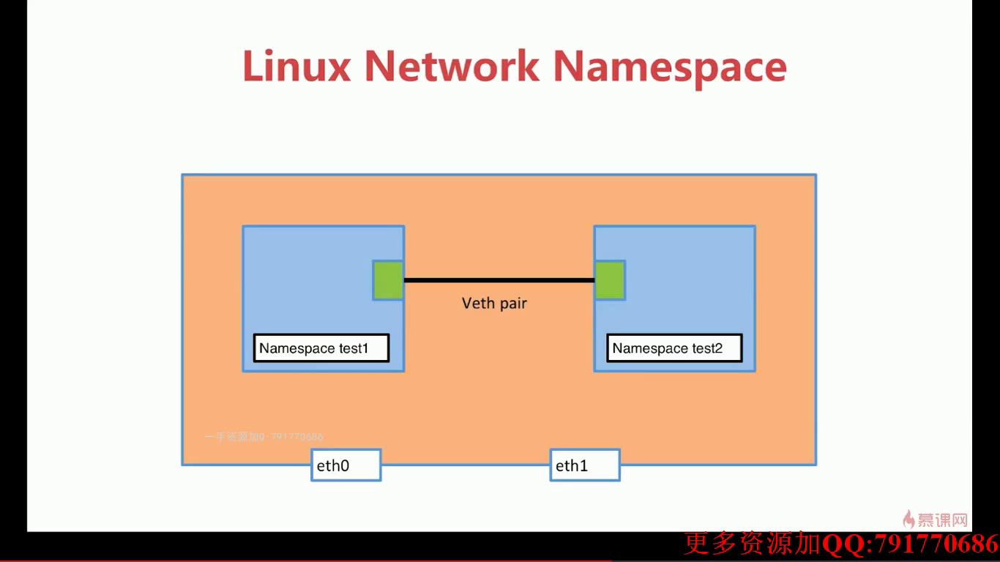
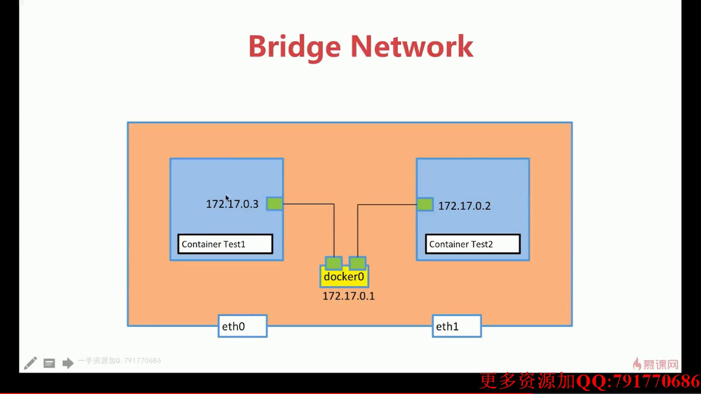

# 系统学习Docker践行DevOps理念

## 容器和虚拟机的区别

Docker能干什么：

    简化配置
    整合服务器
    代码流水线管理
    调试能力
    提高开发效率
    多租户
    隔离应用
    快速部署

Docker + kubernetes(k8s)

K8S(容器编排工具)，Docker官方的容器编排工具是Docker Swarm。

## 第一章：容器技术和Docker简介

虚拟化的局限性：

    每一个虚拟机都是一个完整的操作系统，要给其分配资源，当虚拟机数量增多时，操作系统本身消耗的资源势必增多。

容器解决了什么问题？

    解决了开发和运维之间的矛盾
    在开发和运维之间搭建了一个桥梁，是实现devops的最佳解决方案。

什么是容器？

    对软件和其依赖的标准化打包；
    应用之间相互隔离
    共享同一个OS Kernel
    可以运行在很多主流操作系统上；

容器是APP层面的隔离，虚拟化是物理资源层面上的隔离

虚拟化+容器： 在虚拟化主机中使用容器；


Docker-容器技术的一种实现，另一种常用实现CoreOS。

## 第二章：Docker环境的各种搭建方法

docker-community edition、docker-enterprise(basic,standard,advanced) edition

Docker是一个Linux Application，要准备一个安装好了Docker的Linux系统。

* 1. Install Docker For Mac。(included Docker Engine，Docker Compose，Docker Machine and Kitematic(GUI))

* 2. Install Docker For Windows.

    要求： win10 或 winserver2016，requires 64bit windows 10 Pro with Hyper-V available。

* 3. windows + vagrant + virtualbox + docker 

```bash
    vagrant --help
    mkdir centos7 && cd centos7
    vagrant init centos/7
    vagrant up
    vagrant ssh(sudo yum update)
    exit
    vagrant status
    vagrant halt    挂起虚拟机
    vagrant destroy   删除虚拟机
```

vagrantfile

vagrant也可以驱动vmware，不建议使用； vagrant up --provider=vmware_fusion

* 在centos上安装docker：

```bash
# Uninstall old version
sudo yum remove docker \
                  docker-client \
                  docker-client-latest \
                  docker-common \
                  docker-latest \
                  docker-latest-logrotate \
                  docker-logrotate \
                  docker-engine
```

```bash
# Install requirements
sudo yum install -y yum-utils \
  device-mapper-persistent-data \
  lvm2
```

```bash
# setup stable repository
sudo yum-config-manager \
    --add-repo \
    https://download.docker.com/linux/centos/docker-ce.repo
```

```bash
# Install docker-ce
sudo yum install docker-ce docker-ce-cli containerd.io
```

```bash
sudo systemctl start docker   # start docker
sudo docker run hello-world   # test  docker
```

* 修改vagrantfile，使得vagrant启动虚拟机时自动安装docker：

```bash
xiong@sslinux-development MINGW64 /f/vagrant/centos
$ tail -10 Vagrantfile
  # documentation for more information about their specific syntax and use.
  config.vm.provision "shell", inline: <<-SHELL
        sudo yum remove docker docker-client docker-client-latest docker-common docker-latest docker-latest-logrotate docker-logrotate docker-engine -y
        sudo yum install -y yum-utils device-mapper-persistent-data lvm2
        sudo yum-config-manager --add-repo https://download.docker.com/linux/centos/docker-ce.repo
        sudo yum install -y docker-ce docker-ce-cli containerd.io
        sudo systemctl start docker
        sudo systemctl enable docker
  SHELL
end
```

* Docker Machine

[Doc for Docker-Machine](https://docs.docker.com/machine/install-machine/)

Install docker-machine on winwons with GitBash:

```bash
base=https://github.com/docker/machine/releases/download/v0.16.0 &&
  mkdir -p "$HOME/bin" &&
  curl -L $base/docker-machine-Windows-x86_64.exe > "$HOME/bin/docker-machine.exe" &&
  chmod +x "$HOME/bin/docker-machine.exe"
```

`使用docker-machine在本地创建包含docker的虚拟机：`

```bash
docker-machine create demo   # 创建虚拟机
docker-machine ls            # 查看通过docker-machine创建的虚拟机状态；
docker-machine ssh demo      # ssh连接虚拟机；
docker-machine stop demo     # 停止虚拟机；
docker-machine env demo      # 查看demo中的环境设置

eval $(docker-machine env daemon)    # 将本地的docker server设置为daemon中的；

# 取消上述设置：
docker-machine env --help
eval $(docker-machine env --unset)   # 将docker server设置为本地主机；
```

docker-machine的driver可以管理常见的云服务厂商，即可以使用docker-machine命令在云平台上创建已经包含docker环境的主机。

```bash
$ docker-machine create --driver digitalocean --digitalocean-access-token xxxxx docker-sandbox

$ docker-machine create --driver amazonec2 --amazonec2-access-key AKI******* --amazonec2-secret-key 8T93C*******  aws-sandbox
```

`使用docker-machine在aliyun上创建包含docker的虚拟机:`

AliyunECS:

需要自己安装相关驱动： https://github.com/AliyunContainerService/docker-machine-driver-aliyunecs

保证账户余额大于100元；
访问控制——用户详情——创建AccessKey

```bash
docker-machine create -d aliyunecs --aliyunecs-io-optimized=optimized --aliyunecs-instance-type=ecs.c5.large --aliyunecs-access-key-id=********* --aliyunecs-access-key-secret=****************** --aliyunecs-region=cn-qingdao sslinux
```

docker-machine rm sslinux   # 删除虚拟机，ECS中的实例是要收费的，不用的时候一定要删除；


`AWS，EC2:需要绑定信用卡`

Security --》 IAM --》 创建AccessKey

[详细文档](https://docs.docker.com/machine/drivers/aws/)

docker-machien的awsec2驱动比aliyunecs稳定得多，记得删除避免扣费；


### docker-playground： 无法创建docker环境时使用；

使用docker的账号登录；

临时的，一段时间不使用，就会被销毁；


### Docker安装的总结：
* 1.在Mac上玩Docker

        docker for Mac直接安装；
        通过Virtualbox或者Vmware虚拟化软件直接创建Linux虚拟机，在虚拟机里安装使用Docker。
        通过Vagrant + virtualbox快速构建Docker host。
        通过docker-machine快速搭建Docker host。

* 2.在Windows上玩docker

        Docker for Windows直接安装(队系统要求高至少要win10 pro)，开启Hyper-V；
        通过Virtualbox或者Vmware虚拟化软件直接创建Linux虚拟机，在虚拟机里安装使用Docker；
        通过Vagrant + VitualBox快速搭建Docker host
        通过docker-machine快速单间Docker host

* 3.在linux上玩docker

        Linux主机
        Linux虚拟机(支持虚拟化的任何操作系统或者平台)

* 4.在云上玩docker

        docker-machine + driver (AWS,Aliyun等)
        直接使用与服务上提供的容器服务：
            AWS的ECS(Amazon Elastic Container Service)
            Aliyun的Container Service

---


## 第三章：Docker的镜像和容器

Docker的架构和底层技术：

        Docker提供了一个开发，打包，运行app的平台
        把app和底层infrastructure隔离开来；

Docker Engine:

        后台进程(dockerd)
        REST API Server
        CLI接口(docker)


Docker底层技术支持：

        Namespaces： 做隔离pid，net，ipc，mnt，uts
        Control groups： 做资源限制
        Union file systems: Container和image的分层

### Docker Image：

什么是Image：  

        文件和meta data的集合(root filesystem)
        分层的，并且每一层都可以添加改变删除文件，成为一个新的image；
        不同的image可以共享相同的layer；
        image本身是read-only的

        [vagrant@localhost ~]$ sudo docker image ls


Image的获取：

* 1.Build from Dockerfile：

```bash
mkdir redis
cd redis
cat > Dockerfile << EOF
    FROM ubuntu:14.04
    LABEL maintainer="Guiyin Xiong <guiyin.xiong@gmail.com>"
    RUN apt-get update && apt-get install -y redis-server
    EXPOSE 6379
    ENTRYPOINT [ "/usr/bin/redis-server" ]

sudo docker build -t sslinux/redis:latest .
```


* 2.Pull from Registry

拉取官方image： sudo docker pull IMAGE:TAG

非官方image：   sudo docker pull USERNAME/IMAGE:TAG

```bash
$ docker pull ubuntu:14.04
```

将当前用户加入docker组，使得运行docker命令时不必再用sudo。

        sudo gpasswd -a vagrant docker


* 3.制作base image：

```bash
[vagrant@localhost ~]$ docker pull hello-world
[vagrant@localhost ~]$ docker run hello-world
```

```bash
[vagrant@localhost ~]$ mkdir hello-world
[vagrant@localhost ~]$ vim hello.c
[vagrant@localhost ~]$ cat hello.c
#include<stdio.h>

int main()
{
        printf("hello docker\n")
}
[vagrant@localhost ~]$ sudo yum install -y gcc glibc-static
[vagrant@localhost ~]$ gcc -static hello.c -o hello

[vagrant@localhost hello-world]$ vim Dockerfile
[vagrant@localhost hello-world]$ cat Dockerfile
FROM scratch
ADD hello /
CMD ["/hello"]


[vagrant@localhost hello-world]$ docker build -t sslinux/hello-world .
Sending build context to Docker daemon  869.9kB
Step 1/3 : FROM scratch
 --->
Step 2/3 : ADD hello /
 ---> 28d43280360b
Step 3/3 : CMD ["/hello"]
 ---> Running in 20e177bdd13e
Removing intermediate container 20e177bdd13e
 ---> 6cfb19e6e5f9
Successfully built 6cfb19e6e5f9
Successfully tagged sslinux/hello-world:latest


[vagrant@localhost hello-world]$ docker image ls
REPOSITORY            TAG                 IMAGE ID            CREATED             SIZE
# 只有800多k
sslinux/hello-world   latest              6cfb19e6e5f9        27 seconds ago      857kB
sslinux/redis         latest              085d7cef2f2c        21 minutes ago      205MB
ubuntu                14.04               5dbc3f318ea5        5 weeks ago         188MB
hello-world           latest              fce289e99eb9        2 months ago        1.84kB

# 查看某镜像的分层
[vagrant@localhost hello-world]$ docker history 6cfb19e6e5f9
IMAGE               CREATED             CREATED BY                                      SIZE                COMMENT
6cfb19e6e5f9        2 minutes ago       /bin/sh -c #(nop)  CMD ["/hello"]               0B
28d43280360b        2 minutes ago       /bin/sh -c #(nop) ADD file:0bd91ef318c5fa6bf鈥?   857kB


[vagrant@localhost hello-world]$ docker run sslinux/hello-world
hello docker
[vagrant@localhost hello-world]$
```

### 什么是container？

        通过Image创建(copy)
        在Image layer之上建立一个container layer(可读写)
        类比面向对象：类和实例
        Image负责app的存储和分发，Container负责运行app；

```bash
# 查看当前正在运行的container
[vagrant@localhost hello-world]$ docker container ls
CONTAINER ID        IMAGE               COMMAND             CREATED             STATUS              PORTS               NAMES

# 查看所有的container，包括已经运行结束的；
[vagrant@localhost hello-world]$ docker container ls -a
CONTAINER ID        IMAGE                 COMMAND             CREATED             STATUS                      PORTS               NAMES
f2b21d14b2d3        sslinux/hello-world   "/hello"            6 minutes ago       Exited (13) 6 minutes ago                       gallant_leavitt
fab54bbc5330        hello-world           "/hello"            23 minutes ago      Exited (0) 23 minutes ago                       peaceful_joliot
```

```bash
docker image ls == docker images
docker container ls == docker ps

docker rm    # 删除container
docker rmi   # 删除image

[vagrant@localhost ~]$ docker container ls
CONTAINER ID        IMAGE               COMMAND             CREATED             STATUS              PORTS               NAMES
[vagrant@localhost ~]$ docker container ls -aq　　 # 这里列出的是所有container，包括up的；
f2b21d14b2d3
fab54bbc5330
[vagrant@localhost ~]$ docker rm $(docker container ls -aq) 
f2b21d14b2d3
fab54bbc5330

[vagrant@localhost ~]$ docker container ls -f "status=exited" -q
[vagrant@localhost ~]$ docker rm $(docker container ls -f "status=exited" -q)
```

* docker container commit  == docker commit  # 通过提交对一个container的修改来创建image
* docker image build == docker build    # 通过Dockerfile创建image；

```bash
[vagrant@localhost ~]$ docker container commit --help

Usage:  docker container commit [OPTIONS] CONTAINER [REPOSITORY[:TAG]]

Create a new image from a container's changes

Options:
  -a, --author string    Author (e.g., "John Hannibal Smith <hannibal@a-team.com>")
  -c, --change list      Apply Dockerfile instruction to the created image
  -m, --message string   Commit message
  -p, --pause            Pause container during commit (default true)
```

```bash
[vagrant@localhost ~]$ docker image build --help

Usage:  docker image build [OPTIONS] PATH | URL | -

Build an image from a Dockerfile
```

```bash
# 分享docker image 一般都通过分享Dockerfile来实现；
[vagrant@localhost ~]$ mkdir docker-centos-vim
[vagrant@localhost ~]$ cd docker-centos-vim
[vagrant@localhost docker-centos-vim]$ vim Dockerfile
[vagrant@localhost docker-centos-vim]$ cat Dockerfile
FROM centos
RUN yum install -y vim
[vagrant@localhost docker-centos-vim]$ docker build -t sslinux/centos-vim-new .
```

### Dockerfile语法梳理及最佳实践

* FROM 

        FROM scratch   # 制作base image
        FROM centos    # 使用base image
        FROM Ubuntu:14.04

尽量使用官方的image作为base image

* LABEL

        LABEL maintainer="guiyin.xiong@gmail.com"
        LABEL version="1.0"
        LABEL description="This is description"

Metadata不可少。

* RUN

        RUN yum update && yum install -y vim \
        python-dev   # 反斜线换行

        RUN apt-get update && apt-get install -y perl \
        pwgen --no-install-recommends && rm -rf \
        /var/lib/apt/lists/*    # 注意清理cache

        RUN /bin/bash -c 'source $HOME/.bashrc;echo $HOME'

RUN命令为了美观，复杂的RUN请用反斜线换行！避免无用分层，合并多条命令成一行。

* WORKDIR   设定当前工作目录

        WORKDIR /root
        WORKDIR /test # 如果没有回自动创建test目录
        WORKDIR demo
        RUN pwd       # 输出结果应该是/test/demo

用WORKDIR，不要用RUN cd，  尽量使用绝对路径；

* ADD and COPY

        ADD hello /
        ADD test.tar.gz /    # 添加到根目录并解压

        WORKDIR /root
        ADD hell test/       # /root/test/hello

        WORKDIR /root
        COPY hello test/

ADD or COPY：

        大部分情况，COPY优于ADD！
        ADD除了COPY还有额外功能(解压)!
        添加远程文件/目录请使用curl或者wget。

* ENV  定义环境变量

        ENV MYSQL_VERSION 5.6  # 设置常量
        RUN apt-get install -y mysql-server="${MYSQL_VERSION}" \
        && rm -rf /var/lib/apt/lists/*   # 引用常量；

尽量使用ENV增加可维护性!


* VOLUME and EXPOSE   存储和网络

* CMD and ENTRYPOINT  

        RUN: 执行命令并创建新的Image Layer
        CMD：设置容器启动后默认执行的命令和参数
        ENTRYPOINT：设置容器启动时运行的命令；

  - 1.Shell格式：

```Dockerfile
RUN apt-get install -y vim
CMD echo "hello docker"
ENTRYPOINT echo "hello docker"
```

  - 2.Exec格式：

```Dockerfile
RUN [ "apt-get","install", "-y", "vim" ]
CMD [ "/bin/echo", "hello docker" ]
ENTRYPOINT [ "/bin/echo", "hello docker" ]
```

```bash
# Shell和Exec格式：
[vagrant@localhost ShellAndExec]$ cat Dockerfile1
FROM centos
ENV name Docker
ENTRYPOINT echo "hello $name"

# build镜像
[vagrant@localhost ShellAndExec]$ docker build -t sslinux/centos-entrypoint-shell -f Dockerfile1 .
Sending build context to Docker daemon  3.072kB
Step 1/3 : FROM centos
 ---> 1e1148e4cc2c
Step 2/3 : ENV name Docker
 ---> Running in 7e29e982aa41
Removing intermediate container 7e29e982aa41
 ---> b4dfc2b1477f
Step 3/3 : ENTRYPOINT echo "hello $name"
 ---> Running in 87a000788347
Removing intermediate container 87a000788347
 ---> ec32b35112a0
Successfully built ec32b35112a0
Successfully tagged sslinux/centos-entrypoint-shell:latest
# shell格式：替换变量引用；
[vagrant@localhost ShellAndExec]$ docker run  sslinux/centos-entrypoint-shell
hello Docker

################################################
[vagrant@localhost ShellAndExec]$ cat Dockerfile2
FROM centos
ENV name Docker
ENTRYPOINT [ "/bin/echo", "hello $name" ]

[vagrant@localhost ShellAndExec]$ docker build -t sslinux/centos-entrypoint-exec -f Dockerfile2 .
Sending build context to Docker daemon  3.072kB
Step 1/3 : FROM centos
 ---> 1e1148e4cc2c
Step 2/3 : ENV name Docker
 ---> Using cache
 ---> b4dfc2b1477f
Step 3/3 : ENTRYPOINT [ "/bin/echo", "hello $name" ]
 ---> Running in 6736f1fbabf1
Removing intermediate container 6736f1fbabf1
 ---> c769c3bd0475
Successfully built c769c3bd0475
Successfully tagged sslinux/centos-entrypoint-shell:latest

# exec格式： 未替换变量引用；
[vagrant@localhost ShellAndExec]$ docker run sslinux/centos-entrypoint-exec
hello $name

# exec格式若想替换变量引用，需要使用如下格式：
ENTRYPOINT ["/bin/bash","-c","echo hello $name"]
```


* CMD

        容器启动时默认执行的命令
        如果docker run 指定了其他命令，CMD命令被忽略；
        如果定义了多个CMD，只有最后一个会执行；

* ENTRYPOINT

        让容器以应用程序或者服务的形式运行
        就算docker run时指定了其他命令，也不会被忽略，一定会执行
        最佳实践： 写一个shell脚本作为ENTRYPOINT

```Dockerfile
COPY docker-entrypoint.sh /usr/local/bin
ENTRYPOINT ["docker-entrypoint.sh"]

EXPOSE 27017
CMD ["mongod"]
```

[Docker官方提供的Dockerfile](https://github.com/docker-library)
[Docker官方有关Dockerfile的手册](https://docs.docker.com/engine/reference/builder/#run)


### docker image的发布：

https://hub.docker.com

如果只是获取别人的镜像，则不需要注册，若要发布自己的镜像，则需要注册了。

先登录，再push：

```bash
[vagrant@localhost ShellAndExec]$ docker login
[vagrant@localhost ShellAndExec]$ docker push  sslinux/hello-world:latest
```

大部分人在使用非官方docker image这件事上会有顾虑，担心不安全；

所以，推荐使用分享Dockerfile，需要与Github或Bitbuckket绑定，docker hub自动构建image，后续自己看。


```bash
# Docker官方提供的registry image：无web界面；
docker run -d -p 5000:5000 --restart always --name registry registry:2
```

往私有docker registry中push image：

```bash
$ docker build -t 10.75.44.222:5000/hello-world .
$ docker push 10.75.44.222:5000/hello-world
# 会因为不被信任而导致失败；

# 需要往/etc/docker/daemon.json文件中增加一个：

{ "insecure-registries":["10.75.44.222:5000"] }

# 在dockerd的Unit(.service)文件中添加一行：
EnvironmentFile=/etc/docker/daemon.json

$ sudo systemctl restart docker.service

$ docker push 10.75.44.222:5000/hello-world # 此时再push就能成功了；
```

但是上面构建的docker registry无web界面，所以无法查看push上去的镜像；

此时可以通过[Docker Registry API](https://docs.docker.com/registry/spec/api/#listing-repositories)去查看：


```bash
curl -X GET http://10.75.44.222:5000/v2/_catalog
```

删除本地镜像后也可以从刚才搭建的私有docker registry中pull回来；


### Dockerfile实践： 部署Python flask程序：

```python
# python程序：
[vagrant@localhost python-flask]$ cat app.py
from flask import Flask
app = Flask(__name__)
@app.route('/')
def hello():
    return "hello docker"

if __name__ == "__main__":
    app.run()
```

```Dockerfile
# Dockerfile
[vagrant@localhost flask-hello-world]$ cat Dockerfile
FROM python:2.7
LABEL maintainer="Guiyin Xiong<guiyin.xiong@gmail.com>"
RUN pip install flask
COPY app.py /app/
WORKDIR /app
EXPOSE 5000
CMD ["python","/app/app.py"]
```

```bash
# build image:
[vagrant@localhost flask-hello-world]$ docker build -t sslinux/flask-hello-world .

# run container:
[vagrant@localhost flask-hello-world]$ docker run -d -p 5000:5000 --name flask-hello-world sslinux/flask-hello-world
fc66e642669d06e828ac9fd2c03473b2893c5c49897384d9c6f3529e19bc7137
[vagrant@localhost flask-hello-world]$ docker ps
CONTAINER ID        IMAGE                       COMMAND                CREATED             STATUS              PORTS                    NAMES
fc66e642669d        sslinux/flask-hello-world   "python /app/app.py"   6 seconds ago       Up 5 seconds        0.0.0.0:5000->5000/tcp   flask-hello-world
```

### 容器的操作：

```bash
[vagrant@localhost flask-hello-world]$ docker container

Usage:  docker container COMMAND

Manage containers

Commands:
  attach      Attach local standard input, output, and error streams to a running container
  commit      Create a new image from a container's changes
  cp          Copy files/folders between a container and the local filesystem
  create      Create a new container
  diff        Inspect changes to files or directories on a container's filesystem
  exec        Run a command in a running container
  export      Export a container's filesystem as a tar archive
  inspect     Display detailed information on one or more containers
  kill        Kill one or more running containers
  logs        Fetch the logs of a container
  ls          List containers
  pause       Pause all processes within one or more containers
  port        List port mappings or a specific mapping for the container
  prune       Remove all stopped containers
  rename      Rename a container
  restart     Restart one or more containers
  rm          Remove one or more containers
  run         Run a command in a new container
  start       Start one or more stopped containers
  stats       Display a live stream of container(s) resource usage statistics
  stop        Stop one or more running containers
  top         Display the running processes of a container
  unpause     Unpause all processes within one or more containers
  update      Update configuration of one or more containers
  wait        Block until one or more containers stop, then print their exit codes

Run 'docker container COMMAND --help' for more information on a command.
```

* docker exec CONTAINER  对运行中的容器执行一个程序：

```bash
[vagrant@localhost flask-hello-world]$ docker exec -it fc66 /bin/bash
[vagrant@localhost flask-hello-world]$ docker exec -it fc66 python
[vagrant@localhost flask-hello-world]$ docker exec -it fc66 ip addr
```

* docker stop CONTAINER 停止一个正在运行的容器；
* docker start CONTAINER
* docker rm (docker ps -aq)   # 删除容器；
* docker inspect CONTAINER  # 查看容器的详细信息；
* docker logs CONTAINER # 查看container运行的日志；


### Dockerfile实践：

```bash
[vagrant@localhost flask-hello-world]$ docker run -it ubuntu
Digest: sha256:108314d481f0085bf9233129e9112c59795fa1a74e3bd26e4827d0313e44dc26
Status: Downloaded newer image for ubuntu:latest
root@98e337b6897c:/# apt-get update && apt-get install -y stress
# stress 是一个机器性能测试工具：

root@98e337b6897c:/# stress --vm 1 --verbose
stress: info: [252] dispatching hogs: 0 cpu, 0 io, 1 vm, 0 hdd
stress: dbug: [252] using backoff sleep of 3000us

# 超出内存限制，所以分配失败；
root@98e337b6897c:/# stress --vm 1 --vm-bytes 500000M --verbose
stress: info: [254] dispatching hogs: 0 cpu, 0 io, 1 vm, 0 hdd
stress: dbug: [254] using backoff sleep of 3000us
stress: dbug: [254] --> hogvm worker 1 [255] forked
stress: dbug: [255] allocating 524288000000 bytes ...
stress: FAIL: [255] (494) hogvm malloc failed: Cannot allocate memory
stress: FAIL: [254] (394) <-- worker 255 returned error 1
```

* 将stress通过Dockerfile封装进image：

```bash
[vagrant@localhost ubuntu-stress]$ cat Dockerfile
FROM ubuntu
RUN apt-get update && apt-get install -y stress
ENTRYPOINT ["/usr/bin/stress"]
CMD []

[vagrant@localhost ubuntu-stress]$ docker build -t sslinux/ubuntu-stress .
```

```bash
[vagrant@localhost ubuntu-stress]$ docker run -it sslinux/ubuntu-stress
stress imposes certain types of compute stress on your system

Usage: stress [OPTION [ARG]] ...
 -?, --help         show this help statement
     --version      show version statement
 -v, --verbose      be verbose
 -q, --quiet        be quiet
 -n, --dry-run      show what would have been done
 -t, --timeout N    timeout after N seconds
     --backoff N    wait factor of N microseconds before work starts
 -c, --cpu N        spawn N workers spinning on sqrt()
 -i, --io N         spawn N workers spinning on sync()
 -m, --vm N         spawn N workers spinning on malloc()/free()
     --vm-bytes B   malloc B bytes per vm worker (default is 256MB)
     --vm-stride B  touch a byte every B bytes (default is 4096)
     --vm-hang N    sleep N secs before free (default none, 0 is inf)
     --vm-keep      redirty memory instead of freeing and reallocating
 -d, --hdd N        spawn N workers spinning on write()/unlink()
     --hdd-bytes B  write B bytes per hdd worker (default is 1GB)

Example: stress --cpu 8 --io 4 --vm 2 --vm-bytes 128M --timeout 10s

Note: Numbers may be suffixed with s,m,h,d,y (time) or B,K,M,G (size).
```

```bash
# 可以在运行容器时，给stress命令传递参数：
[vagrant@localhost ubuntu-stress]$ docker run -it sslinux/ubuntu-stress --vm 1 --verbose
stress: info: [1] dispatching hogs: 0 cpu, 0 io, 1 vm, 0 hdd
stress: dbug: [1] using backoff sleep of 3000us
stress: dbug: [1] --> hogvm worker 1 [6] forked
stress: dbug: [6] allocating 268435456 bytes ...
stress: dbug: [6] touching bytes in strides of 4096 bytes ...
stress: dbug: [6] freed 268435456 bytes
stress: dbug: [6] allocating 268435456 bytes ...
stress: dbug: [6] touching bytes in strides of 4096 bytes ...
stress: dbug: [6] freed 268435456 bytes
stress: dbug: [6] allocating 268435456 bytes ...
stress: dbug: [6] touching bytes in strides of 4096 bytes ...
```

第四章：Docker的网络

单机：

        Bridge Network
        Host Network
        None Network

多机： 

        Overlay Network


网络基础概念：

    基于数据包的通信方式；
    ISO/OSI七层参考模型
    TCP/IP模型

    路由的概念；
    IP地址和路由   
    wireshark抓包工具

Network namespace：

```bash
[vagrant@docker-node1 ~]$ docker run -d --name test1 busybox /bin/sh -c "while true; do sleep 3600;done"
[vagrant@docker-node1 ~]$ docker run -d --name test2 busybox /bin/sh -c "while true;do sleep 3600;done"
b48e367bb5a05dca57cc3d9e0a21e8d173098a8474843903f1e8f0f0e98c3cab
[vagrant@docker-node1 ~]$ docker ps
CONTAINER ID        IMAGE               COMMAND                  CREATED             STATUS              PORTS               NAMES
b48e367bb5a0        busybox             "/bin/sh -c 'while t…"   7 seconds ago       Up 6 seconds                            test2
1adc04bed5dd        busybox             "/bin/sh -c 'while t…"   6 minutes ago       Up 6 minutes                            test1

[vagrant@docker-node1 ~]$ docker exec test1 ip addr
1: lo: <LOOPBACK,UP,LOWER_UP> mtu 65536 qdisc noqueue qlen 1000
    link/loopback 00:00:00:00:00:00 brd 00:00:00:00:00:00
    inet 127.0.0.1/8 scope host lo
       valid_lft forever preferred_lft forever
5: eth0@if6: <BROADCAST,MULTICAST,UP,LOWER_UP,M-DOWN> mtu 1500 qdisc noqueue
    link/ether 02:42:ac:11:00:02 brd ff:ff:ff:ff:ff:ff
    inet 172.17.0.2/16 brd 172.17.255.255 scope global eth0
       valid_lft forever preferred_lft forever

[vagrant@docker-node1 ~]$ docker exec test2 ip addr
1: lo: <LOOPBACK,UP,LOWER_UP> mtu 65536 qdisc noqueue qlen 1000
    link/loopback 00:00:00:00:00:00 brd 00:00:00:00:00:00
    inet 127.0.0.1/8 scope host lo
       valid_lft forever preferred_lft forever
7: eth0@if8: <BROADCAST,MULTICAST,UP,LOWER_UP,M-DOWN> mtu 1500 qdisc noqueue
    link/ether 02:42:ac:11:00:03 brd ff:ff:ff:ff:ff:ff
    inet 172.17.0.3/16 brd 172.17.255.255 scope global eth0
       valid_lft forever preferred_lft forever

# 两个容器的网卡是在同一个网段内的；
# network namespace使得docker container和docker host之间的网络是隔离的；
```

### 管理Network namespace：

```bash
[vagrant@docker-node1 ~]$ sudo ip netns list   # 查看网络名称空间；
[vagrant@docker-node1 ~]$ sudo ip netns add test1  # 添加一个Network namespace
[vagrant@docker-node1 ~]$ sudo ip netns list
test1
[vagrant@docker-node1 ~]$ sudo ip netns add test2
[vagrant@docker-node1 ~]$ sudo ip netns list
test2
test1

[vagrant@docker-node1 ~]$ sudo ip netns exec test1 ip a
1: lo: <LOOPBACK> mtu 65536 qdisc noop state DOWN group default qlen 1000
    link/loopback 00:00:00:00:00:00 brd 00:00:00:00:00:00

[vagrant@docker-node1 ~]$ ip link
1: lo: <LOOPBACK,UP,LOWER_UP> mtu 65536 qdisc noqueue state UNKNOWN mode DEFAULT group default qlen 1000
    link/loopback 00:00:00:00:00:00 brd 00:00:00:00:00:00
2: eth0: <BROADCAST,MULTICAST,UP,LOWER_UP> mtu 1500 qdisc pfifo_fast state UP mode DEFAULT group default qlen 1000
    link/ether 52:54:00:75:dc:3d brd ff:ff:ff:ff:ff:ff
3: eth1: <BROADCAST,MULTICAST,UP,LOWER_UP> mtu 1500 qdisc pfifo_fast state UP mode DEFAULT group default qlen 1000
    link/ether 08:00:27:65:ca:59 brd ff:ff:ff:ff:ff:ff
4: docker0: <BROADCAST,MULTICAST,UP,LOWER_UP> mtu 1500 qdisc noqueue state UP mode DEFAULT group default
    link/ether 02:42:f7:43:7a:ef brd ff:ff:ff:ff:ff:ff
6: veth65c71b4@if5: <BROADCAST,MULTICAST,UP,LOWER_UP> mtu 1500 qdisc noqueue master docker0 state UP mode DEFAULT group default
    link/ether fa:8c:d3:02:c9:ed brd ff:ff:ff:ff:ff:ff link-netnsid 0
8: veth8306c2c@if7: <BROADCAST,MULTICAST,UP,LOWER_UP> mtu 1500 qdisc noqueue master docker0 state UP mode DEFAULT group default
    link/ether ce:87:ec:3b:71:da brd ff:ff:ff:ff:ff:ff link-netnsid 1

[vagrant@docker-node1 ~]$ sudo ip netns  exec test1 ip link
1: lo: <LOOPBACK> mtu 65536 qdisc noop state DOWN mode DEFAULT group default qlen 1000
    link/loopback 00:00:00:00:00:00 brd 00:00:00:00:00:00

[vagrant@docker-node1 ~]$ sudo ip netns exec test1 ip link set dev lo up
[vagrant@docker-node1 ~]$ sudo ip netns  exec test1 ip link
1: lo: <LOOPBACK,UP,LOWER_UP> mtu 65536 qdisc noqueue state UNKNOWN mode DEFAULT group default qlen 1000
    link/loopback 00:00:00:00:00:00 brd 00:00:00:00:00:00
```

创建一对veth，连接两个Network namespace：

```bash
[vagrant@docker-node1 ~]$ sudo ip link add veth-test1 type veth peer name veth-test2
[vagrant@docker-node1 ~]$ ip link
1: lo: <LOOPBACK,UP,LOWER_UP> mtu 65536 qdisc noqueue state UNKNOWN mode DEFAULT group default qlen 1000
    link/loopback 00:00:00:00:00:00 brd 00:00:00:00:00:00
2: eth0: <BROADCAST,MULTICAST,UP,LOWER_UP> mtu 1500 qdisc pfifo_fast state UP mode DEFAULT group default qlen 1000
    link/ether 52:54:00:75:dc:3d brd ff:ff:ff:ff:ff:ff
3: eth1: <BROADCAST,MULTICAST,UP,LOWER_UP> mtu 1500 qdisc pfifo_fast state UP mode DEFAULT group default qlen 1000
    link/ether 08:00:27:65:ca:59 brd ff:ff:ff:ff:ff:ff
4: docker0: <BROADCAST,MULTICAST,UP,LOWER_UP> mtu 1500 qdisc noqueue state UP mode DEFAULT group default
    link/ether 02:42:f7:43:7a:ef brd ff:ff:ff:ff:ff:ff
6: veth65c71b4@if5: <BROADCAST,MULTICAST,UP,LOWER_UP> mtu 1500 qdisc noqueue master docker0 state UP mode DEFAULT group default
    link/ether fa:8c:d3:02:c9:ed brd ff:ff:ff:ff:ff:ff link-netnsid 0
8: veth8306c2c@if7: <BROADCAST,MULTICAST,UP,LOWER_UP> mtu 1500 qdisc noqueue master docker0 state UP mode DEFAULT group default
    link/ether ce:87:ec:3b:71:da brd ff:ff:ff:ff:ff:ff link-netnsid 1
9: veth-test2@veth-test1: <BROADCAST,MULTICAST,M-DOWN> mtu 1500 qdisc noop state DOWN mode DEFAULT group default qlen 1000
    link/ether fe:5e:88:ab:06:fb brd ff:ff:ff:ff:ff:ff
10: veth-test1@veth-test2: <BROADCAST,MULTICAST,M-DOWN> mtu 1500 qdisc noop state DOWN mode DEFAULT group default qlen 1000
    link/ether 32:f0:3e:0b:a0:6d brd ff:ff:ff:ff:ff:ff

# 将veth-test1添加到Network namespace：test1中；
[vagrant@docker-node1 ~]$ sudo ip link set veth-test1 netns test1
[vagrant@docker-node1 ~]$ sudo ip netns exec test1 ip link
1: lo: <LOOPBACK,UP,LOWER_UP> mtu 65536 qdisc noqueue state UNKNOWN mode DEFAULT group default qlen 1000
    link/loopback 00:00:00:00:00:00 brd 00:00:00:00:00:00
10: veth-test1@if9: <BROADCAST,MULTICAST> mtu 1500 qdisc noop state DOWN mode DEFAULT group default qlen 1000
    link/ether 32:f0:3e:0b:a0:6d brd ff:ff:ff:ff:ff:ff link-netnsid 0

# 查看本机的ip link，发现之前的veth-test1已经不见了；
[vagrant@docker-node1 ~]$ ip link
1: lo: <LOOPBACK,UP,LOWER_UP> mtu 65536 qdisc noqueue state UNKNOWN mode DEFAULT group default qlen 1000
    link/loopback 00:00:00:00:00:00 brd 00:00:00:00:00:00
2: eth0: <BROADCAST,MULTICAST,UP,LOWER_UP> mtu 1500 qdisc pfifo_fast state UP mode DEFAULT group default qlen 1000
    link/ether 52:54:00:75:dc:3d brd ff:ff:ff:ff:ff:ff
3: eth1: <BROADCAST,MULTICAST,UP,LOWER_UP> mtu 1500 qdisc pfifo_fast state UP mode DEFAULT group default qlen 1000
    link/ether 08:00:27:65:ca:59 brd ff:ff:ff:ff:ff:ff
4: docker0: <BROADCAST,MULTICAST,UP,LOWER_UP> mtu 1500 qdisc noqueue state UP mode DEFAULT group default
    link/ether 02:42:f7:43:7a:ef brd ff:ff:ff:ff:ff:ff
6: veth65c71b4@if5: <BROADCAST,MULTICAST,UP,LOWER_UP> mtu 1500 qdisc noqueue master docker0 state UP mode DEFAULT group default
    link/ether fa:8c:d3:02:c9:ed brd ff:ff:ff:ff:ff:ff link-netnsid 0
8: veth8306c2c@if7: <BROADCAST,MULTICAST,UP,LOWER_UP> mtu 1500 qdisc noqueue master docker0 state UP mode DEFAULT group default
    link/ether ce:87:ec:3b:71:da brd ff:ff:ff:ff:ff:ff link-netnsid 1
9: veth-test2@if10: <BROADCAST,MULTICAST> mtu 1500 qdisc noop state DOWN mode DEFAULT group default qlen 1000
    link/ether fe:5e:88:ab:06:fb brd ff:ff:ff:ff:ff:ff link-netnsid 2

# 将veth-test添加到 netns test2中：
[vagrant@docker-node1 ~]$ sudo ip link set veth-test2 netns test2
[vagrant@docker-node1 ~]$ sudo ip link
1: lo: <LOOPBACK,UP,LOWER_UP> mtu 65536 qdisc noqueue state UNKNOWN mode DEFAULT group default qlen 1000
    link/loopback 00:00:00:00:00:00 brd 00:00:00:00:00:00
2: eth0: <BROADCAST,MULTICAST,UP,LOWER_UP> mtu 1500 qdisc pfifo_fast state UP mode DEFAULT group default qlen 1000
    link/ether 52:54:00:75:dc:3d brd ff:ff:ff:ff:ff:ff
3: eth1: <BROADCAST,MULTICAST,UP,LOWER_UP> mtu 1500 qdisc pfifo_fast state UP mode DEFAULT group default qlen 1000
    link/ether 08:00:27:65:ca:59 brd ff:ff:ff:ff:ff:ff
4: docker0: <BROADCAST,MULTICAST,UP,LOWER_UP> mtu 1500 qdisc noqueue state UP mode DEFAULT group default
    link/ether 02:42:f7:43:7a:ef brd ff:ff:ff:ff:ff:ff
6: veth65c71b4@if5: <BROADCAST,MULTICAST,UP,LOWER_UP> mtu 1500 qdisc noqueue master docker0 state UP mode DEFAULT group default
    link/ether fa:8c:d3:02:c9:ed brd ff:ff:ff:ff:ff:ff link-netnsid 0
8: veth8306c2c@if7: <BROADCAST,MULTICAST,UP,LOWER_UP> mtu 1500 qdisc noqueue master docker0 state UP mode DEFAULT group default
    link/ether ce:87:ec:3b:71:da brd ff:ff:ff:ff:ff:ff link-netnsid 1

[vagrant@docker-node1 ~]$ sudo ip netns exec test2 ip link
1: lo: <LOOPBACK> mtu 65536 qdisc noop state DOWN mode DEFAULT group default qlen 1000
    link/loopback 00:00:00:00:00:00 brd 00:00:00:00:00:00
9: veth-test2@if10: <BROADCAST,MULTICAST> mtu 1500 qdisc noop state DOWN mode DEFAULT group default qlen 1000
    link/ether fe:5e:88:ab:06:fb brd ff:ff:ff:ff:ff:ff link-netnsid 0

# 为veth-test1和veth-test2配置ip地址：
[vagrant@docker-node1 ~]$ sudo ip netns exec test1 ip addr add 192.168.1.1/24 dev veth-test1
[vagrant@docker-node1 ~]$ sudo ip netns exec test2 ip addr add 192.168.1.2/24 dev veth-test2

# 地址已配置，但查看的时候并无显示，并且接口状态为DOWN。
[vagrant@docker-node1 ~]$ sudo ip netns exec test1 ip link
1: lo: <LOOPBACK,UP,LOWER_UP> mtu 65536 qdisc noqueue state UNKNOWN mode DEFAULT group default qlen 1000
    link/loopback 00:00:00:00:00:00 brd 00:00:00:00:00:00
10: veth-test1@if9: <BROADCAST,MULTICAST> mtu 1500 qdisc noop state DOWN mode DEFAULT group default qlen 1000
    link/ether 32:f0:3e:0b:a0:6d brd ff:ff:ff:ff:ff:ff link-netnsid 1
[vagrant@docker-node1 ~]$ sudo ip netns exec test2 ip link
1: lo: <LOOPBACK> mtu 65536 qdisc noop state DOWN mode DEFAULT group default qlen 1000
    link/loopback 00:00:00:00:00:00 brd 00:00:00:00:00:00
9: veth-test2@if10: <BROADCAST,MULTICAST> mtu 1500 qdisc noop state DOWN mode DEFAULT group default qlen 1000
    link/ether fe:5e:88:ab:06:fb brd ff:ff:ff:ff:ff:ff link-netnsid 0


# 设置接口状态为UP：
[vagrant@docker-node1 ~]$ sudo ip netns exec test1 ip link set dev veth-test1 up
[vagrant@docker-node1 ~]$ sudo ip netns exec test2 ip link set dev veth-test2 up
# 接口状态为UP，IP地址已配置：
[vagrant@docker-node1 ~]$ sudo ip netns exec test1 ip link
1: lo: <LOOPBACK,UP,LOWER_UP> mtu 65536 qdisc noqueue state UNKNOWN mode DEFAULT group default qlen 1000
    link/loopback 00:00:00:00:00:00 brd 00:00:00:00:00:00
10: veth-test1@if9: <BROADCAST,MULTICAST,UP,LOWER_UP> mtu 1500 qdisc noqueue state UP mode DEFAULT group default qlen 1000
    link/ether 32:f0:3e:0b:a0:6d brd ff:ff:ff:ff:ff:ff link-netnsid 1
[vagrant@docker-node1 ~]$ sudo ip netns exec test1 ip addr
1: lo: <LOOPBACK,UP,LOWER_UP> mtu 65536 qdisc noqueue state UNKNOWN group default qlen 1000
    link/loopback 00:00:00:00:00:00 brd 00:00:00:00:00:00
    inet 127.0.0.1/8 scope host lo
       valid_lft forever preferred_lft forever
    inet6 ::1/128 scope host
       valid_lft forever preferred_lft forever
10: veth-test1@if9: <BROADCAST,MULTICAST,UP,LOWER_UP> mtu 1500 qdisc noqueue state UP group default qlen 1000
    link/ether 32:f0:3e:0b:a0:6d brd ff:ff:ff:ff:ff:ff link-netnsid 1
    inet 192.168.1.1/24 scope global veth-test1
       valid_lft forever preferred_lft forever
    inet6 fe80::30f0:3eff:fe0b:a06d/64 scope link
       valid_lft forever preferred_lft forever
# 接口状态为UP，IP地址已配置：
[vagrant@docker-node1 ~]$ sudo ip netns exec test2 ip link
1: lo: <LOOPBACK> mtu 65536 qdisc noop state DOWN mode DEFAULT group default qlen 1000
    link/loopback 00:00:00:00:00:00 brd 00:00:00:00:00:00
9: veth-test2@if10: <BROADCAST,MULTICAST,UP,LOWER_UP> mtu 1500 qdisc noqueue state UP mode DEFAULT group default qlen 1000
    link/ether fe:5e:88:ab:06:fb brd ff:ff:ff:ff:ff:ff link-netnsid 0
[vagrant@docker-node1 ~]$ sudo ip netns exec test2 ip addr
1: lo: <LOOPBACK> mtu 65536 qdisc noop state DOWN group default qlen 1000
    link/loopback 00:00:00:00:00:00 brd 00:00:00:00:00:00
9: veth-test2@if10: <BROADCAST,MULTICAST,UP,LOWER_UP> mtu 1500 qdisc noqueue state UP group default qlen 1000
    link/ether fe:5e:88:ab:06:fb brd ff:ff:ff:ff:ff:ff link-netnsid 0
    inet 192.168.1.2/24 scope global veth-test2
       valid_lft forever preferred_lft forever
    inet6 fe80::fc5e:88ff:feab:6fb/64 scope link
       valid_lft forever preferred_lft forever

# 从netns test1中ping netns test2中的地址192.168.1.2
[vagrant@docker-node1 ~]$ sudo ip netns exec test ip a
Cannot open network namespace "test": No such file or directory
[vagrant@docker-node1 ~]$ sudo ip netns exec test1 ip a
1: lo: <LOOPBACK,UP,LOWER_UP> mtu 65536 qdisc noqueue state UNKNOWN group default qlen 1000
    link/loopback 00:00:00:00:00:00 brd 00:00:00:00:00:00
    inet 127.0.0.1/8 scope host lo
       valid_lft forever preferred_lft forever
    inet6 ::1/128 scope host
       valid_lft forever preferred_lft forever
10: veth-test1@if9: <BROADCAST,MULTICAST,UP,LOWER_UP> mtu 1500 qdisc noqueue state UP group default qlen 1000
    link/ether 32:f0:3e:0b:a0:6d brd ff:ff:ff:ff:ff:ff link-netnsid 1
    inet 192.168.1.1/24 scope global veth-test1
       valid_lft forever preferred_lft forever
    inet6 fe80::30f0:3eff:fe0b:a06d/64 scope link
       valid_lft forever preferred_lft forever
[vagrant@docker-node1 ~]$ sudo ip netns exec test1 ping 192.168.1.2
PING 192.168.1.2 (192.168.1.2) 56(84) bytes of data.
64 bytes from 192.168.1.2: icmp_seq=1 ttl=64 time=0.117 ms
64 bytes from 192.168.1.2: icmp_seq=2 ttl=64 time=0.040 ms
64 bytes from 192.168.1.2: icmp_seq=3 ttl=64 time=0.046 ms
64 bytes from 192.168.1.2: icmp_seq=4 ttl=64 time=0.065 ms
^C
--- 192.168.1.2 ping statistics ---
4 packets transmitted, 4 received, 0% packet loss, time 3001ms
rtt min/avg/max/mdev = 0.040/0.067/0.117/0.030 ms

# 从netns test2中ping netns test1中的地址192.168.1.1
[vagrant@docker-node1 ~]$ sudo ip netns exec test2 ping 192.168.1.1
PING 192.168.1.1 (192.168.1.1) 56(84) bytes of data.
64 bytes from 192.168.1.1: icmp_seq=1 ttl=64 time=0.087 ms
64 bytes from 192.168.1.1: icmp_seq=2 ttl=64 time=0.065 ms
64 bytes from 192.168.1.1: icmp_seq=3 ttl=64 time=0.047 ms
64 bytes from 192.168.1.1: icmp_seq=4 ttl=64 time=0.177 ms
^C
--- 192.168.1.1 ping statistics ---
4 packets transmitted, 4 received, 0% packet loss, time 3001ms
rtt min/avg/max/mdev = 0.047/0.094/0.177/0.049 ms
```

### docker network

```bash
[vagrant@docker-node1 ~]$ docker ps
CONTAINER ID        IMAGE               COMMAND                  CREATED             STATUS              PORTS               NAMES
1adc04bed5dd        busybox             "/bin/sh -c 'while t…"   About an hour ago   Up About an hour                        test1

# 列举当前docker host上的docker网络：
[vagrant@docker-node1 ~]$ sudo docker network ls
NETWORK ID          NAME                DRIVER              SCOPE
c41f4c7edb5f        bridge              bridge              local
3223d3ccbd65        host                host                local
985f7e6de4ae        none                null                local
[vagrant@docker-node1 ~]$ docker network inspect c41f4c7edb5f #(此处是NETORK ID)
[
    {
        "Name": "bridge",
        "Id": "c41f4c7edb5f022d0670cebb91b435a52daadc10166ec93c978286f7037d3805",
        "Created": "2019-03-06T12:04:45.294875659Z",
        "Scope": "local",
        "Driver": "bridge",
        "EnableIPv6": false,
        "IPAM": {
            "Driver": "default",
            "Options": null,
            "Config": [
                {
                    "Subnet": "172.17.0.0/16"
                }
            ]
        },
        "Internal": false,
        "Attachable": false,
        "Ingress": false,
        "ConfigFrom": {
            "Network": ""
        },
        "ConfigOnly": false,
        "Containers": {
            "1adc04bed5dd51d4cf3d788da084c8f8652bb289aab9e8c3af69042128ac8da3": {
                "Name": "test1",
                "EndpointID": "7fb3ec5938338881b03b80c5475b4772cf056a010795c6f820b332bf9c8a2811",
                "MacAddress": "02:42:ac:11:00:02",
                "IPv4Address": "172.17.0.2/16",
                "IPv6Address": ""
            }
        },
        "Options": {
            "com.docker.network.bridge.default_bridge": "true",
            "com.docker.network.bridge.enable_icc": "true",
            "com.docker.network.bridge.enable_ip_masquerade": "true",
            "com.docker.network.bridge.host_binding_ipv4": "0.0.0.0",
            "com.docker.network.bridge.name": "docker0",
            "com.docker.network.driver.mtu": "1500"
        },
        "Labels": {}
    }
]


[vagrant@docker-node1 ~]$ sudo yum install -y bridge-utils


[vagrant@docker-node1 ~]$ brctl show
bridge name     bridge id               STP enabled     interfaces
docker0         8000.0242f7437aef       no              veth65c71b4

[vagrant@docker-node1 ~]$ ip link
1: lo: <LOOPBACK,UP,LOWER_UP> mtu 65536 qdisc noqueue state UNKNOWN mode DEFAULT group default qlen 1000
    link/loopback 00:00:00:00:00:00 brd 00:00:00:00:00:00
2: eth0: <BROADCAST,MULTICAST,UP,LOWER_UP> mtu 1500 qdisc pfifo_fast state UP mode DEFAULT group default qlen 1000
    link/ether 52:54:00:75:dc:3d brd ff:ff:ff:ff:ff:ff
3: eth1: <BROADCAST,MULTICAST,UP,LOWER_UP> mtu 1500 qdisc pfifo_fast state UP mode DEFAULT group default qlen 1000
    link/ether 08:00:27:65:ca:59 brd ff:ff:ff:ff:ff:ff
4: docker0: <BROADCAST,MULTICAST,UP,LOWER_UP> mtu 1500 qdisc noqueue state UP mode DEFAULT group default
    link/ether 02:42:f7:43:7a:ef brd ff:ff:ff:ff:ff:ff
# 下面这个link是连到了docker0这个bridge上了的。
6: veth65c71b4@if5: <BROADCAST,MULTICAST,UP,LOWER_UP> mtu 1500 qdisc noqueue master docker0 state UP mode DEFAULT group default
    link/ether fa:8c:d3:02:c9:ed brd ff:ff:ff:ff:ff:ff link-netnsid 0

# 说明：
没创建一个docker container，即创建了一对儿veth，一端在docker host上，一端在容器中；
而在dockerhost中的一端是被桥接到了 bridge docker0上，所以各docker container能通过桥docker0进行通信；

# 验证命令：
[vagrant@docker-node1 ~]$ brctl show
bridge name     bridge id               STP enabled     interfaces
docker0         8000.0242f7437aef       no              veth44fb17e
                                                        veth65c71b4
# 有两个veth被桥接到了docker0上，这两个veth分别对应两个docker container；

[vagrant@docker-node1 ~]$ docker network ls
NETWORK ID          NAME                DRIVER              SCOPE
c41f4c7edb5f        bridge              bridge              local
3223d3ccbd65        host                host                local
985f7e6de4ae        none                null                local
# 查看docker host上的网桥docker0的情况：
[vagrant@docker-node1 ~]$ docker network inspect bridge
[
    {
        "Name": "bridge",
        "Id": "c41f4c7edb5f022d0670cebb91b435a52daadc10166ec93c978286f7037d3805",
        "Created": "2019-03-06T12:04:45.294875659Z",
        "Scope": "local",
        "Driver": "bridge",
        "EnableIPv6": false,
        "IPAM": {
            "Driver": "default",
            "Options": null,
            "Config": [
                {
                    "Subnet": "172.17.0.0/16"
                }
            ]
        },
        "Internal": false,
        "Attachable": false,
        "Ingress": false,
        "ConfigFrom": {
            "Network": ""
        },
        "ConfigOnly": false,
        # 有两个容器(test1、test2)，连接到了这个网桥上；
        "Containers": {
            "1adc04bed5dd51d4cf3d788da084c8f8652bb289aab9e8c3af69042128ac8da3": {
                "Name": "test1",
                "EndpointID": "7fb3ec5938338881b03b80c5475b4772cf056a010795c6f820b332bf9c8a2811",
                "MacAddress": "02:42:ac:11:00:02",
                "IPv4Address": "172.17.0.2/16",
                "IPv6Address": ""
            },
            "f7ab98fd20f4b9cc0088c44db7ec8dda33a5fc2d32585e36a64799765f437c96": {
                "Name": "test2",
                "EndpointID": "f6b5210b66aecd65f73f030c4eb0ef6ab66692d259a5273f5f4cfb4085488e86",
                "MacAddress": "02:42:ac:11:00:03",
                "IPv4Address": "172.17.0.3/16",
                "IPv6Address": ""
            }
        },
        "Options": {
            "com.docker.network.bridge.default_bridge": "true",
            "com.docker.network.bridge.enable_icc": "true",
            "com.docker.network.bridge.enable_ip_masquerade": "true",
            "com.docker.network.bridge.host_binding_ipv4": "0.0.0.0",
            "com.docker.network.bridge.name": "docker0",
            "com.docker.network.driver.mtu": "1500"
        },
        "Labels": {}
    }
]
```

* 看图：



两个docker实例间如何通信：




docker实例如何访问互联网：


### 容器之间的link：

场景假设：

        需要两个docker container：
            1. 数据库
            2.后台服务
        如何保证在多次启动数据库容器后(IP变化)，后台服务的容器依然能访问数据库容器；

```bash
[vagrant@docker-node1 ~]$ docker stop test2
test2
[vagrant@docker-node1 ~]$ docker rm test2
test2
[vagrant@docker-node1 ~]$ docker ps
CONTAINER ID        IMAGE               COMMAND                  CREATED             STATUS              PORTS               NAMES
1adc04bed5dd        busybox             "/bin/sh -c 'while t…"   2 hours ago         Up 2 hours                              test1
```

使用--link创建容器test2：

```bash
[vagrant@docker-node1 ~]$ docker run -d --name test2 --link test1 busybox /bin/sh -c "while true;do sleep 3600; done"
19a0baa02ccfc7d691362c7dfebd50432305ccf87d10ed653ec090e43c350ebe

# 进入容器test2中，连接容器test1：
[vagrant@docker-node1 ~]$ docker exec -it test /bin/sh
Error: No such container: test
[vagrant@docker-node1 ~]$ docker exec -it test2 /bin/sh
/ # ip addr
1: lo: <LOOPBACK,UP,LOWER_UP> mtu 65536 qdisc noqueue qlen 1000
    link/loopback 00:00:00:00:00:00 brd 00:00:00:00:00:00
    inet 127.0.0.1/8 scope host lo
       valid_lft forever preferred_lft forever
15: eth0@if16: <BROADCAST,MULTICAST,UP,LOWER_UP,M-DOWN> mtu 1500 qdisc noqueue
    link/ether 02:42:ac:11:00:03 brd ff:ff:ff:ff:ff:ff
    inet 172.17.0.3/16 brd 172.17.255.255 scope global eth0
       valid_lft forever preferred_lft forever
/ # ping 172.17.0.2
PING 172.17.0.2 (172.17.0.2): 56 data bytes
64 bytes from 172.17.0.2: seq=0 ttl=64 time=0.119 ms
64 bytes from 172.17.0.2: seq=1 ttl=64 time=0.182 ms
64 bytes from 172.17.0.2: seq=2 ttl=64 time=0.113 ms
^C
--- 172.17.0.2 ping statistics ---
3 packets transmitted, 3 packets received, 0% packet loss
round-trip min/avg/max = 0.113/0.138/0.182 ms

# 此时在容器test2中ping 名字：test1 也是能ping通的；
/ # ping test1
PING test1 (172.17.0.2): 56 data bytes
64 bytes from 172.17.0.2: seq=0 ttl=64 time=0.080 ms
64 bytes from 172.17.0.2: seq=1 ttl=64 time=0.179 ms
64 bytes from 172.17.0.2: seq=2 ttl=64 time=0.068 ms
^C
--- test1 ping statistics ---
3 packets transmitted, 3 packets received, 0% packet loss
round-trip min/avg/max = 0.068/0.109/0.179 ms

#此时便可以通过 test1:port 的方式访问 容器test1中的服务，但此种方式并不常用；
```

恢复实验环境：

```bash
[vagrant@docker-node1 ~]$ docker stop test2
test2
[vagrant@docker-node1 ~]$ docker rm test2
test2
[vagrant@docker-node1 ~]$ docker run -d --name test2 busybox /bin/sh -c "while true;do sleep 3600;done"
70785e394f6ea13df0a78ac079af96f2e67104ae5b57c7c13fe794e6876e649f

# 默认情况下，新建的容器会自动桥接到docker0上；
[vagrant@docker-node1 ~]$ docker network ls
NETWORK ID          NAME                DRIVER              SCOPE
c41f4c7edb5f        bridge              bridge              local
3223d3ccbd65        host                host                local
985f7e6de4ae        none                null                local
```

### 自建一个新的network bridge，并将新建的容器连接到这个bridge上：

```bash
[vagrant@docker-node1 ~]$ docker network create -d bridge mybridge
a8912c9619185e1a44e6a4deac9bfa8e4be3e81dff69a7edce21de7ff0537717
[vagrant@docker-node1 ~]$ docker network ls
NETWORK ID          NAME                DRIVER              SCOPE
c41f4c7edb5f        bridge              bridge              local
3223d3ccbd65        host                host                local
`a8912c961918`        mybridge            bridge              local
985f7e6de4ae        none                null                local

[vagrant@docker-node1 ~]$ brctl show
bridge name     bridge id               STP enabled     interfaces
`br-a8912c961918`         8000.0242a251f58f       no
docker0         8000.0242f7437aef       no              veth65c71b4
                                                        vethe3c415b

# 运行新的容器，使用--network选项将其连接到指定的bridge上；
[vagrant@docker-node1 ~]$ docker run -d --name test3 --network mybridge busybox /bin/sh -c "while true;do sleep 3600; done"
7b511134775e134bd80394143c8950e02499e41f4198a7bcebd666c158a35056

[vagrant@docker-node1 ~]$ brctl show
bridge name     bridge id               STP enabled     interfaces
br-a8912c961918         8000.0242a251f58f       no              veth6bcbe70
docker0         8000.0242f7437aef       no              veth65c71b4
                                                        vethe3c415b

[vagrant@docker-node1 ~]$ docker network inspect mybridge
[
    {
        "Name": "mybridge",
        "Id": "a8912c9619185e1a44e6a4deac9bfa8e4be3e81dff69a7edce21de7ff0537717",
        "Created": "2019-03-06T14:19:14.862302816Z",
        "Scope": "local",
        "Driver": "bridge",
        "EnableIPv6": false,
        "IPAM": {
            "Driver": "default",
            "Options": {},
            "Config": [
                {
                    "Subnet": "172.18.0.0/16",
                    "Gateway": "172.18.0.1"
                }
            ]
        },
        "Internal": false,
        "Attachable": false,
        "Ingress": false,
        "ConfigFrom": {
            "Network": ""
        },
        "ConfigOnly": false,
        "Containers": {
            "7b511134775e134bd80394143c8950e02499e41f4198a7bcebd666c158a35056": {
                "Name": "test3",
                "EndpointID": "57a75388c14070a47d61c8f18e60e6949f56a9607b8c0acc2d84df5e54513985",
                "MacAddress": "02:42:ac:12:00:02",
                "IPv4Address": "172.18.0.2/16",
                "IPv6Address": ""
            }
        },
        "Options": {},
        "Labels": {}
    }
]

# 将已经创建的容器test1和test2连接到 mybridge上：
[vagrant@docker-node1 ~]$ docker network connect --help

Usage:  docker network connect [OPTIONS] NETWORK CONTAINER

Connect a container to a network

Options:
      --alias strings           Add network-scoped alias for the container
      --ip string               IPv4 address (e.g., 172.30.100.104)
      --ip6 string              IPv6 address (e.g., 2001:db8::33)
      --link list               Add link to another container
      --link-local-ip strings   Add a link-local address for the container

[vagrant@docker-node1 ~]$ docker network connect mybridge test2

# 此时，容器test2 既在bridge上，又在新建的mybridge上；
[vagrant@docker-node1 ~]$ docker network inspect bridge
[
    {
        "Name": "bridge",
        "Id": "c41f4c7edb5f022d0670cebb91b435a52daadc10166ec93c978286f7037d3805",
        "Created": "2019-03-06T12:04:45.294875659Z",
        "Scope": "local",
        "Driver": "bridge",
        "EnableIPv6": false,
        "IPAM": {
            "Driver": "default",
            "Options": null,
            "Config": [
                {
                    "Subnet": "172.17.0.0/16"
                }
            ]
        },
        "Internal": false,
        "Attachable": false,
        "Ingress": false,
        "ConfigFrom": {
            "Network": ""
        },
        "ConfigOnly": false,
        "Containers": {
            "1adc04bed5dd51d4cf3d788da084c8f8652bb289aab9e8c3af69042128ac8da3": {
                "Name": "test1",
                "EndpointID": "7fb3ec5938338881b03b80c5475b4772cf056a010795c6f820b332bf9c8a2811",
                "MacAddress": "02:42:ac:11:00:02",
                "IPv4Address": "172.17.0.2/16",
                "IPv6Address": ""
            },
            "70785e394f6ea13df0a78ac079af96f2e67104ae5b57c7c13fe794e6876e649f": {
                "Name": "test2",
                "EndpointID": "27db4c2317a3b7027fa56f296cf0a8b20afe3abe80f798dfa37fa830161c6010",
                "MacAddress": "02:42:ac:11:00:03",
                "IPv4Address": "172.17.0.3/16",
                "IPv6Address": ""
            }
        },
        "Options": {
            "com.docker.network.bridge.default_bridge": "true",
            "com.docker.network.bridge.enable_icc": "true",
            "com.docker.network.bridge.enable_ip_masquerade": "true",
            "com.docker.network.bridge.host_binding_ipv4": "0.0.0.0",
            "com.docker.network.bridge.name": "docker0",
            "com.docker.network.driver.mtu": "1500"
        },
        "Labels": {}
    }
]
[vagrant@docker-node1 ~]$ docker network inspect mybridge
[
    {
        "Name": "mybridge",
        "Id": "a8912c9619185e1a44e6a4deac9bfa8e4be3e81dff69a7edce21de7ff0537717",
        "Created": "2019-03-06T14:19:14.862302816Z",
        "Scope": "local",
        "Driver": "bridge",
        "EnableIPv6": false,
        "IPAM": {
            "Driver": "default",
            "Options": {},
            "Config": [
                {
                    "Subnet": "172.18.0.0/16",
                    "Gateway": "172.18.0.1"
                }
            ]
        },
        "Internal": false,
        "Attachable": false,
        "Ingress": false,
        "ConfigFrom": {
            "Network": ""
        },
        "ConfigOnly": false,
        "Containers": {
            "70785e394f6ea13df0a78ac079af96f2e67104ae5b57c7c13fe794e6876e649f": {
                "Name": "test2",
                "EndpointID": "419c953206178f1bb44bc4cde20a2bfd094a6a68e6cf12970dea7af531897ce6",
                "MacAddress": "02:42:ac:12:00:03",
                "IPv4Address": "172.18.0.3/16",
                "IPv6Address": ""
            },
            "7b511134775e134bd80394143c8950e02499e41f4198a7bcebd666c158a35056": {
                "Name": "test3",
                "EndpointID": "57a75388c14070a47d61c8f18e60e6949f56a9607b8c0acc2d84df5e54513985",
                "MacAddress": "02:42:ac:12:00:02",
                "IPv4Address": "172.18.0.2/16",
                "IPv6Address": ""
            }
        },
        "Options": {},
        "Labels": {}
    }
]

[vagrant@docker-node1 ~]$ docker exec test2 ip addr
1: lo: <LOOPBACK,UP,LOWER_UP> mtu 65536 qdisc noqueue qlen 1000
    link/loopback 00:00:00:00:00:00 brd 00:00:00:00:00:00
    inet 127.0.0.1/8 scope host lo
       valid_lft forever preferred_lft forever
17: eth0@if18: <BROADCAST,MULTICAST,UP,LOWER_UP,M-DOWN> mtu 1500 qdisc noqueue
    link/ether 02:42:ac:11:00:03 brd ff:ff:ff:ff:ff:ff
    inet 172.17.0.3/16 brd 172.17.255.255 scope global eth0
       valid_lft forever preferred_lft forever
22: eth1@if23: <BROADCAST,MULTICAST,UP,LOWER_UP,M-DOWN> mtu 1500 qdisc noqueue
    link/ether 02:42:ac:12:00:03 brd ff:ff:ff:ff:ff:ff
    inet 172.18.0.3/16 brd 172.18.255.255 scope global eth1
       valid_lft forever preferred_lft forever
```

因为容器test2和test3都连接到了自定义的mybridge上，所以test2和test3之间不仅能通过ip地址互相访问，也能通过容器名称互相访问；

此时，若想通过名称test1 访问容器test1，需要将容器test1也连接到mybridge上；

`docker network connect mybridge test1`


问题： port mapping(端口映射)

```bash
[vagrant@docker-node1 ~]$ docker run --name web -d -p 80:80 nginx
a1b96d2319052864b14d35c8d1c38bdc630e788b1d7c370e61e5a38135036cc5
```

### docker network host and none

```bash
[vagrant@docker-node1 ~]$ docker network ls
NETWORK ID          NAME                DRIVER              SCOPE
c41f4c7edb5f        bridge              bridge              local
3223d3ccbd65        host                host                local
a8912c961918        mybridge            bridge              local
985f7e6de4ae        none                null                local

[vagrant@docker-node1 ~]$ docker ps
CONTAINER ID        IMAGE               COMMAND             CREATED             STATUS              PORTS               NAMES
[vagrant@docker-node1 ~]$ docker run -d --name test --network none busybox /bin/sh -c "while true;do sleep;done"
2b1fc3b3f19e4651467e47e2d982b2e2c18c64e9c9e59e1138a7341087617ca4
[vagrant@docker-node1 ~]$ docker ps
CONTAINER ID        IMAGE               COMMAND                  CREATED             STATUS              PORTS               NAMES
2b1fc3b3f19e        busybox             "/bin/sh -c 'while t…"   11 seconds ago      Up 10 seconds                           test
[vagrant@docker-node1 ~]$ docker network inspect none
[
    {
        "Name": "none",
        "Id": "985f7e6de4aecbdfe2ac734e361a30dbda0ed9cff796cf1455dba668b788ab20",
        "Created": "2019-03-06T12:04:45.227627066Z",
        "Scope": "local",
        "Driver": "null",
        "EnableIPv6": false,
        "IPAM": {
            "Driver": "default",
            "Options": null,
            "Config": []
        },
        "Internal": false,
        "Attachable": false,
        "Ingress": false,
        "ConfigFrom": {
            "Network": ""
        },
        "ConfigOnly": false,
        "Containers": {
            "2b1fc3b3f19e4651467e47e2d982b2e2c18c64e9c9e59e1138a7341087617ca4": {
                "Name": "test",
                "EndpointID": "2299b548f082bd1a4e6ecf461e756e22fc523163aafea8d8b55950f0f31b3d97",
                "MacAddress": "",
                "IPv4Address": "",
                "IPv6Address": ""
                # 没有任何网络信息；
            }
        },
        "Options": {},
        "Labels": {}
    }
]

[vagrant@docker-node1 ~]$ docker exec -it test /bin/sh
/ # ip addr
1: lo: <LOOPBACK,UP,LOWER_UP> mtu 65536 qdisc noqueue qlen 1000
    link/loopback 00:00:00:00:00:00 brd 00:00:00:00:00:00
    inet 127.0.0.1/8 scope host lo
       valid_lft forever preferred_lft forever
    # 除了以交互式进入容器，没有其他方法可以访问；

# 应用场景： 容器安全性较高；只能在本地访问；
```

创建连接到host的容器：

```bash
[vagrant@docker-node1 ~]$ docker run -d --name test --network host busybox /bin/sh -c "while true;do sleep;done"
c7f308b8346b4916b1ac4222497917461f11ab829f34c5d8bb9920c312cd0d12
[vagrant@docker-node1 ~]$ docker ps
CONTAINER ID        IMAGE               COMMAND                  CREATED             STATUS              PORTS               NAMES
c7f308b8346b        busybox             "/bin/sh -c 'while t…"   5 seconds ago       Up 4 seconds                            test
[vagrant@docker-node1 ~]$ docker network inspect host
[
    {
        "Name": "host",
        "Id": "3223d3ccbd65f5076c1679616ff3cae154a860cdfdb4ebd9314ddaf28d4110f7",
        "Created": "2019-03-06T12:04:45.245877699Z",
        "Scope": "local",
        "Driver": "host",
        "EnableIPv6": false,
        "IPAM": {
            "Driver": "default",
            "Options": null,
            "Config": []
        },
        "Internal": false,
        "Attachable": false,
        "Ingress": false,
        "ConfigFrom": {
            "Network": ""
        },
        "ConfigOnly": false,
        "Containers": {
            "c7f308b8346b4916b1ac4222497917461f11ab829f34c5d8bb9920c312cd0d12": {
                "Name": "test",
                "EndpointID": "a785ed10bd18c7976c8330c12580b1406d5b50c3a088db63a7fd3484910469f4",
                "MacAddress": "",
                "IPv4Address": "",
                "IPv6Address": ""
                # 创建之初也没有网络信息；
            }
        },
        "Options": {},
        "Labels": {}
    }
]

# 使用--network=host创建的容器，不具备独立的networknamespace，而是和docker-host共享；
# 容易引发端口冲突；
```


第五章：Docker的持久化存储和数据共享
第六章：Docker Compose多容器部署
第七章：容器编排Docker Swarm
第八章：DevOps初体验——Docker Cloud和Docker企业版
第九章：容器编排Kubernetes
第十章：容器的运维和监控
第十一章：Docker+DevOps实战——过程和工具
第十二章：总结


