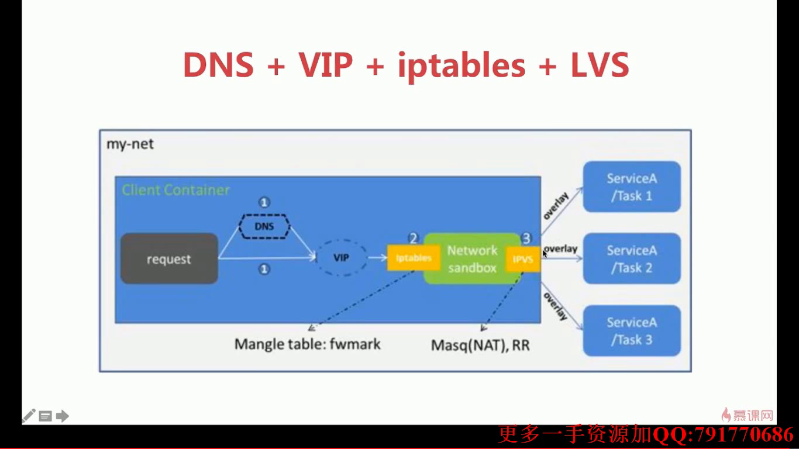
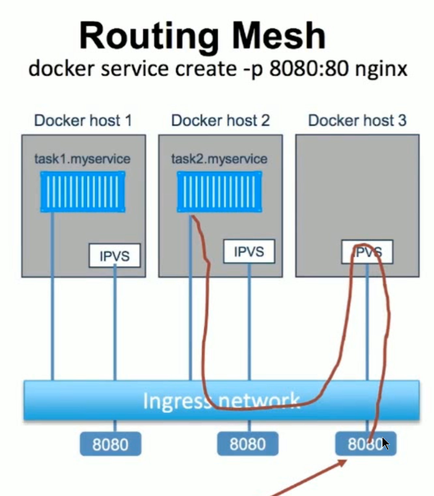

# 系统学习Docker践行DevOps理念

## 容器和虚拟机的区别

Docker能干什么：

    简化配置
    整合服务器
    代码流水线管理
    调试能力
    提高开发效率
    多租户
    隔离应用
    快速部署

Docker + kubernetes(k8s)

K8S(容器编排工具)，Docker官方的容器编排工具是Docker Swarm。

## 第一章：容器技术和Docker简介

虚拟化的局限性：

    每一个虚拟机都是一个完整的操作系统，要给其分配资源，当虚拟机数量增多时，操作系统本身消耗的资源势必增多。

容器解决了什么问题？

    解决了开发和运维之间的矛盾
    在开发和运维之间搭建了一个桥梁，是实现devops的最佳解决方案。

什么是容器？

    对软件和其依赖的标准化打包；
    应用之间相互隔离
    共享同一个OS Kernel
    可以运行在很多主流操作系统上；

容器是APP层面的隔离，虚拟化是物理资源层面上的隔离

虚拟化+容器： 在虚拟化主机中使用容器；


Docker-容器技术的一种实现，另一种常用实现CoreOS。

## 第二章：Docker环境的各种搭建方法

docker-community edition、docker-enterprise(basic,standard,advanced) edition

Docker是一个Linux Application，要准备一个安装好了Docker的Linux系统。

* 1. Install Docker For Mac。(included Docker Engine，Docker Compose，Docker Machine and Kitematic(GUI))

* 2. Install Docker For Windows.

    要求： win10 或 winserver2016，requires 64bit windows 10 Pro with Hyper-V available。

* 3. windows + vagrant + virtualbox + docker 

```bash
    vagrant --help
    mkdir centos7 && cd centos7
    vagrant init centos/7
    vagrant up
    vagrant ssh(sudo yum update)
    exit
    vagrant status
    vagrant halt    挂起虚拟机
    vagrant destroy   删除虚拟机
```

vagrantfile

vagrant也可以驱动vmware，不建议使用； vagrant up --provider=vmware_fusion

* 在centos上安装docker：

```bash
# Uninstall old version
sudo yum remove docker \
                  docker-client \
                  docker-client-latest \
                  docker-common \
                  docker-latest \
                  docker-latest-logrotate \
                  docker-logrotate \
                  docker-engine
```

```bash
# Install requirements
sudo yum install -y yum-utils \
  device-mapper-persistent-data \
  lvm2
```

```bash
# setup stable repository
sudo yum-config-manager \
    --add-repo \
    https://download.docker.com/linux/centos/docker-ce.repo
```

```bash
# Install docker-ce
sudo yum install docker-ce docker-ce-cli containerd.io
```

```bash
sudo systemctl start docker   # start docker
sudo docker run hello-world   # test  docker
```

* 修改vagrantfile，使得vagrant启动虚拟机时自动安装docker：

```bash
xiong@sslinux-development MINGW64 /f/vagrant/centos
$ tail -10 Vagrantfile
  # documentation for more information about their specific syntax and use.
  config.vm.provision "shell", inline: <<-SHELL
        sudo yum remove docker docker-client docker-client-latest docker-common docker-latest docker-latest-logrotate docker-logrotate docker-engine -y
        sudo yum install -y yum-utils device-mapper-persistent-data lvm2
        sudo yum-config-manager --add-repo https://download.docker.com/linux/centos/docker-ce.repo
        sudo yum install -y docker-ce docker-ce-cli containerd.io
        sudo systemctl start docker
        sudo systemctl enable docker
  SHELL
end
```

* Docker Machine

[Doc for Docker-Machine](https://docs.docker.com/machine/install-machine/)

Install docker-machine on winwons with GitBash:

```bash
base=https://github.com/docker/machine/releases/download/v0.16.0 &&
  mkdir -p "$HOME/bin" &&
  curl -L $base/docker-machine-Windows-x86_64.exe > "$HOME/bin/docker-machine.exe" &&
  chmod +x "$HOME/bin/docker-machine.exe"
```

`使用docker-machine在本地创建包含docker的虚拟机：`

```bash
docker-machine create demo   # 创建虚拟机
docker-machine ls            # 查看通过docker-machine创建的虚拟机状态；
docker-machine ssh demo      # ssh连接虚拟机；
docker-machine stop demo     # 停止虚拟机；
docker-machine env demo      # 查看demo中的环境设置

eval $(docker-machine env daemon)    # 将本地的docker server设置为daemon中的；

# 取消上述设置：
docker-machine env --help
eval $(docker-machine env --unset)   # 将docker server设置为本地主机；
```

docker-machine的driver可以管理常见的云服务厂商，即可以使用docker-machine命令在云平台上创建已经包含docker环境的主机。

```bash
$ docker-machine create --driver digitalocean --digitalocean-access-token xxxxx docker-sandbox

$ docker-machine create --driver amazonec2 --amazonec2-access-key AKI******* --amazonec2-secret-key 8T93C*******  aws-sandbox
```

`使用docker-machine在aliyun上创建包含docker的虚拟机:`

AliyunECS:

需要自己安装相关驱动： https://github.com/AliyunContainerService/docker-machine-driver-aliyunecs

保证账户余额大于100元；
访问控制——用户详情——创建AccessKey

```bash
docker-machine create -d aliyunecs --aliyunecs-io-optimized=optimized --aliyunecs-instance-type=ecs.c5.large --aliyunecs-access-key-id=********* --aliyunecs-access-key-secret=****************** --aliyunecs-region=cn-qingdao sslinux
```

docker-machine rm sslinux   # 删除虚拟机，ECS中的实例是要收费的，不用的时候一定要删除；


`AWS，EC2:需要绑定信用卡`

Security --》 IAM --》 创建AccessKey

[详细文档](https://docs.docker.com/machine/drivers/aws/)

docker-machien的awsec2驱动比aliyunecs稳定得多，记得删除避免扣费；


### docker-playground： 无法创建docker环境时使用；

使用docker的账号登录；

临时的，一段时间不使用，就会被销毁；


### Docker安装的总结：
* 1.在Mac上玩Docker

        docker for Mac直接安装；
        通过Virtualbox或者Vmware虚拟化软件直接创建Linux虚拟机，在虚拟机里安装使用Docker。
        通过Vagrant + virtualbox快速构建Docker host。
        通过docker-machine快速搭建Docker host。

* 2.在Windows上玩docker

        Docker for Windows直接安装(队系统要求高至少要win10 pro)，开启Hyper-V；
        通过Virtualbox或者Vmware虚拟化软件直接创建Linux虚拟机，在虚拟机里安装使用Docker；
        通过Vagrant + VitualBox快速搭建Docker host
        通过docker-machine快速单间Docker host

* 3.在linux上玩docker

        Linux主机
        Linux虚拟机(支持虚拟化的任何操作系统或者平台)

* 4.在云上玩docker

        docker-machine + driver (AWS,Aliyun等)
        直接使用与服务上提供的容器服务：
            AWS的ECS(Amazon Elastic Container Service)
            Aliyun的Container Service

---


## 第三章：Docker的镜像和容器

Docker的架构和底层技术：

        Docker提供了一个开发，打包，运行app的平台
        把app和底层infrastructure隔离开来；

Docker Engine:

        后台进程(dockerd)
        REST API Server
        CLI接口(docker)


Docker底层技术支持：

        Namespaces： 做隔离pid，net，ipc，mnt，uts
        Control groups： 做资源限制
        Union file systems: Container和image的分层

### Docker Image：

什么是Image：  

        文件和meta data的集合(root filesystem)
        分层的，并且每一层都可以添加改变删除文件，成为一个新的image；
        不同的image可以共享相同的layer；
        image本身是read-only的

        [vagrant@localhost ~]$ sudo docker image ls


Image的获取：

* 1.Build from Dockerfile：

```bash
mkdir redis
cd redis
cat > Dockerfile << EOF
    FROM ubuntu:14.04
    LABEL maintainer="Guiyin Xiong <guiyin.xiong@gmail.com>"
    RUN apt-get update && apt-get install -y redis-server
    EXPOSE 6379
    ENTRYPOINT [ "/usr/bin/redis-server" ]

sudo docker build -t sslinux/redis:latest .
```


* 2.Pull from Registry

拉取官方image： sudo docker pull IMAGE:TAG

非官方image：   sudo docker pull USERNAME/IMAGE:TAG

```bash
$ docker pull ubuntu:14.04
```

将当前用户加入docker组，使得运行docker命令时不必再用sudo。

        sudo gpasswd -a vagrant docker


* 3.制作base image：

```bash
[vagrant@localhost ~]$ docker pull hello-world
[vagrant@localhost ~]$ docker run hello-world
```

```bash
[vagrant@localhost ~]$ mkdir hello-world
[vagrant@localhost ~]$ vim hello.c
[vagrant@localhost ~]$ cat hello.c
#include<stdio.h>

int main()
{
        printf("hello docker\n")
}
[vagrant@localhost ~]$ sudo yum install -y gcc glibc-static
[vagrant@localhost ~]$ gcc -static hello.c -o hello

[vagrant@localhost hello-world]$ vim Dockerfile
[vagrant@localhost hello-world]$ cat Dockerfile
FROM scratch
ADD hello /
CMD ["/hello"]


[vagrant@localhost hello-world]$ docker build -t sslinux/hello-world .
Sending build context to Docker daemon  869.9kB
Step 1/3 : FROM scratch
 --->
Step 2/3 : ADD hello /
 ---> 28d43280360b
Step 3/3 : CMD ["/hello"]
 ---> Running in 20e177bdd13e
Removing intermediate container 20e177bdd13e
 ---> 6cfb19e6e5f9
Successfully built 6cfb19e6e5f9
Successfully tagged sslinux/hello-world:latest


[vagrant@localhost hello-world]$ docker image ls
REPOSITORY            TAG                 IMAGE ID            CREATED             SIZE
# 只有800多k
sslinux/hello-world   latest              6cfb19e6e5f9        27 seconds ago      857kB
sslinux/redis         latest              085d7cef2f2c        21 minutes ago      205MB
ubuntu                14.04               5dbc3f318ea5        5 weeks ago         188MB
hello-world           latest              fce289e99eb9        2 months ago        1.84kB

# 查看某镜像的分层
[vagrant@localhost hello-world]$ docker history 6cfb19e6e5f9
IMAGE               CREATED             CREATED BY                                      SIZE                COMMENT
6cfb19e6e5f9        2 minutes ago       /bin/sh -c #(nop)  CMD ["/hello"]               0B
28d43280360b        2 minutes ago       /bin/sh -c #(nop) ADD file:0bd91ef318c5fa6bf鈥?   857kB


[vagrant@localhost hello-world]$ docker run sslinux/hello-world
hello docker
[vagrant@localhost hello-world]$
```

### 什么是container？

        通过Image创建(copy)
        在Image layer之上建立一个container layer(可读写)
        类比面向对象：类和实例
        Image负责app的存储和分发，Container负责运行app；

```bash
# 查看当前正在运行的container
[vagrant@localhost hello-world]$ docker container ls
CONTAINER ID        IMAGE               COMMAND             CREATED             STATUS              PORTS               NAMES

# 查看所有的container，包括已经运行结束的；
[vagrant@localhost hello-world]$ docker container ls -a
CONTAINER ID        IMAGE                 COMMAND             CREATED             STATUS                      PORTS               NAMES
f2b21d14b2d3        sslinux/hello-world   "/hello"            6 minutes ago       Exited (13) 6 minutes ago                       gallant_leavitt
fab54bbc5330        hello-world           "/hello"            23 minutes ago      Exited (0) 23 minutes ago                       peaceful_joliot
```

```bash
docker image ls == docker images
docker container ls == docker ps

docker rm    # 删除container
docker rmi   # 删除image

[vagrant@localhost ~]$ docker container ls
CONTAINER ID        IMAGE               COMMAND             CREATED             STATUS              PORTS               NAMES
[vagrant@localhost ~]$ docker container ls -aq　　 # 这里列出的是所有container，包括up的；
f2b21d14b2d3
fab54bbc5330
[vagrant@localhost ~]$ docker rm $(docker container ls -aq) 
f2b21d14b2d3
fab54bbc5330

[vagrant@localhost ~]$ docker container ls -f "status=exited" -q
[vagrant@localhost ~]$ docker rm $(docker container ls -f "status=exited" -q)
```

* docker container commit  == docker commit  # 通过提交对一个container的修改来创建image
* docker image build == docker build    # 通过Dockerfile创建image；

```bash
[vagrant@localhost ~]$ docker container commit --help

Usage:  docker container commit [OPTIONS] CONTAINER [REPOSITORY[:TAG]]

Create a new image from a container's changes

Options:
  -a, --author string    Author (e.g., "John Hannibal Smith <hannibal@a-team.com>")
  -c, --change list      Apply Dockerfile instruction to the created image
  -m, --message string   Commit message
  -p, --pause            Pause container during commit (default true)
```

```bash
[vagrant@localhost ~]$ docker image build --help

Usage:  docker image build [OPTIONS] PATH | URL | -

Build an image from a Dockerfile
```

```bash
# 分享docker image 一般都通过分享Dockerfile来实现；
[vagrant@localhost ~]$ mkdir docker-centos-vim
[vagrant@localhost ~]$ cd docker-centos-vim
[vagrant@localhost docker-centos-vim]$ vim Dockerfile
[vagrant@localhost docker-centos-vim]$ cat Dockerfile
FROM centos
RUN yum install -y vim
[vagrant@localhost docker-centos-vim]$ docker build -t sslinux/centos-vim-new .
```

### Dockerfile语法梳理及最佳实践

* FROM 

        FROM scratch   # 制作base image
        FROM centos    # 使用base image
        FROM Ubuntu:14.04

尽量使用官方的image作为base image

* LABEL

        LABEL maintainer="guiyin.xiong@gmail.com"
        LABEL version="1.0"
        LABEL description="This is description"

Metadata不可少。

* RUN

        RUN yum update && yum install -y vim \
        python-dev   # 反斜线换行

        RUN apt-get update && apt-get install -y perl \
        pwgen --no-install-recommends && rm -rf \
        /var/lib/apt/lists/*    # 注意清理cache

        RUN /bin/bash -c 'source $HOME/.bashrc;echo $HOME'

RUN命令为了美观，复杂的RUN请用反斜线换行！避免无用分层，合并多条命令成一行。

* WORKDIR   设定当前工作目录

        WORKDIR /root
        WORKDIR /test # 如果没有回自动创建test目录
        WORKDIR demo
        RUN pwd       # 输出结果应该是/test/demo

用WORKDIR，不要用RUN cd，  尽量使用绝对路径；

* ADD and COPY

        ADD hello /
        ADD test.tar.gz /    # 添加到根目录并解压

        WORKDIR /root
        ADD hell test/       # /root/test/hello

        WORKDIR /root
        COPY hello test/

ADD or COPY：

        大部分情况，COPY优于ADD！
        ADD除了COPY还有额外功能(解压)!
        添加远程文件/目录请使用curl或者wget。

* ENV  定义环境变量

        ENV MYSQL_VERSION 5.6  # 设置常量
        RUN apt-get install -y mysql-server="${MYSQL_VERSION}" \
        && rm -rf /var/lib/apt/lists/*   # 引用常量；

尽量使用ENV增加可维护性!


* VOLUME and EXPOSE   存储和网络

* CMD and ENTRYPOINT  

        RUN: 执行命令并创建新的Image Layer
        CMD：设置容器启动后默认执行的命令和参数
        ENTRYPOINT：设置容器启动时运行的命令；

  - 1.Shell格式：

```Dockerfile
RUN apt-get install -y vim
CMD echo "hello docker"
ENTRYPOINT echo "hello docker"
```

  - 2.Exec格式：

```Dockerfile
RUN [ "apt-get","install", "-y", "vim" ]
CMD [ "/bin/echo", "hello docker" ]
ENTRYPOINT [ "/bin/echo", "hello docker" ]
```

```bash
# Shell和Exec格式：
[vagrant@localhost ShellAndExec]$ cat Dockerfile1
FROM centos
ENV name Docker
ENTRYPOINT echo "hello $name"

# build镜像
[vagrant@localhost ShellAndExec]$ docker build -t sslinux/centos-entrypoint-shell -f Dockerfile1 .
Sending build context to Docker daemon  3.072kB
Step 1/3 : FROM centos
 ---> 1e1148e4cc2c
Step 2/3 : ENV name Docker
 ---> Running in 7e29e982aa41
Removing intermediate container 7e29e982aa41
 ---> b4dfc2b1477f
Step 3/3 : ENTRYPOINT echo "hello $name"
 ---> Running in 87a000788347
Removing intermediate container 87a000788347
 ---> ec32b35112a0
Successfully built ec32b35112a0
Successfully tagged sslinux/centos-entrypoint-shell:latest
# shell格式：替换变量引用；
[vagrant@localhost ShellAndExec]$ docker run  sslinux/centos-entrypoint-shell
hello Docker

################################################
[vagrant@localhost ShellAndExec]$ cat Dockerfile2
FROM centos
ENV name Docker
ENTRYPOINT [ "/bin/echo", "hello $name" ]

[vagrant@localhost ShellAndExec]$ docker build -t sslinux/centos-entrypoint-exec -f Dockerfile2 .
Sending build context to Docker daemon  3.072kB
Step 1/3 : FROM centos
 ---> 1e1148e4cc2c
Step 2/3 : ENV name Docker
 ---> Using cache
 ---> b4dfc2b1477f
Step 3/3 : ENTRYPOINT [ "/bin/echo", "hello $name" ]
 ---> Running in 6736f1fbabf1
Removing intermediate container 6736f1fbabf1
 ---> c769c3bd0475
Successfully built c769c3bd0475
Successfully tagged sslinux/centos-entrypoint-shell:latest

# exec格式： 未替换变量引用；
[vagrant@localhost ShellAndExec]$ docker run sslinux/centos-entrypoint-exec
hello $name

# exec格式若想替换变量引用，需要使用如下格式：
ENTRYPOINT ["/bin/bash","-c","echo hello $name"]
```


* CMD

        容器启动时默认执行的命令
        如果docker run 指定了其他命令，CMD命令被忽略；
        如果定义了多个CMD，只有最后一个会执行；

* ENTRYPOINT

        让容器以应用程序或者服务的形式运行
        就算docker run时指定了其他命令，也不会被忽略，一定会执行
        最佳实践： 写一个shell脚本作为ENTRYPOINT

```Dockerfile
COPY docker-entrypoint.sh /usr/local/bin
ENTRYPOINT ["docker-entrypoint.sh"]

EXPOSE 27017
CMD ["mongod"]
```

[Docker官方提供的Dockerfile](https://github.com/docker-library)
[Docker官方有关Dockerfile的手册](https://docs.docker.com/engine/reference/builder/#run)


### docker image的发布：

https://hub.docker.com

如果只是获取别人的镜像，则不需要注册，若要发布自己的镜像，则需要注册了。

先登录，再push：

```bash
[vagrant@localhost ShellAndExec]$ docker login
[vagrant@localhost ShellAndExec]$ docker push  sslinux/hello-world:latest
```

大部分人在使用非官方docker image这件事上会有顾虑，担心不安全；

所以，推荐使用分享Dockerfile，需要与Github或Bitbuckket绑定，docker hub自动构建image，后续自己看。


```bash
# Docker官方提供的registry image：无web界面；
docker run -d -p 5000:5000 --restart always --name registry registry:2
```

往私有docker registry中push image：

```bash
$ docker build -t 10.75.44.222:5000/hello-world .
$ docker push 10.75.44.222:5000/hello-world
# 会因为不被信任而导致失败；

# 需要往/etc/docker/daemon.json文件中增加一个：

{ "insecure-registries":["10.75.44.222:5000"] }

# 在dockerd的Unit(.service)文件中添加一行：
EnvironmentFile=/etc/docker/daemon.json

$ sudo systemctl restart docker.service

$ docker push 10.75.44.222:5000/hello-world # 此时再push就能成功了；
```

但是上面构建的docker registry无web界面，所以无法查看push上去的镜像；

此时可以通过[Docker Registry API](https://docs.docker.com/registry/spec/api/#listing-repositories)去查看：


```bash
curl -X GET http://10.75.44.222:5000/v2/_catalog
```

删除本地镜像后也可以从刚才搭建的私有docker registry中pull回来；


### Dockerfile实践： 部署Python flask程序：

```python
# python程序：
[vagrant@localhost python-flask]$ cat app.py
from flask import Flask
app = Flask(__name__)
@app.route('/')
def hello():
    return "hello docker"

if __name__ == "__main__":
    app.run()
```

```Dockerfile
# Dockerfile
[vagrant@localhost flask-hello-world]$ cat Dockerfile
FROM python:2.7
LABEL maintainer="Guiyin Xiong<guiyin.xiong@gmail.com>"
RUN pip install flask
COPY app.py /app/
WORKDIR /app
EXPOSE 5000
CMD ["python","/app/app.py"]
```

```bash
# build image:
[vagrant@localhost flask-hello-world]$ docker build -t sslinux/flask-hello-world .

# run container:
[vagrant@localhost flask-hello-world]$ docker run -d -p 5000:5000 --name flask-hello-world sslinux/flask-hello-world
fc66e642669d06e828ac9fd2c03473b2893c5c49897384d9c6f3529e19bc7137
[vagrant@localhost flask-hello-world]$ docker ps
CONTAINER ID        IMAGE                       COMMAND                CREATED             STATUS              PORTS                    NAMES
fc66e642669d        sslinux/flask-hello-world   "python /app/app.py"   6 seconds ago       Up 5 seconds        0.0.0.0:5000->5000/tcp   flask-hello-world
```

### 容器的操作：

```bash
[vagrant@localhost flask-hello-world]$ docker container

Usage:  docker container COMMAND

Manage containers

Commands:
  attach      Attach local standard input, output, and error streams to a running container
  commit      Create a new image from a container's changes
  cp          Copy files/folders between a container and the local filesystem
  create      Create a new container
  diff        Inspect changes to files or directories on a container's filesystem
  exec        Run a command in a running container
  export      Export a container's filesystem as a tar archive
  inspect     Display detailed information on one or more containers
  kill        Kill one or more running containers
  logs        Fetch the logs of a container
  ls          List containers
  pause       Pause all processes within one or more containers
  port        List port mappings or a specific mapping for the container
  prune       Remove all stopped containers
  rename      Rename a container
  restart     Restart one or more containers
  rm          Remove one or more containers
  run         Run a command in a new container
  start       Start one or more stopped containers
  stats       Display a live stream of container(s) resource usage statistics
  stop        Stop one or more running containers
  top         Display the running processes of a container
  unpause     Unpause all processes within one or more containers
  update      Update configuration of one or more containers
  wait        Block until one or more containers stop, then print their exit codes

Run 'docker container COMMAND --help' for more information on a command.
```

* docker exec CONTAINER  对运行中的容器执行一个程序：

```bash
[vagrant@localhost flask-hello-world]$ docker exec -it fc66 /bin/bash
[vagrant@localhost flask-hello-world]$ docker exec -it fc66 python
[vagrant@localhost flask-hello-world]$ docker exec -it fc66 ip addr
```

* docker stop CONTAINER 停止一个正在运行的容器；
* docker start CONTAINER
* docker rm (docker ps -aq)   # 删除容器；
* docker inspect CONTAINER  # 查看容器的详细信息；
* docker logs CONTAINER # 查看container运行的日志；


### Dockerfile实践：

```bash
[vagrant@localhost flask-hello-world]$ docker run -it ubuntu
Digest: sha256:108314d481f0085bf9233129e9112c59795fa1a74e3bd26e4827d0313e44dc26
Status: Downloaded newer image for ubuntu:latest
root@98e337b6897c:/# apt-get update && apt-get install -y stress
# stress 是一个机器性能测试工具：

root@98e337b6897c:/# stress --vm 1 --verbose
stress: info: [252] dispatching hogs: 0 cpu, 0 io, 1 vm, 0 hdd
stress: dbug: [252] using backoff sleep of 3000us

# 超出内存限制，所以分配失败；
root@98e337b6897c:/# stress --vm 1 --vm-bytes 500000M --verbose
stress: info: [254] dispatching hogs: 0 cpu, 0 io, 1 vm, 0 hdd
stress: dbug: [254] using backoff sleep of 3000us
stress: dbug: [254] --> hogvm worker 1 [255] forked
stress: dbug: [255] allocating 524288000000 bytes ...
stress: FAIL: [255] (494) hogvm malloc failed: Cannot allocate memory
stress: FAIL: [254] (394) <-- worker 255 returned error 1
```

* 将stress通过Dockerfile封装进image：

```bash
[vagrant@localhost ubuntu-stress]$ cat Dockerfile
FROM ubuntu
RUN apt-get update && apt-get install -y stress
ENTRYPOINT ["/usr/bin/stress"]
CMD []

[vagrant@localhost ubuntu-stress]$ docker build -t sslinux/ubuntu-stress .
```

```bash
[vagrant@localhost ubuntu-stress]$ docker run -it sslinux/ubuntu-stress
stress imposes certain types of compute stress on your system

Usage: stress [OPTION [ARG]] ...
 -?, --help         show this help statement
     --version      show version statement
 -v, --verbose      be verbose
 -q, --quiet        be quiet
 -n, --dry-run      show what would have been done
 -t, --timeout N    timeout after N seconds
     --backoff N    wait factor of N microseconds before work starts
 -c, --cpu N        spawn N workers spinning on sqrt()
 -i, --io N         spawn N workers spinning on sync()
 -m, --vm N         spawn N workers spinning on malloc()/free()
     --vm-bytes B   malloc B bytes per vm worker (default is 256MB)
     --vm-stride B  touch a byte every B bytes (default is 4096)
     --vm-hang N    sleep N secs before free (default none, 0 is inf)
     --vm-keep      redirty memory instead of freeing and reallocating
 -d, --hdd N        spawn N workers spinning on write()/unlink()
     --hdd-bytes B  write B bytes per hdd worker (default is 1GB)

Example: stress --cpu 8 --io 4 --vm 2 --vm-bytes 128M --timeout 10s

Note: Numbers may be suffixed with s,m,h,d,y (time) or B,K,M,G (size).
```

```bash
# 可以在运行容器时，给stress命令传递参数：
[vagrant@localhost ubuntu-stress]$ docker run -it sslinux/ubuntu-stress --vm 1 --verbose
stress: info: [1] dispatching hogs: 0 cpu, 0 io, 1 vm, 0 hdd
stress: dbug: [1] using backoff sleep of 3000us
stress: dbug: [1] --> hogvm worker 1 [6] forked
stress: dbug: [6] allocating 268435456 bytes ...
stress: dbug: [6] touching bytes in strides of 4096 bytes ...
stress: dbug: [6] freed 268435456 bytes
stress: dbug: [6] allocating 268435456 bytes ...
stress: dbug: [6] touching bytes in strides of 4096 bytes ...
stress: dbug: [6] freed 268435456 bytes
stress: dbug: [6] allocating 268435456 bytes ...
stress: dbug: [6] touching bytes in strides of 4096 bytes ...
```

第四章：Docker的网络

单机：

        Bridge Network
        Host Network
        None Network

多机： 

        Overlay Network


网络基础概念：

    基于数据包的通信方式；
    ISO/OSI七层参考模型
    TCP/IP模型

    路由的概念；
    IP地址和路由   
    wireshark抓包工具

Network namespace：

```bash
[vagrant@docker-node1 ~]$ docker run -d --name test1 busybox /bin/sh -c "while true; do sleep 3600;done"
[vagrant@docker-node1 ~]$ docker run -d --name test2 busybox /bin/sh -c "while true;do sleep 3600;done"
b48e367bb5a05dca57cc3d9e0a21e8d173098a8474843903f1e8f0f0e98c3cab
[vagrant@docker-node1 ~]$ docker ps
CONTAINER ID        IMAGE               COMMAND                  CREATED             STATUS              PORTS               NAMES
b48e367bb5a0        busybox             "/bin/sh -c 'while t…"   7 seconds ago       Up 6 seconds                            test2
1adc04bed5dd        busybox             "/bin/sh -c 'while t…"   6 minutes ago       Up 6 minutes                            test1

[vagrant@docker-node1 ~]$ docker exec test1 ip addr
1: lo: <LOOPBACK,UP,LOWER_UP> mtu 65536 qdisc noqueue qlen 1000
    link/loopback 00:00:00:00:00:00 brd 00:00:00:00:00:00
    inet 127.0.0.1/8 scope host lo
       valid_lft forever preferred_lft forever
5: eth0@if6: <BROADCAST,MULTICAST,UP,LOWER_UP,M-DOWN> mtu 1500 qdisc noqueue
    link/ether 02:42:ac:11:00:02 brd ff:ff:ff:ff:ff:ff
    inet 172.17.0.2/16 brd 172.17.255.255 scope global eth0
       valid_lft forever preferred_lft forever

[vagrant@docker-node1 ~]$ docker exec test2 ip addr
1: lo: <LOOPBACK,UP,LOWER_UP> mtu 65536 qdisc noqueue qlen 1000
    link/loopback 00:00:00:00:00:00 brd 00:00:00:00:00:00
    inet 127.0.0.1/8 scope host lo
       valid_lft forever preferred_lft forever
7: eth0@if8: <BROADCAST,MULTICAST,UP,LOWER_UP,M-DOWN> mtu 1500 qdisc noqueue
    link/ether 02:42:ac:11:00:03 brd ff:ff:ff:ff:ff:ff
    inet 172.17.0.3/16 brd 172.17.255.255 scope global eth0
       valid_lft forever preferred_lft forever

# 两个容器的网卡是在同一个网段内的；
# network namespace使得docker container和docker host之间的网络是隔离的；
```

### 管理Network namespace：

```bash
[vagrant@docker-node1 ~]$ sudo ip netns list   # 查看网络名称空间；
[vagrant@docker-node1 ~]$ sudo ip netns add test1  # 添加一个Network namespace
[vagrant@docker-node1 ~]$ sudo ip netns list
test1
[vagrant@docker-node1 ~]$ sudo ip netns add test2
[vagrant@docker-node1 ~]$ sudo ip netns list
test2
test1

[vagrant@docker-node1 ~]$ sudo ip netns exec test1 ip a
1: lo: <LOOPBACK> mtu 65536 qdisc noop state DOWN group default qlen 1000
    link/loopback 00:00:00:00:00:00 brd 00:00:00:00:00:00

[vagrant@docker-node1 ~]$ ip link
1: lo: <LOOPBACK,UP,LOWER_UP> mtu 65536 qdisc noqueue state UNKNOWN mode DEFAULT group default qlen 1000
    link/loopback 00:00:00:00:00:00 brd 00:00:00:00:00:00
2: eth0: <BROADCAST,MULTICAST,UP,LOWER_UP> mtu 1500 qdisc pfifo_fast state UP mode DEFAULT group default qlen 1000
    link/ether 52:54:00:75:dc:3d brd ff:ff:ff:ff:ff:ff
3: eth1: <BROADCAST,MULTICAST,UP,LOWER_UP> mtu 1500 qdisc pfifo_fast state UP mode DEFAULT group default qlen 1000
    link/ether 08:00:27:65:ca:59 brd ff:ff:ff:ff:ff:ff
4: docker0: <BROADCAST,MULTICAST,UP,LOWER_UP> mtu 1500 qdisc noqueue state UP mode DEFAULT group default
    link/ether 02:42:f7:43:7a:ef brd ff:ff:ff:ff:ff:ff
6: veth65c71b4@if5: <BROADCAST,MULTICAST,UP,LOWER_UP> mtu 1500 qdisc noqueue master docker0 state UP mode DEFAULT group default
    link/ether fa:8c:d3:02:c9:ed brd ff:ff:ff:ff:ff:ff link-netnsid 0
8: veth8306c2c@if7: <BROADCAST,MULTICAST,UP,LOWER_UP> mtu 1500 qdisc noqueue master docker0 state UP mode DEFAULT group default
    link/ether ce:87:ec:3b:71:da brd ff:ff:ff:ff:ff:ff link-netnsid 1

[vagrant@docker-node1 ~]$ sudo ip netns  exec test1 ip link
1: lo: <LOOPBACK> mtu 65536 qdisc noop state DOWN mode DEFAULT group default qlen 1000
    link/loopback 00:00:00:00:00:00 brd 00:00:00:00:00:00

[vagrant@docker-node1 ~]$ sudo ip netns exec test1 ip link set dev lo up
[vagrant@docker-node1 ~]$ sudo ip netns  exec test1 ip link
1: lo: <LOOPBACK,UP,LOWER_UP> mtu 65536 qdisc noqueue state UNKNOWN mode DEFAULT group default qlen 1000
    link/loopback 00:00:00:00:00:00 brd 00:00:00:00:00:00
```

创建一对veth，连接两个Network namespace：

```bash
[vagrant@docker-node1 ~]$ sudo ip link add veth-test1 type veth peer name veth-test2
[vagrant@docker-node1 ~]$ ip link
1: lo: <LOOPBACK,UP,LOWER_UP> mtu 65536 qdisc noqueue state UNKNOWN mode DEFAULT group default qlen 1000
    link/loopback 00:00:00:00:00:00 brd 00:00:00:00:00:00
2: eth0: <BROADCAST,MULTICAST,UP,LOWER_UP> mtu 1500 qdisc pfifo_fast state UP mode DEFAULT group default qlen 1000
    link/ether 52:54:00:75:dc:3d brd ff:ff:ff:ff:ff:ff
3: eth1: <BROADCAST,MULTICAST,UP,LOWER_UP> mtu 1500 qdisc pfifo_fast state UP mode DEFAULT group default qlen 1000
    link/ether 08:00:27:65:ca:59 brd ff:ff:ff:ff:ff:ff
4: docker0: <BROADCAST,MULTICAST,UP,LOWER_UP> mtu 1500 qdisc noqueue state UP mode DEFAULT group default
    link/ether 02:42:f7:43:7a:ef brd ff:ff:ff:ff:ff:ff
6: veth65c71b4@if5: <BROADCAST,MULTICAST,UP,LOWER_UP> mtu 1500 qdisc noqueue master docker0 state UP mode DEFAULT group default
    link/ether fa:8c:d3:02:c9:ed brd ff:ff:ff:ff:ff:ff link-netnsid 0
8: veth8306c2c@if7: <BROADCAST,MULTICAST,UP,LOWER_UP> mtu 1500 qdisc noqueue master docker0 state UP mode DEFAULT group default
    link/ether ce:87:ec:3b:71:da brd ff:ff:ff:ff:ff:ff link-netnsid 1
9: veth-test2@veth-test1: <BROADCAST,MULTICAST,M-DOWN> mtu 1500 qdisc noop state DOWN mode DEFAULT group default qlen 1000
    link/ether fe:5e:88:ab:06:fb brd ff:ff:ff:ff:ff:ff
10: veth-test1@veth-test2: <BROADCAST,MULTICAST,M-DOWN> mtu 1500 qdisc noop state DOWN mode DEFAULT group default qlen 1000
    link/ether 32:f0:3e:0b:a0:6d brd ff:ff:ff:ff:ff:ff

# 将veth-test1添加到Network namespace：test1中；
[vagrant@docker-node1 ~]$ sudo ip link set veth-test1 netns test1
[vagrant@docker-node1 ~]$ sudo ip netns exec test1 ip link
1: lo: <LOOPBACK,UP,LOWER_UP> mtu 65536 qdisc noqueue state UNKNOWN mode DEFAULT group default qlen 1000
    link/loopback 00:00:00:00:00:00 brd 00:00:00:00:00:00
10: veth-test1@if9: <BROADCAST,MULTICAST> mtu 1500 qdisc noop state DOWN mode DEFAULT group default qlen 1000
    link/ether 32:f0:3e:0b:a0:6d brd ff:ff:ff:ff:ff:ff link-netnsid 0

# 查看本机的ip link，发现之前的veth-test1已经不见了；
[vagrant@docker-node1 ~]$ ip link
1: lo: <LOOPBACK,UP,LOWER_UP> mtu 65536 qdisc noqueue state UNKNOWN mode DEFAULT group default qlen 1000
    link/loopback 00:00:00:00:00:00 brd 00:00:00:00:00:00
2: eth0: <BROADCAST,MULTICAST,UP,LOWER_UP> mtu 1500 qdisc pfifo_fast state UP mode DEFAULT group default qlen 1000
    link/ether 52:54:00:75:dc:3d brd ff:ff:ff:ff:ff:ff
3: eth1: <BROADCAST,MULTICAST,UP,LOWER_UP> mtu 1500 qdisc pfifo_fast state UP mode DEFAULT group default qlen 1000
    link/ether 08:00:27:65:ca:59 brd ff:ff:ff:ff:ff:ff
4: docker0: <BROADCAST,MULTICAST,UP,LOWER_UP> mtu 1500 qdisc noqueue state UP mode DEFAULT group default
    link/ether 02:42:f7:43:7a:ef brd ff:ff:ff:ff:ff:ff
6: veth65c71b4@if5: <BROADCAST,MULTICAST,UP,LOWER_UP> mtu 1500 qdisc noqueue master docker0 state UP mode DEFAULT group default
    link/ether fa:8c:d3:02:c9:ed brd ff:ff:ff:ff:ff:ff link-netnsid 0
8: veth8306c2c@if7: <BROADCAST,MULTICAST,UP,LOWER_UP> mtu 1500 qdisc noqueue master docker0 state UP mode DEFAULT group default
    link/ether ce:87:ec:3b:71:da brd ff:ff:ff:ff:ff:ff link-netnsid 1
9: veth-test2@if10: <BROADCAST,MULTICAST> mtu 1500 qdisc noop state DOWN mode DEFAULT group default qlen 1000
    link/ether fe:5e:88:ab:06:fb brd ff:ff:ff:ff:ff:ff link-netnsid 2

# 将veth-test添加到 netns test2中：
[vagrant@docker-node1 ~]$ sudo ip link set veth-test2 netns test2
[vagrant@docker-node1 ~]$ sudo ip link
1: lo: <LOOPBACK,UP,LOWER_UP> mtu 65536 qdisc noqueue state UNKNOWN mode DEFAULT group default qlen 1000
    link/loopback 00:00:00:00:00:00 brd 00:00:00:00:00:00
2: eth0: <BROADCAST,MULTICAST,UP,LOWER_UP> mtu 1500 qdisc pfifo_fast state UP mode DEFAULT group default qlen 1000
    link/ether 52:54:00:75:dc:3d brd ff:ff:ff:ff:ff:ff
3: eth1: <BROADCAST,MULTICAST,UP,LOWER_UP> mtu 1500 qdisc pfifo_fast state UP mode DEFAULT group default qlen 1000
    link/ether 08:00:27:65:ca:59 brd ff:ff:ff:ff:ff:ff
4: docker0: <BROADCAST,MULTICAST,UP,LOWER_UP> mtu 1500 qdisc noqueue state UP mode DEFAULT group default
    link/ether 02:42:f7:43:7a:ef brd ff:ff:ff:ff:ff:ff
6: veth65c71b4@if5: <BROADCAST,MULTICAST,UP,LOWER_UP> mtu 1500 qdisc noqueue master docker0 state UP mode DEFAULT group default
    link/ether fa:8c:d3:02:c9:ed brd ff:ff:ff:ff:ff:ff link-netnsid 0
8: veth8306c2c@if7: <BROADCAST,MULTICAST,UP,LOWER_UP> mtu 1500 qdisc noqueue master docker0 state UP mode DEFAULT group default
    link/ether ce:87:ec:3b:71:da brd ff:ff:ff:ff:ff:ff link-netnsid 1

[vagrant@docker-node1 ~]$ sudo ip netns exec test2 ip link
1: lo: <LOOPBACK> mtu 65536 qdisc noop state DOWN mode DEFAULT group default qlen 1000
    link/loopback 00:00:00:00:00:00 brd 00:00:00:00:00:00
9: veth-test2@if10: <BROADCAST,MULTICAST> mtu 1500 qdisc noop state DOWN mode DEFAULT group default qlen 1000
    link/ether fe:5e:88:ab:06:fb brd ff:ff:ff:ff:ff:ff link-netnsid 0

# 为veth-test1和veth-test2配置ip地址：
[vagrant@docker-node1 ~]$ sudo ip netns exec test1 ip addr add 192.168.1.1/24 dev veth-test1
[vagrant@docker-node1 ~]$ sudo ip netns exec test2 ip addr add 192.168.1.2/24 dev veth-test2

# 地址已配置，但查看的时候并无显示，并且接口状态为DOWN。
[vagrant@docker-node1 ~]$ sudo ip netns exec test1 ip link
1: lo: <LOOPBACK,UP,LOWER_UP> mtu 65536 qdisc noqueue state UNKNOWN mode DEFAULT group default qlen 1000
    link/loopback 00:00:00:00:00:00 brd 00:00:00:00:00:00
10: veth-test1@if9: <BROADCAST,MULTICAST> mtu 1500 qdisc noop state DOWN mode DEFAULT group default qlen 1000
    link/ether 32:f0:3e:0b:a0:6d brd ff:ff:ff:ff:ff:ff link-netnsid 1
[vagrant@docker-node1 ~]$ sudo ip netns exec test2 ip link
1: lo: <LOOPBACK> mtu 65536 qdisc noop state DOWN mode DEFAULT group default qlen 1000
    link/loopback 00:00:00:00:00:00 brd 00:00:00:00:00:00
9: veth-test2@if10: <BROADCAST,MULTICAST> mtu 1500 qdisc noop state DOWN mode DEFAULT group default qlen 1000
    link/ether fe:5e:88:ab:06:fb brd ff:ff:ff:ff:ff:ff link-netnsid 0


# 设置接口状态为UP：
[vagrant@docker-node1 ~]$ sudo ip netns exec test1 ip link set dev veth-test1 up
[vagrant@docker-node1 ~]$ sudo ip netns exec test2 ip link set dev veth-test2 up
# 接口状态为UP，IP地址已配置：
[vagrant@docker-node1 ~]$ sudo ip netns exec test1 ip link
1: lo: <LOOPBACK,UP,LOWER_UP> mtu 65536 qdisc noqueue state UNKNOWN mode DEFAULT group default qlen 1000
    link/loopback 00:00:00:00:00:00 brd 00:00:00:00:00:00
10: veth-test1@if9: <BROADCAST,MULTICAST,UP,LOWER_UP> mtu 1500 qdisc noqueue state UP mode DEFAULT group default qlen 1000
    link/ether 32:f0:3e:0b:a0:6d brd ff:ff:ff:ff:ff:ff link-netnsid 1
[vagrant@docker-node1 ~]$ sudo ip netns exec test1 ip addr
1: lo: <LOOPBACK,UP,LOWER_UP> mtu 65536 qdisc noqueue state UNKNOWN group default qlen 1000
    link/loopback 00:00:00:00:00:00 brd 00:00:00:00:00:00
    inet 127.0.0.1/8 scope host lo
       valid_lft forever preferred_lft forever
    inet6 ::1/128 scope host
       valid_lft forever preferred_lft forever
10: veth-test1@if9: <BROADCAST,MULTICAST,UP,LOWER_UP> mtu 1500 qdisc noqueue state UP group default qlen 1000
    link/ether 32:f0:3e:0b:a0:6d brd ff:ff:ff:ff:ff:ff link-netnsid 1
    inet 192.168.1.1/24 scope global veth-test1
       valid_lft forever preferred_lft forever
    inet6 fe80::30f0:3eff:fe0b:a06d/64 scope link
       valid_lft forever preferred_lft forever
# 接口状态为UP，IP地址已配置：
[vagrant@docker-node1 ~]$ sudo ip netns exec test2 ip link
1: lo: <LOOPBACK> mtu 65536 qdisc noop state DOWN mode DEFAULT group default qlen 1000
    link/loopback 00:00:00:00:00:00 brd 00:00:00:00:00:00
9: veth-test2@if10: <BROADCAST,MULTICAST,UP,LOWER_UP> mtu 1500 qdisc noqueue state UP mode DEFAULT group default qlen 1000
    link/ether fe:5e:88:ab:06:fb brd ff:ff:ff:ff:ff:ff link-netnsid 0
[vagrant@docker-node1 ~]$ sudo ip netns exec test2 ip addr
1: lo: <LOOPBACK> mtu 65536 qdisc noop state DOWN group default qlen 1000
    link/loopback 00:00:00:00:00:00 brd 00:00:00:00:00:00
9: veth-test2@if10: <BROADCAST,MULTICAST,UP,LOWER_UP> mtu 1500 qdisc noqueue state UP group default qlen 1000
    link/ether fe:5e:88:ab:06:fb brd ff:ff:ff:ff:ff:ff link-netnsid 0
    inet 192.168.1.2/24 scope global veth-test2
       valid_lft forever preferred_lft forever
    inet6 fe80::fc5e:88ff:feab:6fb/64 scope link
       valid_lft forever preferred_lft forever

# 从netns test1中ping netns test2中的地址192.168.1.2
[vagrant@docker-node1 ~]$ sudo ip netns exec test ip a
Cannot open network namespace "test": No such file or directory
[vagrant@docker-node1 ~]$ sudo ip netns exec test1 ip a
1: lo: <LOOPBACK,UP,LOWER_UP> mtu 65536 qdisc noqueue state UNKNOWN group default qlen 1000
    link/loopback 00:00:00:00:00:00 brd 00:00:00:00:00:00
    inet 127.0.0.1/8 scope host lo
       valid_lft forever preferred_lft forever
    inet6 ::1/128 scope host
       valid_lft forever preferred_lft forever
10: veth-test1@if9: <BROADCAST,MULTICAST,UP,LOWER_UP> mtu 1500 qdisc noqueue state UP group default qlen 1000
    link/ether 32:f0:3e:0b:a0:6d brd ff:ff:ff:ff:ff:ff link-netnsid 1
    inet 192.168.1.1/24 scope global veth-test1
       valid_lft forever preferred_lft forever
    inet6 fe80::30f0:3eff:fe0b:a06d/64 scope link
       valid_lft forever preferred_lft forever
[vagrant@docker-node1 ~]$ sudo ip netns exec test1 ping 192.168.1.2
PING 192.168.1.2 (192.168.1.2) 56(84) bytes of data.
64 bytes from 192.168.1.2: icmp_seq=1 ttl=64 time=0.117 ms
64 bytes from 192.168.1.2: icmp_seq=2 ttl=64 time=0.040 ms
64 bytes from 192.168.1.2: icmp_seq=3 ttl=64 time=0.046 ms
64 bytes from 192.168.1.2: icmp_seq=4 ttl=64 time=0.065 ms
^C
--- 192.168.1.2 ping statistics ---
4 packets transmitted, 4 received, 0% packet loss, time 3001ms
rtt min/avg/max/mdev = 0.040/0.067/0.117/0.030 ms

# 从netns test2中ping netns test1中的地址192.168.1.1
[vagrant@docker-node1 ~]$ sudo ip netns exec test2 ping 192.168.1.1
PING 192.168.1.1 (192.168.1.1) 56(84) bytes of data.
64 bytes from 192.168.1.1: icmp_seq=1 ttl=64 time=0.087 ms
64 bytes from 192.168.1.1: icmp_seq=2 ttl=64 time=0.065 ms
64 bytes from 192.168.1.1: icmp_seq=3 ttl=64 time=0.047 ms
64 bytes from 192.168.1.1: icmp_seq=4 ttl=64 time=0.177 ms
^C
--- 192.168.1.1 ping statistics ---
4 packets transmitted, 4 received, 0% packet loss, time 3001ms
rtt min/avg/max/mdev = 0.047/0.094/0.177/0.049 ms
```

### docker network

```bash
[vagrant@docker-node1 ~]$ docker ps
CONTAINER ID        IMAGE               COMMAND                  CREATED             STATUS              PORTS               NAMES
1adc04bed5dd        busybox             "/bin/sh -c 'while t…"   About an hour ago   Up About an hour                        test1

# 列举当前docker host上的docker网络：
[vagrant@docker-node1 ~]$ sudo docker network ls
NETWORK ID          NAME                DRIVER              SCOPE
c41f4c7edb5f        bridge              bridge              local
3223d3ccbd65        host                host                local
985f7e6de4ae        none                null                local
[vagrant@docker-node1 ~]$ docker network inspect c41f4c7edb5f #(此处是NETORK ID)
[
    {
        "Name": "bridge",
        "Id": "c41f4c7edb5f022d0670cebb91b435a52daadc10166ec93c978286f7037d3805",
        "Created": "2019-03-06T12:04:45.294875659Z",
        "Scope": "local",
        "Driver": "bridge",
        "EnableIPv6": false,
        "IPAM": {
            "Driver": "default",
            "Options": null,
            "Config": [
                {
                    "Subnet": "172.17.0.0/16"
                }
            ]
        },
        "Internal": false,
        "Attachable": false,
        "Ingress": false,
        "ConfigFrom": {
            "Network": ""
        },
        "ConfigOnly": false,
        "Containers": {
            "1adc04bed5dd51d4cf3d788da084c8f8652bb289aab9e8c3af69042128ac8da3": {
                "Name": "test1",
                "EndpointID": "7fb3ec5938338881b03b80c5475b4772cf056a010795c6f820b332bf9c8a2811",
                "MacAddress": "02:42:ac:11:00:02",
                "IPv4Address": "172.17.0.2/16",
                "IPv6Address": ""
            }
        },
        "Options": {
            "com.docker.network.bridge.default_bridge": "true",
            "com.docker.network.bridge.enable_icc": "true",
            "com.docker.network.bridge.enable_ip_masquerade": "true",
            "com.docker.network.bridge.host_binding_ipv4": "0.0.0.0",
            "com.docker.network.bridge.name": "docker0",
            "com.docker.network.driver.mtu": "1500"
        },
        "Labels": {}
    }
]


[vagrant@docker-node1 ~]$ sudo yum install -y bridge-utils


[vagrant@docker-node1 ~]$ brctl show
bridge name     bridge id               STP enabled     interfaces
docker0         8000.0242f7437aef       no              veth65c71b4

[vagrant@docker-node1 ~]$ ip link
1: lo: <LOOPBACK,UP,LOWER_UP> mtu 65536 qdisc noqueue state UNKNOWN mode DEFAULT group default qlen 1000
    link/loopback 00:00:00:00:00:00 brd 00:00:00:00:00:00
2: eth0: <BROADCAST,MULTICAST,UP,LOWER_UP> mtu 1500 qdisc pfifo_fast state UP mode DEFAULT group default qlen 1000
    link/ether 52:54:00:75:dc:3d brd ff:ff:ff:ff:ff:ff
3: eth1: <BROADCAST,MULTICAST,UP,LOWER_UP> mtu 1500 qdisc pfifo_fast state UP mode DEFAULT group default qlen 1000
    link/ether 08:00:27:65:ca:59 brd ff:ff:ff:ff:ff:ff
4: docker0: <BROADCAST,MULTICAST,UP,LOWER_UP> mtu 1500 qdisc noqueue state UP mode DEFAULT group default
    link/ether 02:42:f7:43:7a:ef brd ff:ff:ff:ff:ff:ff
# 下面这个link是连到了docker0这个bridge上了的。
6: veth65c71b4@if5: <BROADCAST,MULTICAST,UP,LOWER_UP> mtu 1500 qdisc noqueue master docker0 state UP mode DEFAULT group default
    link/ether fa:8c:d3:02:c9:ed brd ff:ff:ff:ff:ff:ff link-netnsid 0

# 说明：
没创建一个docker container，即创建了一对儿veth，一端在docker host上，一端在容器中；
而在dockerhost中的一端是被桥接到了 bridge docker0上，所以各docker container能通过桥docker0进行通信；

# 验证命令：
[vagrant@docker-node1 ~]$ brctl show
bridge name     bridge id               STP enabled     interfaces
docker0         8000.0242f7437aef       no              veth44fb17e
                                                        veth65c71b4
# 有两个veth被桥接到了docker0上，这两个veth分别对应两个docker container；

[vagrant@docker-node1 ~]$ docker network ls
NETWORK ID          NAME                DRIVER              SCOPE
c41f4c7edb5f        bridge              bridge              local
3223d3ccbd65        host                host                local
985f7e6de4ae        none                null                local
# 查看docker host上的网桥docker0的情况：
[vagrant@docker-node1 ~]$ docker network inspect bridge
[
    {
        "Name": "bridge",
        "Id": "c41f4c7edb5f022d0670cebb91b435a52daadc10166ec93c978286f7037d3805",
        "Created": "2019-03-06T12:04:45.294875659Z",
        "Scope": "local",
        "Driver": "bridge",
        "EnableIPv6": false,
        "IPAM": {
            "Driver": "default",
            "Options": null,
            "Config": [
                {
                    "Subnet": "172.17.0.0/16"
                }
            ]
        },
        "Internal": false,
        "Attachable": false,
        "Ingress": false,
        "ConfigFrom": {
            "Network": ""
        },
        "ConfigOnly": false,
        # 有两个容器(test1、test2)，连接到了这个网桥上；
        "Containers": {
            "1adc04bed5dd51d4cf3d788da084c8f8652bb289aab9e8c3af69042128ac8da3": {
                "Name": "test1",
                "EndpointID": "7fb3ec5938338881b03b80c5475b4772cf056a010795c6f820b332bf9c8a2811",
                "MacAddress": "02:42:ac:11:00:02",
                "IPv4Address": "172.17.0.2/16",
                "IPv6Address": ""
            },
            "f7ab98fd20f4b9cc0088c44db7ec8dda33a5fc2d32585e36a64799765f437c96": {
                "Name": "test2",
                "EndpointID": "f6b5210b66aecd65f73f030c4eb0ef6ab66692d259a5273f5f4cfb4085488e86",
                "MacAddress": "02:42:ac:11:00:03",
                "IPv4Address": "172.17.0.3/16",
                "IPv6Address": ""
            }
        },
        "Options": {
            "com.docker.network.bridge.default_bridge": "true",
            "com.docker.network.bridge.enable_icc": "true",
            "com.docker.network.bridge.enable_ip_masquerade": "true",
            "com.docker.network.bridge.host_binding_ipv4": "0.0.0.0",
            "com.docker.network.bridge.name": "docker0",
            "com.docker.network.driver.mtu": "1500"
        },
        "Labels": {}
    }
]
```

* 看图：


两个docker实例间如何通信：


docker实例如何访问互联网：


### 容器之间的link：

场景假设：

        需要两个docker container：
            1. 数据库
            2.后台服务
        如何保证在多次启动数据库容器后(IP变化)，后台服务的容器依然能访问数据库容器；

```bash
[vagrant@docker-node1 ~]$ docker stop test2
test2
[vagrant@docker-node1 ~]$ docker rm test2
test2
[vagrant@docker-node1 ~]$ docker ps
CONTAINER ID        IMAGE               COMMAND                  CREATED             STATUS              PORTS               NAMES
1adc04bed5dd        busybox             "/bin/sh -c 'while t…"   2 hours ago         Up 2 hours                              test1
```

使用--link创建容器test2：

```bash
[vagrant@docker-node1 ~]$ docker run -d --name test2 --link test1 busybox /bin/sh -c "while true;do sleep 3600; done"
19a0baa02ccfc7d691362c7dfebd50432305ccf87d10ed653ec090e43c350ebe

# 进入容器test2中，连接容器test1：
[vagrant@docker-node1 ~]$ docker exec -it test /bin/sh
Error: No such container: test
[vagrant@docker-node1 ~]$ docker exec -it test2 /bin/sh
/ # ip addr
1: lo: <LOOPBACK,UP,LOWER_UP> mtu 65536 qdisc noqueue qlen 1000
    link/loopback 00:00:00:00:00:00 brd 00:00:00:00:00:00
    inet 127.0.0.1/8 scope host lo
       valid_lft forever preferred_lft forever
15: eth0@if16: <BROADCAST,MULTICAST,UP,LOWER_UP,M-DOWN> mtu 1500 qdisc noqueue
    link/ether 02:42:ac:11:00:03 brd ff:ff:ff:ff:ff:ff
    inet 172.17.0.3/16 brd 172.17.255.255 scope global eth0
       valid_lft forever preferred_lft forever
/ # ping 172.17.0.2
PING 172.17.0.2 (172.17.0.2): 56 data bytes
64 bytes from 172.17.0.2: seq=0 ttl=64 time=0.119 ms
64 bytes from 172.17.0.2: seq=1 ttl=64 time=0.182 ms
64 bytes from 172.17.0.2: seq=2 ttl=64 time=0.113 ms
^C
--- 172.17.0.2 ping statistics ---
3 packets transmitted, 3 packets received, 0% packet loss
round-trip min/avg/max = 0.113/0.138/0.182 ms

# 此时在容器test2中ping 名字：test1 也是能ping通的；
/ # ping test1
PING test1 (172.17.0.2): 56 data bytes
64 bytes from 172.17.0.2: seq=0 ttl=64 time=0.080 ms
64 bytes from 172.17.0.2: seq=1 ttl=64 time=0.179 ms
64 bytes from 172.17.0.2: seq=2 ttl=64 time=0.068 ms
^C
--- test1 ping statistics ---
3 packets transmitted, 3 packets received, 0% packet loss
round-trip min/avg/max = 0.068/0.109/0.179 ms

#此时便可以通过 test1:port 的方式访问 容器test1中的服务，但此种方式并不常用；
```

恢复实验环境：

```bash
[vagrant@docker-node1 ~]$ docker stop test2
test2
[vagrant@docker-node1 ~]$ docker rm test2
test2
[vagrant@docker-node1 ~]$ docker run -d --name test2 busybox /bin/sh -c "while true;do sleep 3600;done"
70785e394f6ea13df0a78ac079af96f2e67104ae5b57c7c13fe794e6876e649f

# 默认情况下，新建的容器会自动桥接到docker0上；
[vagrant@docker-node1 ~]$ docker network ls
NETWORK ID          NAME                DRIVER              SCOPE
c41f4c7edb5f        bridge              bridge              local
3223d3ccbd65        host                host                local
985f7e6de4ae        none                null                local
```

### 自建一个新的network bridge，并将新建的容器连接到这个bridge上：

```bash
[vagrant@docker-node1 ~]$ docker network create -d bridge mybridge
a8912c9619185e1a44e6a4deac9bfa8e4be3e81dff69a7edce21de7ff0537717
[vagrant@docker-node1 ~]$ docker network ls
NETWORK ID          NAME                DRIVER              SCOPE
c41f4c7edb5f        bridge              bridge              local
3223d3ccbd65        host                host                local
`a8912c961918`        mybridge            bridge              local
985f7e6de4ae        none                null                local

[vagrant@docker-node1 ~]$ brctl show
bridge name     bridge id               STP enabled     interfaces
`br-a8912c961918`         8000.0242a251f58f       no
docker0         8000.0242f7437aef       no              veth65c71b4
                                                        vethe3c415b

# 运行新的容器，使用--network选项将其连接到指定的bridge上；
[vagrant@docker-node1 ~]$ docker run -d --name test3 --network mybridge busybox /bin/sh -c "while true;do sleep 3600; done"
7b511134775e134bd80394143c8950e02499e41f4198a7bcebd666c158a35056

[vagrant@docker-node1 ~]$ brctl show
bridge name     bridge id               STP enabled     interfaces
br-a8912c961918         8000.0242a251f58f       no              veth6bcbe70
docker0         8000.0242f7437aef       no              veth65c71b4
                                                        vethe3c415b

[vagrant@docker-node1 ~]$ docker network inspect mybridge
[
    {
        "Name": "mybridge",
        "Id": "a8912c9619185e1a44e6a4deac9bfa8e4be3e81dff69a7edce21de7ff0537717",
        "Created": "2019-03-06T14:19:14.862302816Z",
        "Scope": "local",
        "Driver": "bridge",
        "EnableIPv6": false,
        "IPAM": {
            "Driver": "default",
            "Options": {},
            "Config": [
                {
                    "Subnet": "172.18.0.0/16",
                    "Gateway": "172.18.0.1"
                }
            ]
        },
        "Internal": false,
        "Attachable": false,
        "Ingress": false,
        "ConfigFrom": {
            "Network": ""
        },
        "ConfigOnly": false,
        "Containers": {
            "7b511134775e134bd80394143c8950e02499e41f4198a7bcebd666c158a35056": {
                "Name": "test3",
                "EndpointID": "57a75388c14070a47d61c8f18e60e6949f56a9607b8c0acc2d84df5e54513985",
                "MacAddress": "02:42:ac:12:00:02",
                "IPv4Address": "172.18.0.2/16",
                "IPv6Address": ""
            }
        },
        "Options": {},
        "Labels": {}
    }
]

# 将已经创建的容器test1和test2连接到 mybridge上：
[vagrant@docker-node1 ~]$ docker network connect --help

Usage:  docker network connect [OPTIONS] NETWORK CONTAINER

Connect a container to a network

Options:
      --alias strings           Add network-scoped alias for the container
      --ip string               IPv4 address (e.g., 172.30.100.104)
      --ip6 string              IPv6 address (e.g., 2001:db8::33)
      --link list               Add link to another container
      --link-local-ip strings   Add a link-local address for the container

[vagrant@docker-node1 ~]$ docker network connect mybridge test2

# 此时，容器test2 既在bridge上，又在新建的mybridge上；
[vagrant@docker-node1 ~]$ docker network inspect bridge
[
    {
        "Name": "bridge",
        "Id": "c41f4c7edb5f022d0670cebb91b435a52daadc10166ec93c978286f7037d3805",
        "Created": "2019-03-06T12:04:45.294875659Z",
        "Scope": "local",
        "Driver": "bridge",
        "EnableIPv6": false,
        "IPAM": {
            "Driver": "default",
            "Options": null,
            "Config": [
                {
                    "Subnet": "172.17.0.0/16"
                }
            ]
        },
        "Internal": false,
        "Attachable": false,
        "Ingress": false,
        "ConfigFrom": {
            "Network": ""
        },
        "ConfigOnly": false,
        "Containers": {
            "1adc04bed5dd51d4cf3d788da084c8f8652bb289aab9e8c3af69042128ac8da3": {
                "Name": "test1",
                "EndpointID": "7fb3ec5938338881b03b80c5475b4772cf056a010795c6f820b332bf9c8a2811",
                "MacAddress": "02:42:ac:11:00:02",
                "IPv4Address": "172.17.0.2/16",
                "IPv6Address": ""
            },
            "70785e394f6ea13df0a78ac079af96f2e67104ae5b57c7c13fe794e6876e649f": {
                "Name": "test2",
                "EndpointID": "27db4c2317a3b7027fa56f296cf0a8b20afe3abe80f798dfa37fa830161c6010",
                "MacAddress": "02:42:ac:11:00:03",
                "IPv4Address": "172.17.0.3/16",
                "IPv6Address": ""
            }
        },
        "Options": {
            "com.docker.network.bridge.default_bridge": "true",
            "com.docker.network.bridge.enable_icc": "true",
            "com.docker.network.bridge.enable_ip_masquerade": "true",
            "com.docker.network.bridge.host_binding_ipv4": "0.0.0.0",
            "com.docker.network.bridge.name": "docker0",
            "com.docker.network.driver.mtu": "1500"
        },
        "Labels": {}
    }
]
[vagrant@docker-node1 ~]$ docker network inspect mybridge
[
    {
        "Name": "mybridge",
        "Id": "a8912c9619185e1a44e6a4deac9bfa8e4be3e81dff69a7edce21de7ff0537717",
        "Created": "2019-03-06T14:19:14.862302816Z",
        "Scope": "local",
        "Driver": "bridge",
        "EnableIPv6": false,
        "IPAM": {
            "Driver": "default",
            "Options": {},
            "Config": [
                {
                    "Subnet": "172.18.0.0/16",
                    "Gateway": "172.18.0.1"
                }
            ]
        },
        "Internal": false,
        "Attachable": false,
        "Ingress": false,
        "ConfigFrom": {
            "Network": ""
        },
        "ConfigOnly": false,
        "Containers": {
            "70785e394f6ea13df0a78ac079af96f2e67104ae5b57c7c13fe794e6876e649f": {
                "Name": "test2",
                "EndpointID": "419c953206178f1bb44bc4cde20a2bfd094a6a68e6cf12970dea7af531897ce6",
                "MacAddress": "02:42:ac:12:00:03",
                "IPv4Address": "172.18.0.3/16",
                "IPv6Address": ""
            },
            "7b511134775e134bd80394143c8950e02499e41f4198a7bcebd666c158a35056": {
                "Name": "test3",
                "EndpointID": "57a75388c14070a47d61c8f18e60e6949f56a9607b8c0acc2d84df5e54513985",
                "MacAddress": "02:42:ac:12:00:02",
                "IPv4Address": "172.18.0.2/16",
                "IPv6Address": ""
            }
        },
        "Options": {},
        "Labels": {}
    }
]

[vagrant@docker-node1 ~]$ docker exec test2 ip addr
1: lo: <LOOPBACK,UP,LOWER_UP> mtu 65536 qdisc noqueue qlen 1000
    link/loopback 00:00:00:00:00:00 brd 00:00:00:00:00:00
    inet 127.0.0.1/8 scope host lo
       valid_lft forever preferred_lft forever
17: eth0@if18: <BROADCAST,MULTICAST,UP,LOWER_UP,M-DOWN> mtu 1500 qdisc noqueue
    link/ether 02:42:ac:11:00:03 brd ff:ff:ff:ff:ff:ff
    inet 172.17.0.3/16 brd 172.17.255.255 scope global eth0
       valid_lft forever preferred_lft forever
22: eth1@if23: <BROADCAST,MULTICAST,UP,LOWER_UP,M-DOWN> mtu 1500 qdisc noqueue
    link/ether 02:42:ac:12:00:03 brd ff:ff:ff:ff:ff:ff
    inet 172.18.0.3/16 brd 172.18.255.255 scope global eth1
       valid_lft forever preferred_lft forever
```

因为容器test2和test3都连接到了自定义的mybridge上，所以test2和test3之间不仅能通过ip地址互相访问，也能通过容器名称互相访问；

此时，若想通过名称test1 访问容器test1，需要将容器test1也连接到mybridge上；

`docker network connect mybridge test1`


问题： port mapping(端口映射)

```bash
[vagrant@docker-node1 ~]$ docker run --name web -d -p 80:80 nginx
a1b96d2319052864b14d35c8d1c38bdc630e788b1d7c370e61e5a38135036cc5
```

### docker network host and none

```bash
[vagrant@docker-node1 ~]$ docker network ls
NETWORK ID          NAME                DRIVER              SCOPE
c41f4c7edb5f        bridge              bridge              local
3223d3ccbd65        host                host                local
a8912c961918        mybridge            bridge              local
985f7e6de4ae        none                null                local

[vagrant@docker-node1 ~]$ docker ps
CONTAINER ID        IMAGE               COMMAND             CREATED             STATUS              PORTS               NAMES
[vagrant@docker-node1 ~]$ docker run -d --name test --network none busybox /bin/sh -c "while true;do sleep;done"
2b1fc3b3f19e4651467e47e2d982b2e2c18c64e9c9e59e1138a7341087617ca4
[vagrant@docker-node1 ~]$ docker ps
CONTAINER ID        IMAGE               COMMAND                  CREATED             STATUS              PORTS               NAMES
2b1fc3b3f19e        busybox             "/bin/sh -c 'while t…"   11 seconds ago      Up 10 seconds                           test
[vagrant@docker-node1 ~]$ docker network inspect none
[
    {
        "Name": "none",
        "Id": "985f7e6de4aecbdfe2ac734e361a30dbda0ed9cff796cf1455dba668b788ab20",
        "Created": "2019-03-06T12:04:45.227627066Z",
        "Scope": "local",
        "Driver": "null",
        "EnableIPv6": false,
        "IPAM": {
            "Driver": "default",
            "Options": null,
            "Config": []
        },
        "Internal": false,
        "Attachable": false,
        "Ingress": false,
        "ConfigFrom": {
            "Network": ""
        },
        "ConfigOnly": false,
        "Containers": {
            "2b1fc3b3f19e4651467e47e2d982b2e2c18c64e9c9e59e1138a7341087617ca4": {
                "Name": "test",
                "EndpointID": "2299b548f082bd1a4e6ecf461e756e22fc523163aafea8d8b55950f0f31b3d97",
                "MacAddress": "",
                "IPv4Address": "",
                "IPv6Address": ""
                # 没有任何网络信息；
            }
        },
        "Options": {},
        "Labels": {}
    }
]

[vagrant@docker-node1 ~]$ docker exec -it test /bin/sh
/ # ip addr
1: lo: <LOOPBACK,UP,LOWER_UP> mtu 65536 qdisc noqueue qlen 1000
    link/loopback 00:00:00:00:00:00 brd 00:00:00:00:00:00
    inet 127.0.0.1/8 scope host lo
       valid_lft forever preferred_lft forever
    # 除了以交互式进入容器，没有其他方法可以访问；

# 应用场景： 容器安全性较高；只能在本地访问；
```

创建连接到host的容器：

```bash
[vagrant@docker-node1 ~]$ docker run -d --name test --network host busybox /bin/sh -c "while true;do sleep;done"
c7f308b8346b4916b1ac4222497917461f11ab829f34c5d8bb9920c312cd0d12
[vagrant@docker-node1 ~]$ docker ps
CONTAINER ID        IMAGE               COMMAND                  CREATED             STATUS              PORTS               NAMES
c7f308b8346b        busybox             "/bin/sh -c 'while t…"   5 seconds ago       Up 4 seconds                            test
[vagrant@docker-node1 ~]$ docker network inspect host
[
    {
        "Name": "host",
        "Id": "3223d3ccbd65f5076c1679616ff3cae154a860cdfdb4ebd9314ddaf28d4110f7",
        "Created": "2019-03-06T12:04:45.245877699Z",
        "Scope": "local",
        "Driver": "host",
        "EnableIPv6": false,
        "IPAM": {
            "Driver": "default",
            "Options": null,
            "Config": []
        },
        "Internal": false,
        "Attachable": false,
        "Ingress": false,
        "ConfigFrom": {
            "Network": ""
        },
        "ConfigOnly": false,
        "Containers": {
            "c7f308b8346b4916b1ac4222497917461f11ab829f34c5d8bb9920c312cd0d12": {
                "Name": "test",
                "EndpointID": "a785ed10bd18c7976c8330c12580b1406d5b50c3a088db63a7fd3484910469f4",
                "MacAddress": "",
                "IPv4Address": "",
                "IPv6Address": ""
                # 创建之初也没有网络信息；
            }
        },
        "Options": {},
        "Labels": {}
    }
]

# 使用--network=host创建的容器，不具备独立的networknamespace，而是和docker-host共享；
# 容易引发端口冲突；
```


### 多容器复杂应用的部署：

```bash
[vagrant@docker-node1 flask-redis]$ pwd
/home/vagrant/flask-redis
[vagrant@docker-node1 flask-redis]$ cat app.py
from flask import Flask
from redis import Redis
import os
import socket

app = Flask(__name__)
redis = Redis(host=os.environ.get('REDIS_HOST', '127.0.0.1'), port=6379)


@app.route('/')
def hello():
    redis.incr('hits')
    return 'Hello Container World! I have been seen %s times and my hostname is %s.\n' % (redis.get('hits'),socket.gethostname())


if __name__ == "__main__":
    app.run(host="0.0.0.0", port=5000, debug=True)
[vagrant@docker-node1 flask-redis]$ cat Dockerfile
FROM python:2.7
LABEL maintaner="Peng Xiao xiaoquwl@gmail.com"
COPY . /app
WORKDIR /app
RUN pip install flask redis
EXPOSE 5000
CMD [ "python", "app.py" ]
```

```bash
# 先启动redis容器：
[vagrant@docker-node1 flask-redis]$ docker run  -d --name redis redis
4e3dc5d8fef545812d2a5fe307d492a541435e3f638d8f54d980ad9947d88c9f
[vagrant@docker-node1 flask-redis]$ docker ps
CONTAINER ID        IMAGE               COMMAND                  CREATED             STATUS              PORTS               NAMES
4e3dc5d8fef5        redis               "docker-entrypoint.s…"   4 seconds ago       Up 2 seconds        6379/tcp            redis


# 基于Dockerfile build flask镜像：
[vagrant@docker-node1 flask-redis]$ docker build -t sslinux/flask-redis .

[vagrant@docker-node1 flask-redis]$ docker image ls
REPOSITORY            TAG                 IMAGE ID            CREATED             SIZE
sslinux/flask-redis   latest              39b0b6b05d72        51 seconds ago      919MB
python                2.7                 3be5dc25d0fa        33 hours ago        914MB
nginx                 latest              881bd08c0b08        35 hours ago        109MB
redis                 latest              0f88f9be5839        35 hours ago        95MB
busybox               latest              d8233ab899d4        2 weeks ago         1.2MB

[vagrant@docker-node1 flask-redis]$ docker run -d --link redis --name flask-redis -e REDIS_HOST=redis sslinux/flask-redis
0d53ee961485c67587eec6c63b0010ceba8de25c19f5021b4ed0197f6db4e7c1

# 查看环境变量是否设置成功
[vagrant@docker-node1 flask-redis]$ docker exec flask-redis /bin/sh -c "env | grep REDIS_HOST"
REDIS_HOST=redis
[vagrant@docker-node1 flask-redis]$

# 查看--link设置是否生效，通过redis名称访问
[vagrant@docker-node1 flask-redis]$ docker exec flask-redis /bin/sh -c "ping redis"
PING redis (172.17.0.2) 56(84) bytes of data.
64 bytes from redis (172.17.0.2): icmp_seq=1 ttl=64 time=0.061 ms
64 bytes from redis (172.17.0.2): icmp_seq=2 ttl=64 time=0.228 ms
64 bytes from redis (172.17.0.2): icmp_seq=3 ttl=64 time=0.135 ms
64 bytes from redis (172.17.0.2): icmp_seq=4 ttl=64 time=0.084 ms
^C

# 在容器中访问flask-redis提供的服务，运行结果正常；
[vagrant@docker-node1 flask-redis]$ docker exec flask-redis /bin/sh -c "curl 127.0.0.1:5000"
  % Total    % Received % Xferd  Average Speed   Time    Time     Time  Current
                                 Dload  Upload   Total   Spent    Left  Speed
100    81  100    81    0     0   3502      0 --:--:-- --:--:-- --:--:--  3681
Hello Container World! I have been seen 1 times and my hostname is 0d53ee961485.
[vagrant@docker-node1 flask-redis]$ docker exec flask-redis /bin/sh -c "curl 127.0.0.1:5000"
  % Total    % Received % Xferd  Average Speed   Time    Time     Time  Current
                                 Dload  Upload   Total   Spent    Left  Speed
100    81  100    81    0     0   4358      0 --:--:-- --:--:-- --:--:--  4500
Hello Container World! I have been seen 2 times and my hostname is 0d53ee961485.
[vagrant@docker-node1 flask-redis]$ docker exec flask-redis /bin/sh -c "curl 127.0.0.1:5000"
  % Total    % Received % Xferd  Average Speed   Time    Time     Time  Current
                                 Dload  Upload   Total   Spent    Left  Speed
100    81  100    81    0     0  16014      0 --:--:-- --:--:-- --:--:-- 20250
Hello Container World! I have been seen 3 times and my hostname is 0d53ee961485.
[vagrant@docker-node1 flask-redis]$ docker exec flask-redis /bin/sh -c "curl 127.0.0.1:5000"
  % Total    % Received % Xferd  Average Speed   Time    Time     Time  Current
                                 Dload  Upload   Total   Spent    Left  Speed
100    81  100    81    0     0   4979      0 --:--:-- --:--:-- --:--:--  5062
Hello Container World! I have been seen 4 times and my hostname is 0d53ee961485.

# 增减端口映射：
[vagrant@docker-node1 flask-redis]$ docker run -d -p 5000:5000 --link redis --name flask-redis -e REDIS_HOST=redis sslinux/flask-redis
45f62a824e1f0bee1f3be0b3b4306ca9c85d4c176dec0f81615c0ec289f64abc
[vagrant@docker-node1 flask-redis]$ curl 127.0.0.1:5000
Hello Container World! I have been seen 5 times and my hostname is 45f62a824e1f.
[vagrant@docker-node1 flask-redis]$ curl 127.0.0.1:5000
Hello Container World! I have been seen 6 times and my hostname is 45f62a824e1f.
[vagrant@docker-node1 flask-redis]$ curl 127.0.0.1:5000
Hello Container World! I have been seen 7 times and my hostname is 45f62a824e1f.
```

选项说明：

        -e 向容器中传递环境变量，非常常用；


思考：


### VXLAN，通过嵌套封装数据包的方式，自行研究；

隧道，tunnel。

underlay 和 overlay


* 实验： 跨docker-host的docker container通信：

#### 使用overlay通信，依赖于一个第三方的 分布式KV存储(有很多，例如：etcd)；

个人理解： 此处的分布式KV存储(etcd)，主要用于多docker-host间共享名称空间(namespace).

[基于分布式KV存储etcd构建多docker主机通信网络](multi-host-network.md)


在docker-node1上运行容器test1：

```bash
[vagrant@docker-node1 etcd-v3.0.12-linux-amd64]$ docker run -d --name test1 --network demo busybox sh -c "while true;do sleep 3600;done"
09eb541cb95b35a57e21c9d4ecdb383a0a1eeca7775b31191f00d6f848b3ef61
```

再在docker-node2上运行容器test1会提示已经存在：

```bash
[vagrant@docker-node2 etcd-v3.0.12-linux-amd64]$ sudo docker run -d --name test1 --network demo busybox sh -c "while true;do sleep 3600;done"
docker: Error response from daemon: Conflict. The container name "/test1" is already in use by container "2f1976099cf6c71c121e67c281bd00b118ab88660754cbbeeef8061ea5fbdd67". You have to remove (or rename) that container to be able to reuse that name.
See 'docker run --help'.

# 运行容器test2：
[vagrant@docker-node2 etcd-v3.0.12-linux-amd64]$ sudo docker run -d --name test2 --network demo busybox sh -c "while true;do sleep 3600;done"
026f7965d85d553021cdda577797c3d9caf6c34f4e8729a1b3a8ec374f3908bf

[vagrant@docker-node2 etcd-v3.0.12-linux-amd64]$ sudo docker ps
CONTAINER ID        IMAGE               COMMAND                  CREATED             STATUS              PORTS               NAMES
026f7965d85d        busybox             "sh -c 'while true;d鈥?"   10 seconds ago      Up 8 seconds                            test2

[vagrant@docker-node2 etcd-v3.0.12-linux-amd64]$ sudo docker exec test ip a
Error: No such container: test
[vagrant@docker-node2 etcd-v3.0.12-linux-amd64]$ sudo docker exec test2 ip a
1: lo: <LOOPBACK,UP,LOWER_UP> mtu 65536 qdisc noqueue qlen 1000
    link/loopback 00:00:00:00:00:00 brd 00:00:00:00:00:00
    inet 127.0.0.1/8 scope host lo
       valid_lft forever preferred_lft forever
7: eth0@if8: <BROADCAST,MULTICAST,UP,LOWER_UP,M-DOWN> mtu 1450 qdisc noqueue
    link/ether 02:42:0a:00:00:03 brd ff:ff:ff:ff:ff:ff
    inet 10.0.0.3/24 brd 10.0.0.255 scope global eth0
       valid_lft forever preferred_lft forever
10: eth1@if11: <BROADCAST,MULTICAST,UP,LOWER_UP,M-DOWN> mtu 1500 qdisc noqueue
    link/ether 02:42:ac:12:00:02 brd ff:ff:ff:ff:ff:ff
    inet 172.18.0.2/16 brd 172.18.255.255 scope global eth1
       valid_lft forever preferred_lft forever


[vagrant@docker-node1 etcd-v3.0.12-linux-amd64]$ sudo docker exec test1 ip a
1: lo: <LOOPBACK,UP,LOWER_UP> mtu 65536 qdisc noqueue qlen 1000
    link/loopback 00:00:00:00:00:00 brd 00:00:00:00:00:00
    inet 127.0.0.1/8 scope host lo
       valid_lft forever preferred_lft forever
14: eth0@if15: <BROADCAST,MULTICAST,UP,LOWER_UP,M-DOWN> mtu 1450 qdisc noqueue
    link/ether 02:42:0a:00:00:02 brd ff:ff:ff:ff:ff:ff
    inet 10.0.0.2/24 brd 10.0.0.255 scope global eth0
       valid_lft forever preferred_lft forever
16: eth1@if17: <BROADCAST,MULTICAST,UP,LOWER_UP,M-DOWN> mtu 1500 qdisc noqueue
    link/ether 02:42:ac:13:00:02 brd ff:ff:ff:ff:ff:ff
    inet 172.19.0.2/16 brd 172.19.255.255 scope global eth1
       valid_lft forever preferred_lft forever

# test1的ip地址为 10.0.0.2， test2的ip地址为10.0.0.3
```

查看加入到demo网络的容器：

```bash
[vagrant@docker-node1 etcd-v3.0.12-linux-amd64]$ sudo docker network inspect demo
[
    {
        "Name": "demo",
        "Id": "7de985df94d0df312d6789f63be04b1d64c7e906d0551dafb98c0b30c422f067",
        "Created": "2019-03-08T02:55:07.84745607Z",
        "Scope": "global",
        "Driver": "overlay",
        "EnableIPv6": false,
        "IPAM": {
            "Driver": "default",
            "Options": {},
            "Config": [
                {
                    "Subnet": "10.0.0.0/24",
                    "Gateway": "10.0.0.1"
                }
            ]
        },
        "Internal": false,
        "Attachable": false,
        "Ingress": false,
        "ConfigFrom": {
            "Network": ""
        },
        "ConfigOnly": false,
        "Containers": {
            "09eb541cb95b35a57e21c9d4ecdb383a0a1eeca7775b31191f00d6f848b3ef61": {
                "Name": "test1",
                "EndpointID": "bda0e4e0394472efa2dff5638013782e589fa340bfb3f2f9327c32377569469d",
                "MacAddress": "02:42:0a:00:00:02",
                "IPv4Address": "10.0.0.2/24",
                "IPv6Address": ""
            },
            "ep-f465296d537b2bf31922653eb9c49766f7ee612172f7d175b5ebc41265054004": {
                "Name": "test2",
                "EndpointID": "f465296d537b2bf31922653eb9c49766f7ee612172f7d175b5ebc41265054004",
                "MacAddress": "02:42:0a:00:00:03",
                "IPv4Address": "10.0.0.3/24",
                "IPv6Address": ""
            }
        },
        "Options": {},
        "Labels": {}
    }
]
```

```bash
[vagrant@docker-node1 etcd-v3.0.12-linux-amd64]$ sudo docker exec test1 ping 10.0.0.3
PING 10.0.0.3 (10.0.0.3): 56 data bytes
64 bytes from 10.0.0.3: seq=0 ttl=64 time=3.661 ms
64 bytes from 10.0.0.3: seq=1 ttl=64 time=1.076 ms
^C
[vagrant@docker-node1 etcd-v3.0.12-linux-amd64]$ sudo docker exec test1 ping test2
PING test2 (10.0.0.3): 56 data bytes
64 bytes from 10.0.0.3: seq=0 ttl=64 time=3.861 ms
64 bytes from 10.0.0.3: seq=1 ttl=64 time=1.400 ms
64 bytes from 10.0.0.3: seq=2 ttl=64 time=1.216 ms
^C
```

* 补充：

```bash
[vagrant@docker-node1 etcd-v3.0.12-linux-amd64]$ docker network ls
NETWORK ID          NAME                DRIVER              SCOPE
c69963d6be74        bridge              bridge              local
7de985df94d0        demo                overlay             global
5053fa5e6015        docker_gwbridge     bridge              local    # docker_gwbridge是在创建overlay的网络是产生的；
3223d3ccbd65        host                host                local
a8912c961918        mybridge            bridge              local
985f7e6de4ae        none                null                local
[vagrant@docker-node1 etcd-v3.0.12-linux-amd64]$ docker exec test1 ip link
1: lo: <LOOPBACK,UP,LOWER_UP> mtu 65536 qdisc noqueue qlen 1000
    link/loopback 00:00:00:00:00:00 brd 00:00:00:00:00:00
14: eth0@if15: <BROADCAST,MULTICAST,UP,LOWER_UP,M-DOWN> mtu 1450 qdisc noqueue
    link/ether 02:42:0a:00:00:02 brd ff:ff:ff:ff:ff:ff
16: eth1@if17: <BROADCAST,MULTICAST,UP,LOWER_UP,M-DOWN> mtu 1500 qdisc noqueue    # 容器中的eth1@if17,连接到docker-host的桥：docker_gwbridge上，以便对外通信；
    link/ether 02:42:ac:13:00:02 brd ff:ff:ff:ff:ff:ff
[vagrant@docker-node1 etcd-v3.0.12-linux-amd64]$ docker exec test1 ip addr
1: lo: <LOOPBACK,UP,LOWER_UP> mtu 65536 qdisc noqueue qlen 1000
    link/loopback 00:00:00:00:00:00 brd 00:00:00:00:00:00
    inet 127.0.0.1/8 scope host lo
       valid_lft forever preferred_lft forever
14: eth0@if15: <BROADCAST,MULTICAST,UP,LOWER_UP,M-DOWN> mtu 1450 qdisc noqueue
    link/ether 02:42:0a:00:00:02 brd ff:ff:ff:ff:ff:ff
    inet 10.0.0.2/24 brd 10.0.0.255 scope global eth0
       valid_lft forever preferred_lft forever
16: eth1@if17: <BROADCAST,MULTICAST,UP,LOWER_UP,M-DOWN> mtu 1500 qdisc noqueue
    link/ether 02:42:ac:13:00:02 brd ff:ff:ff:ff:ff:ff
    inet 172.19.0.2/16 brd 172.19.255.255 scope global eth1
       valid_lft forever preferred_lft forever

[vagrant@docker-node1 etcd-v3.0.12-linux-amd64]$ brctl show
bridge name     bridge id               STP enabled     interfaces
br-a8912c961918         8000.0242dd243a32       no
docker0         8000.02425c78c1bf       no
docker_gwbridge         8000.02423bfa5e2e       no              veth2bfddeb
[vagrant@docker-node1 etcd-v3.0.12-linux-amd64]$ docker network inspect docker_gwbridge
[
    {
        "Name": "docker_gwbridge",
        "Id": "5053fa5e6015fea27350bfd82abb67ac8d391f43068d9707c142a49973ac8390",
        "Created": "2019-03-08T03:09:16.26064904Z",
        "Scope": "local",
        "Driver": "bridge",
        "EnableIPv6": false,
        "IPAM": {
            "Driver": "default",
            "Options": null,
            "Config": [
                {
                    "Subnet": "172.19.0.0/16",
                    "Gateway": "172.19.0.1"
                }
            ]
        },
        "Internal": false,
        "Attachable": false,
        "Ingress": false,
        "ConfigFrom": {
            "Network": ""
        },
        "ConfigOnly": false,
        "Containers": {
            "09eb541cb95b35a57e21c9d4ecdb383a0a1eeca7775b31191f00d6f848b3ef61": {
                "Name": "gateway_ba2afcb72d4f",
                "EndpointID": "e4874d7ea276032d840e8c9a9255316ce18ddcefbed21bb122382b2544d904ef",
                "MacAddress": "02:42:ac:13:00:02",
                "IPv4Address": "172.19.0.2/16",
                "IPv6Address": ""
            }
        },
        "Options": {
            "com.docker.network.bridge.enable_icc": "false",
            "com.docker.network.bridge.enable_ip_masquerade": "true",
            "com.docker.network.bridge.name": "docker_gwbridge"
        },
        "Labels": {}
    }
]
```


[更多详细资料](https://github.com/docker/labs)

---


第五章：Docker的持久化存储和数据共享


注意： Container layer是可读可写的，但container layer随容器的删除而被删除；


Docker持久化数据的方案：

* 基于本地文件系统的Volume。可以在执行docker create 或 docker run时，通过-v参数将主机的目录作为容器的数据卷。这部分功能便是基于本地文件系统的volume管理。

* 基于plugin的Volume，支持第三方的存储方案，比如NAS，aws。


Volume的类型：

* 受管理的data volume，由docker后台自动创建；位置固定，名字随机；

* 绑定挂载的volume，具体挂载位置可以由用户指定；


vagrant支持插件：

```bash
$ vagrant.exe plugin list
No plugins installed.

xiong@sslinux-development MINGW64 /f/vagrant/docker-k8s-devops-master-9287a2ca56433ca076078b564de9488df81b40be/chapter4
$ vagrant.exe plugin install vagrant-scp
Installing the 'vagrant-scp' plugin. This can take a few minutes...

$ vagrant scp ../chapter5/labs/  docker-node1:/home/vagrant/labs/  # 复制文件；
```

数据持久化： Data Volume

* Dockerfile中的关键字VOLUME，指定容器中的目录挂载到docker-host的文件系统上；

```bash
# 运行mysql 容器：
[vagrant@docker-node1 chapter5]$ docker run -d --name mysql1 -e MYSQL_ALLOW_EMPTY_PASSWORD=true mysql

# 查看volume：
[vagrant@docker-node1 ~]$ docker volume ls
DRIVER              VOLUME NAME
local               758b80c444f33efe0baf8582c045cc3ab0da9d4d5bd3d78a910ce7782ec6b18c
local               f4a0380b653c9766b1b504684cda61e9881e7fdc960e324fcd87e1627b2cfb31
# 查看某个volume的挂载情况：
[vagrant@docker-node1 ~]$ docker volume inspect 758b80c444f33efe0baf8582c045cc3ab0da9d4d5bd3d78a910ce7782ec6b18c
[
    {
        "CreatedAt": "2019-03-06T16:12:44Z",
        "Driver": "local",
        "Labels": null,
        "Mountpoint": "/var/lib/docker/volumes/758b80c444f33efe0baf8582c045cc3ab0da9d4d5bd3d78a910ce7782ec6b18c/_data",
        "Name": "758b80c444f33efe0baf8582c045cc3ab0da9d4d5bd3d78a910ce7782ec6b18c",
        "Options": null,
        "Scope": "local"
    }
]
[vagrant@docker-node1 ~]$ docker volume inspect f4a0380b653c9766b1b504684cda61e9881e7fdc960e324fcd87e1627b2cfb31
[
    {
        "CreatedAt": "2019-03-06T15:18:06Z",
        "Driver": "local",
        "Labels": null,
        "Mountpoint": "/var/lib/docker/volumes/f4a0380b653c9766b1b504684cda61e9881e7fdc960e324fcd87e1627b2cfb31/_data",
        "Name": "f4a0380b653c9766b1b504684cda61e9881e7fdc960e324fcd87e1627b2cfb31",
        "Options": null,
        "Scope": "local"
    }
]
# volume的名称很不友好；
```

运行容器时，自定义volume的名字：

```bash
[vagrant@docker-node1 ~]$ docker run  -d -v mysql:/var/lib/mysql --name mysql1 -e MYSQL_ALLOW_EMPTY_PASSWORD=true mysql
dd84f57bb8bfdf0f294e83318d75932801d02838909358bfa4350a5f35075c0b
[vagrant@docker-node1 ~]$ docker ps
CONTAINER ID        IMAGE               COMMAND                  CREATED             STATUS              PORTS                 NAMES
dd84f57bb8bf        mysql               "docker-entrypoint.s鈥?"   4 seconds ago       Up 3 seconds        3306/tcp, 33060/tcp   mysql1
[vagrant@docker-node1 ~]$ docker volume ls
DRIVER              VOLUME NAME
local               mysql
[vagrant@docker-node1 ~]$ docker volume inspect mysql
[
    {
        "CreatedAt": "2019-03-08T09:41:27Z",
        "Driver": "local",
        "Labels": null,
        "Mountpoint": "/var/lib/docker/volumes/mysql/_data",
        "Name": "mysql",
        "Options": null,
        "Scope": "local"
    }
]
```

### 验证volume中的数据不会因为容器的删除而删除：

```bash
[vagrant@docker-node1 ~]$ docker exec -it mysql1 /bin/bash
root@dd84f57bb8bf:/# mysql -u root
Welcome to the MySQL monitor.  Commands end with ; or \g.
Your MySQL connection id is 8
Server version: 8.0.15 MySQL Community Server - GPL

Copyright (c) 2000, 2019, Oracle and/or its affiliates. All rights reserved.

Oracle is a registered trademark of Oracle Corporation and/or its
affiliates. Other names may be trademarks of their respective
owners.

Type 'help;' or '\h' for help. Type '\c' to clear the current input statement.

mysql> show databases;
+--------------------+
| Database           |
+--------------------+
| information_schema |
| mysql              |
| performance_schema |
| sys                |
+--------------------+
4 rows in set (0.04 sec)

mysql> create database docker;   # 创建一个新的数据库；
Query OK, 1 row affected (0.00 sec)

mysql> show databases;
+--------------------+
| Database           |
+--------------------+
| docker             |
| information_schema |
| mysql              |
| performance_schema |
| sys                |
+--------------------+
5 rows in set (0.00 sec)
```

```bash
# 删除容器：
[vagrant@docker-node1 ~]$ docker rm -f mysql1
mysql1
[vagrant@docker-node1 ~]$ docker container ls   # 容器已经不存在；
CONTAINER ID        IMAGE               COMMAND             CREATED             STATUS              PORTS               NAMES
[vagrant@docker-node1 ~]$ docker volume ls   # 但是volume依然存在；
DRIVER              VOLUME NAME
local               mysql

# 启动新的容器，使用和之前一样的volume
[vagrant@docker-node1 ~]$ docker run -d -v mysql:/var/lib/mysql --name mysql2 -e MYSQL_ALLOW_EMPTY_PASSWORD=true mysql
96ed8691ed0024ca841e0d619bd2c9927b9526b9abfff890d9878c31e46ea78f
[vagrant@docker-node1 ~]$ docker ps
CONTAINER ID        IMAGE               COMMAND                  CREATED             STATUS              PORTS                 NAMES
96ed8691ed00        mysql               "docker-entrypoint.s鈥?"   5 seconds ago       Up 4 seconds        3306/tcp, 33060/tcp   mysql2

# 交互式进入新的容器，查看docker数据库是否依然存在；
[vagrant@docker-node1 ~]$ docker exec -it mysql2 /bin/bash
root@96ed8691ed00:/# mysql -u root
Welcome to the MySQL monitor.  Commands end with ; or \g.
Your MySQL connection id is 8
Server version: 8.0.15 MySQL Community Server - GPL

Copyright (c) 2000, 2019, Oracle and/or its affiliates. All rights reserved.

Oracle is a registered trademark of Oracle Corporation and/or its
affiliates. Other names may be trademarks of their respective
owners.

Type 'help;' or '\h' for help. Type '\c' to clear the current input statement.

mysql> show databases;
+--------------------+
| Database           |
+--------------------+
| docker             |
| information_schema |
| mysql              |
| performance_schema |
| sys                |
+--------------------+
5 rows in set (0.02 sec)

mysql>
```

* 数据持久化： data volume　　　　VOLUME ["/var/lib/mysql"]

        docker run -v mysql:/var/lib/mysql

    data volume需要在Dockerfile中使用VOLUME去创建；


* 数据持久化： Bind Mounting  

    Bind Mounting不需要在Dockerfile中去创建；

        docker run -v /home/aaa:/root/aaa   # 二者进行同步；


* 示例：

```Dockerfile
[vagrant@docker-node1 docker-nginx]$ cat Dockerfile
# this same shows how we can extend/change an existing official image from Docker Hub

FROM nginx:latest
# highly recommend you always pin versions for anything beyond dev/learn

WORKDIR /usr/share/nginx/html
# change working directory to root of nginx webhost
# using WORKDIR is prefered to using 'RUN cd /some/path'

COPY index.html index.html

# I don't have to specify EXPOSE or CMD because they're in my FROM
````

```bash
# 根据Dockerfile创建image
[vagrant@docker-node1 docker-nginx]$ docker build -t sslinux/mynginx .
Sending build context to Docker daemon  3.072kB
Step 1/3 : FROM nginx:latest
 ---> 881bd08c0b08
Step 2/3 : WORKDIR /usr/share/nginx/html
 ---> Running in 2e8087b02183
Removing intermediate container 2e8087b02183
 ---> e8369269d716
Step 3/3 : COPY index.html index.html
 ---> a54177c9b72b
Successfully built a54177c9b72b
Successfully tagged sslinux/mynginx:latest


# 创建容器：
[vagrant@docker-node1 docker-nginx]$ docker run -d --name web -p 80:80 sslinux/mynginx
40a4f1d9545ec63e15de0bde8678eb592c2a40c44dc876e79fbf072e817bda5a
[vagrant@docker-node1 docker-nginx]$ docker ps
CONTAINER ID        IMAGE               COMMAND                  CREATED             STATUS              PORTS                 NAMES
40a4f1d9545e        sslinux/mynginx     "nginx -g 'daemon of鈥?"   5 seconds ago       Up 4 seconds        0.0.0.0:80->80/tcp    web
96ed8691ed00        mysql               "docker-entrypoint.s鈥?"   10 minutes ago      Up 10 minutes       3306/tcp, 33060/tcp   mysql2

[vagrant@docker-node1 docker-nginx]$ curl 127.0.0.1:80
<!doctype html>
<html lang="en">
<head>
  <meta charset="utf-8">

  <title>hello</title>

</head>

<body>
  <h1>Hello Docker! </h1>
</body>
</html>
```

```bash
# 创建新的容器，使用 bind Mounting：
[vagrant@docker-node1 docker-nginx]$ docker run -d -p 80:80 --name web -v $(pwd):/usr/share/nginx/html sslinux/mynginx
dea07ed696d9edf86ad43660ac9c31132df4b850bbccb860be067721df700b3e

[vagrant@docker-node1 docker-nginx]$ docker exec -it web /bin/bash
root@dea07ed696d9:/usr/share/nginx/html# ls
Dockerfile  index.html
root@dea07ed696d9:/usr/share/nginx/html# touch test.txt
root@dea07ed696d9:/usr/share/nginx/html# exit
exit
[vagrant@docker-node1 docker-nginx]$ ls
Dockerfile  index.html  test.txt

# docker-host上的目录和container中的目录是同步的；
```

* 开发者利器：docker bind Mounting

```bash
[vagrant@docker-node1 flask-skeleton]$ pwd
/home/vagrant/chapter5/labs/flask-skeleton
[vagrant@docker-node1 flask-skeleton]$ ls
CONTRIBUTING.md  doc  Dockerfile  LICENSE  manage.py  migrations  README.md  requirements.txt  scripts  skeleton  test-requirements.txt  tests  tox.ini
[vagrant@docker-node1 flask-skeleton]$ cat Dockerfile
FROM python:2.7
LABEL maintainer="Peng Xiao<xiaoquwl@gmail.com>"

COPY . /skeleton
WORKDIR /skeleton
RUN pip install -r requirements.txt
EXPOSE 5000
ENTRYPOINT ["scripts/dev.sh"]
```

```bash
# 温馨提示，在build image之前要确保scripts权限正确；
[vagrant@docker-node1 flask-skeleton]$ docker build -t sslinux/flask-skeleton .
[vagrant@docker-node1 flask-skeleton]$ docker run -d -p 80:5000 --name flask sslinux/flask-skeleton
5ab1bf0d15821ebcb649dcd1a690bb11592af98430f2164b3ece52bceeb49215

[vagrant@docker-node1 flask-skeleton]$ curl 127.0.0.1

[vagrant@docker-node1 flask-skeleton]$ docker rm -f flask
flask
# 使用Bind Mounting：
[vagrant@docker-node1 flask-skeleton]$ docker run -d -p 80:5000 -v $(pwd):/skeleton --name flask sslinux/flask-skeleton
e28e84adb5528af44666b6756108fb128918e41442b0bc03dafecae4cf10d461

# 此时修改自己的python程序，docker container中会同步，我们在浏览器中也能实时看到结果。
```

---

## 第六章：Docker Compose多容器部署

*  部署一个WordPress：

```bash
# 创建mysql容器：
[vagrant@docker-node1 ~]$ docker run -d --name mysql -v mysql-data:/var/lib/mysql -e MYSQL_ROOT_PASSWORD=root -e MYSQL_DATABASE=wordpress mysql
738c9d52b30ecc68f96ed6373c89a90099de53ccd7ce0fc4c25f85cf75828788
[vagrant@docker-node1 ~]$ docker ps
CONTAINER ID        IMAGE                    COMMAND                  CREATED             STATUS              PORTS                  NAMES
738c9d52b30e        mysql                    "docker-entrypoint.s鈥?"   6 seconds ago       Up 5 seconds        3306/tcp, 33060/tcp    mysql

# 启动WordPress容器：
[vagrant@docker-node1 ~]$ docker run -d --name wordpress -e WORDPRESS_DB_HOST=mysql:3306 --link mysql -p 8080:80 wordpress
30dd6318c721864029ece7673d5e27d971e351437718cb60d823c4975c6a5027
[vagrant@docker-node1 ~]$ docker ps
CONTAINER ID        IMAGE               COMMAND                  CREATED             STATUS              PORTS                  NAMES
30dd6318c721        wordpress           "docker-entrypoint.s鈥?"   5 seconds ago       Up 4 seconds        0.0.0.0:8080->80/tcp   wordpress
738c9d52b30e        mysql               "docker-entrypoint.s鈥?"   3 minutes ago       Up 3 minutes        3306/tcp, 33060/tcp    mysql

# 此时便可以通过浏览器访问docker-host的8080端口进行安装了；
```

* Docker Compose： 同时管理一组服务中的多个容器；

* 多容器的APP太恶心：
  - 要从多个Dockerfile build image 或者 Dockerhub拉取image；
  - 要创建多个container；
  - 要管理这些container(启动停止删除)

* 什么是Docker Compose？
  - Docker Compose是一个工具；
  - 这个工具可以通过yml文件定义多容器的docker应用；
  - 通过一条命令就可以根据yml文件的定义去创建或者管理这多个容器。

* docker-compose.yml文件：
  - 三大概念：
    * Services：一个service代表一个container；service的启动类似docker run，可以指定network和volume；
    * Networks
    * Volumes

```yaml
services:
  db:
    image: postgres:9.4   # 从Dockerhub上拉取image；
    build: ./worker   # 使用该目录下的Dockerfile构建image；
    volumes:
      - "db-data:/var/lib/postgresql/data"
    networks:
      - back-tier

# docker volume create db-data
volumes:
  db-data:

# docker network create -d bridge back-tier
# docker network create -d bridge front-tier
networks:
  front-tier:
    driver: bridge
  back-tier:
    driver: bridge

# 等效于：
# docker run -d --network back-tier -v db-data:/var/lib/postgresql/data postgresql:9.4
```

* docker-compose.yml完整示例：

```yaml
[vagrant@docker-node1 wordpress]$ cat docker-compose.yml
version: '3'

services:

  wordpress:
    image: wordpress
    ports:
      - 8080:80
    environment:
      WORDPRESS_DB_HOST: mysql
      WORDPRESS_DB_PASSWORD: root
    networks:
      - my-bridge

  mysql:
    image: mysql
    environment:
      MYSQL_ROOT_PASSWORD: root
      MYSQL_DATABASE: wordpress
    volumes:
      - mysql-data:/var/lib/mysql
    networks:
      - my-bridge

volumes:
  mysql-data:

networks:
  my-bridge:
    driver: bridge
```

* docker-compose文件的版本：
  - Version3(常用并推荐)
  - Version2(也在用) 
  - Version2只能用于单机，Version3可以用于多机；

* linux安装docker-compose：

```bash
curl -L https://github.com/docker/compose/releases/download/1.24.0-rc1/docker-compose-`uname -s`-`uname -m` -o /usr/local/bin/docker-compose
chmod +x /usr/local/bin/docker-compose

# 网络太慢，自己下载了复制进去；
[vagrant@docker-node1 ~]$ sudo cp docker-compose-Linux-x86_64 /usr/local/bin/docker-compose
[vagrant@docker-node1 ~]$ sudo chmod +x /usr/local/bin/docker-compose
[vagrant@docker-node1 ~]$ docker-compose --version
docker-compose version 1.24.0-rc1, build 0f3d4dda
```

* docker-compose up ： debug模式，若要其在后台运行，加-d选项；

```bash
# 根据指定的yaml文件创建并启动容器，文件名默认就是docker-compose.yml,可以省略；
[vagrant@docker-node1 wordpress]$ docker-compose -f docker-compose.yml up
Creating network "wordpress_my-bridge" with driver "bridge"
Creating volume "wordpress_mysql-data" with default driver
Creating wordpress_wordpress_1 ... done
Creating wordpress_mysql_1     ... done
Attaching to wordpress_wordpress_1, wordpress_mysql_1
wordpress_1  | WordPress not found in /var/www/html - copying now...
mysql_1      | Initializing database
......
```

* docker-compose ps : 查看通过docker-compose启动的容器及其状态；
* docker-compose stop ： 停止services；
* docker-compose down ： 停止并删除containers，networks，images和volumes；
* docker-compose start : 启动services；
* docker-compose images ： 列出docker-compose运行的容器和镜像；
* docker-compose exec  ： 在指定的service上执行命令，如docker-compose exec mysql bash

```bash
[vagrant@docker-node1 flask-redis]$ cat docker-compose.yml
version: "3"

services:

  redis:
    image: redis

  web:
    build:
      context: .
      dockerfile: Dockerfile
    ports:
      - 8080:5000
    environment:
      REDIS_HOST: redis

[vagrant@docker-node1 flask-redis]$ docker-compose up -d
Creating network "flask-redis_default" with the default driver
Creating flask-redis_redis_1 ... done
Creating flask-redis_web_1   ... done

[vagrant@docker-node1 flask-redis]$ docker-compose ps
       Name                      Command               State           Ports
-------------------------------------------------------------------------------------
flask-redis_redis_1   docker-entrypoint.sh redis ...   Up      6379/tcp
flask-redis_web_1     python app.py                    Up      0.0.0.0:8080->5000/tcp

# docker-compose scale 扩展container数量；
[vagrant@docker-node1 flask-redis]$ docker-compose scale --help
Set number of containers to run for a service.

Numbers are specified in the form `service=num` as arguments.
For example:

    $ docker-compose scale web=2 worker=3

This command is deprecated. Use the up command with the `--scale` flag
instead.

Usage: scale [options] [SERVICE=NUM...]

Options:
  -t, --timeout TIMEOUT      Specify a shutdown timeout in seconds.
                             (default: 10)

[vagrant@docker-node1 flask-redis]$ cat docker-compose.yml
version: "3"

services:

  redis:
    image: redis

  web:
    build:
      context: .
      dockerfile: Dockerfile
    environment:
      REDIS_HOST: redis

[vagrant@docker-node1 flask-redis]$ docker-compose up -d
Creating network "flask-redis_default" with the default driver
Creating flask-redis_redis_1 ... done
Creating flask-redis_web_1   ... done

[vagrant@docker-node1 flask-redis]$ docker-compose ps
       Name                      Command               State    Ports
-----------------------------------------------------------------------
flask-redis_redis_1   docker-entrypoint.sh redis ...   Up      6379/tcp
flask-redis_web_1     python app.py                    Up      5000/tcp

[vagrant@docker-node1 flask-redis]$ docker-compose up --scale web=3 -d
flask-redis_redis_1 is up-to-date
Starting flask-redis_web_1 ... done
Creating flask-redis_web_2 ... done
Creating flask-redis_web_3 ... done

[vagrant@docker-node1 flask-redis]$ docker-compose ps
       Name                      Command               State    Ports
-----------------------------------------------------------------------
flask-redis_redis_1   docker-entrypoint.sh redis ...   Up      6379/tcp
flask-redis_web_1     python app.py                    Up      5000/tcp
flask-redis_web_2     python app.py                    Up      5000/tcp
flask-redis_web_3     python app.py                    Up      5000/tcp
```

#### 使用docker-compose scale 实现负载均衡：

```bash
[vagrant@docker-node1 lb-scale]$ pwd
/home/vagrant/chapter6/labs/lb-scale
[vagrant@docker-node1 lb-scale]$ ls
app.py  docker-compose.yml  Dockerfile
[vagrant@docker-node1 lb-scale]$ cat docker-compose.yml
```

```yaml
version: "3"

services:

  redis:
    image: redis

  web:
    build:
      context: .
      dockerfile: Dockerfile
    environment:
      REDIS_HOST: redis

  lb:
    image: dockercloud/haproxy
    links:
      - web
    ports:
      - 8080:80
    volumes:
      - /var/run/docker.sock:/var/run/docker.sock
```

```python
[vagrant@docker-node1 lb-scale]$ cat app.py
from flask import Flask
from redis import Redis
import os
import socket

app = Flask(__name__)
redis = Redis(host=os.environ.get('REDIS_HOST', '127.0.0.1'), port=6379)


@app.route('/')
def hello():
    redis.incr('hits')
    return 'Hello Container World! I have been seen %s times and my hostname is %s.\n' % (redis.get('hits'),socket.gethostname())


if __name__ == "__main__":
    app.run(host="0.0.0.0", port=80, debug=True)
```

```dockerfile
[vagrant@docker-node1 lb-scale]$ cat Dockerfile
FROM python:2.7
LABEL maintaner="Peng Xiao xiaoquwl@gmail.com"
COPY . /app
WORKDIR /app
RUN pip install flask redis
EXPOSE 80
CMD [ "python", "app.py" ]
```

```bash
# 启动容器：
[vagrant@docker-node1 lb-scale]$ docker-compose up -d
Starting lb-scale_web_1   ... done
Starting lb-scale_redis_1 ... done
Starting lb-scale_lb_1    ... done
[vagrant@docker-node1 lb-scale]$ docker-compose ps
      Name                    Command               State                    Ports
---------------------------------------------------------------------------------------------------
lb-scale_lb_1      /sbin/tini -- dockercloud- ...   Up      1936/tcp, 443/tcp, 0.0.0.0:8080->80/tcp
lb-scale_redis_1   docker-entrypoint.sh redis ...   Up      6379/tcp
lb-scale_web_1     python app.py                    Up      80/tcp

# 只有一个web容器的情况下访问HAProxy：
[vagrant@docker-node1 lb-scale]$ curl 127.0.0.1:8080
Hello Container World! I have been seen 1 times and my hostname is 805d6d713215.

# 将web容器的数量扩展到3个：
[vagrant@docker-node1 lb-scale]$ docker-compose up --scale web=3 -d
Starting lb-scale_web_1 ... done
lb-scale_redis_1 is up-to-date
Creating lb-scale_web_2 ... done
Creating lb-scale_web_3 ... done
lb-scale_lb_1 is up-to-date

# 扩展后，访问HAProxy，采用轮训的方式负载均衡；
[vagrant@docker-node1 lb-scale]$ curl 127.0.0.1:8080
Hello Container World! I have been seen 2 times and my hostname is 805d6d713215.
[vagrant@docker-node1 lb-scale]$ curl 127.0.0.1:8080
Hello Container World! I have been seen 3 times and my hostname is d50126cbbcc0.
[vagrant@docker-node1 lb-scale]$ curl 127.0.0.1:8080
Hello Container World! I have been seen 4 times and my hostname is 420471bba9a4.
[vagrant@docker-node1 lb-scale]$ curl 127.0.0.1:8080
Hello Container World! I have been seen 5 times and my hostname is 805d6d713215.

[vagrant@docker-node1 lb-scale]$ docker-compose up --scale web=5 -d
Starting lb-scale_web_1 ...
Starting lb-scale_web_1 ... done
Starting lb-scale_web_2 ... done
Starting lb-scale_web_3 ... done
Creating lb-scale_web_4 ... done
Creating lb-scale_web_5 ... done
lb-scale_lb_1 is up-to-date

[vagrant@docker-node1 lb-scale]$ for i in `seq 10`; do curl 127.0.0.1:8080; done
Hello Container World! I have been seen 6 times and my hostname is 805d6d713215.
Hello Container World! I have been seen 7 times and my hostname is d50126cbbcc0.
Hello Container World! I have been seen 8 times and my hostname is 420471bba9a4.
Hello Container World! I have been seen 9 times and my hostname is 7fb9e24eb0f5.
Hello Container World! I have been seen 10 times and my hostname is 0f1672a524da.
Hello Container World! I have been seen 11 times and my hostname is 805d6d713215.
Hello Container World! I have been seen 12 times and my hostname is d50126cbbcc0.
Hello Container World! I have been seen 13 times and my hostname is 420471bba9a4.
Hello Container World! I have been seen 14 times and my hostname is 7fb9e24eb0f5.
Hello Container World! I have been seen 15 times and my hostname is 0f1672a524da.

# 向下扩展(减少):
[vagrant@docker-node1 lb-scale]$ docker-compose up --scale web=3 -d
Stopping and removing lb-scale_web_4 ...
Stopping and removing lb-scale_web_4 ... done
Stopping and removing lb-scale_web_5 ... done
Starting lb-scale_web_1              ... done
Starting lb-scale_web_2              ... done
Starting lb-scale_web_3              ... done
lb-scale_lb_1 is up-to-date
[vagrant@docker-node1 lb-scale]$ docker-compose ps
      Name                    Command               State                    Ports
---------------------------------------------------------------------------------------------------
lb-scale_lb_1      /sbin/tini -- dockercloud- ...   Up      1936/tcp, 443/tcp, 0.0.0.0:8080->80/tcp
lb-scale_redis_1   docker-entrypoint.sh redis ...   Up      6379/tcp
lb-scale_web_1     python app.py                    Up      80/tcp
lb-scale_web_2     python app.py                    Up      80/tcp
lb-scale_web_3     python app.py                    Up      80/tcp
```

* 在多台Docker-host组成的docker cluster中进行scale up？ 后续研究。

#### 示例： 使用docker-compose部署一个复杂的投票应用：


```bash
[vagrant@docker-node1 example-voting-app]$ pwd
/home/vagrant/chapter6/labs/example-voting-app
[vagrant@docker-node1 example-voting-app]$ ls
architecture.png  docker-compose.yml  README.md  result-app  voting-app  worker
[vagrant@docker-node1 example-voting-app]$ cat docker-compose.yml
version: "3"

services:
  voting-app:
    build: ./voting-app/.
    volumes:
     - ./voting-app:/app
    ports:
      - "5000:80"
    links:
      - redis
    networks:
      - front-tier
      - back-tier

  result-app:
    build: ./result-app/.
    volumes:
      - ./result-app:/app
    ports:
      - "5001:80"
    links:
      - db
    networks:
      - front-tier
      - back-tier

  worker:
    build: ./worker
    links:
      - db
      - redis
    networks:
      - back-tier

  redis:
    image: redis
    ports: ["6379"]
    networks:
      - back-tier

  db:
    image: postgres:9.4
    volumes:
      - "db-data:/var/lib/postgresql/data"
    networks:
      - back-tier

volumes:
  db-data:

networks:
  front-tier:
  back-tier:
```

* docker-compose up -d   即可运行；
* docker-compose build  ==> docker-compose up : 先将Dockerfile构建成image再启动容器；

`docker-compose一般用于开发环境，一般不会用于生产环境.`

---

## 第七章：容器编排： Docker Swarm(内置于docker)

* 到处都使用容器==麻烦来了
  - 怎么去管理这么多容器？
  - 怎么能方便的横向扩展？
  - 如果容器down了，怎么能自动恢复？
  - 如何去更新容器而不影响业务？
  - 如何去监控追踪这些容器？
  - 怎么去调度容器的创建？
  - 保护隐私数据？


* Swarm中，节点的两种角色：
  - Manager：集群的大脑，必须避免单点故障； 使用分布式状态存储：Raft；
  - Worker： 实际上的工作节点，容器多数部署在worker节点上；Gossip network；


### 创建一个3节点的docker swarm集群：

* 3 nodes swarm cluster setup：
  - Vagrant + Virtualbox
  - Docker Machine + Virtualbox
  - Play with docker https://labs.play-with-docker.com/

* Vagrant + Virtualbox 

    三台虚拟机信息如下：

        hostname: swarm-manager ip: 192.168.1.100
        hostname: swarm-worker1 ip: 192.168.1.101
        hostname: swarm-worker2 ip: 192.168.1.102

    三台虚拟机都已安装docker-ce

```bash
# 初始化swarm，该命令需要在manager节点上执行；
[vagrant@swarm-manager ~]$ docker swarm init --advertise-addr 192.168.1.100
Swarm initialized: current node (tf0lijdijkthkvtk973qxyvlv) is now a manager.

To add a worker to this swarm, run the following command:
# 加入worker节点到swarm集群中，使用下面的命令；
    docker swarm join --token SWMTKN-1-0ts0hjlnsqch4962q9m0d8erduhqbzfnxaympe37n2alsq8iwh-1f45qtwoslfqur0zj4p8a4vf5 192.168.1.100:2377

To add a manager to this swarm, run 'docker swarm join-token manager' and follow the instructions.
# 加入manager节点： docker swarm join-token manager


# 添加worker1：
[vagrant@swarm-worker1 ~]$ docker swarm join --token SWMTKN-1-0ts0hjlnsqch4962q9m0d8erduhqbzfnxaympe37n2alsq8iwh-1f45qtwoslfqur0zj4p8a4vf5 192.168.1.100:2377
This node joined a swarm as a worker.

# 添加worker2：
[vagrant@swarm-worker2 ~]$ docker swarm join --token SWMTKN-1-0ts0hjlnsqch4962q9m0d8erduhqbzfnxaympe37n2alsq8iwh-1f45qtwoslfqur0zj4p8a4vf5 192.168.1.100:2377
This node joined a swarm as a worker.

# 查看cluster的节点信息：
[vagrant@swarm-manager ~]$ docker node ls
ID                            HOSTNAME            STATUS              AVAILABILITY        MANAGER STATUS      ENGINE VERSION
tf0lijdijkthkvtk973qxyvlv *   swarm-manager       Ready               Active              Leader              18.09.3
o9rg5ba7px9uktl85o79886ia     swarm-worker1       Ready               Active                                  18.09.3
6iewsdj1azj15xdu14k1vc8iu     swarm-worker2       Ready               Active                                  18.09.3
```

### swarm的操作：

* service： container：

        docker service  --help

```bash
# 在dockerswarm mode下，运行容器(container|service)不再使用docker run，而是docker service create

[vagrant@swarm-manager ~]$ docker service create --name demo busybox sh -c "while true; do sleep 3600;done"
wk6fwkya4ah0buol5gihkd7ab
overall progress: 1 out of 1 tasks
1/1: running   [==================================================>]
verify: Service converged

[vagrant@swarm-manager ~]$ docker service ls
ID                  NAME                MODE                REPLICAS            IMAGE               PORTS
wk6fwkya4ah0        demo                replicated          1/1                 busybox:latest
# MODE：replicated，说明可扩展；

[vagrant@swarm-manager ~]$ docker service ps demo
ID                  NAME                IMAGE               NODE                DESIRED STATE       CURRENT STATE                ERROR               PORTS
sj717gubyji9        demo.1              busybox:latest      swarm-worker2       Running             Running about a minute ago

# 扩展service demo：
[vagrant@swarm-manager ~]$ docker service scale demo=5
demo scaled to 5
overall progress: 5 out of 5 tasks
1/5: running   [==================================================>]
2/5: running   [==================================================>]
3/5: running   [==================================================>]
4/5: running   [==================================================>]
5/5: running   [==================================================>]
verify: Service converged
[vagrant@swarm-manager ~]$ docker service ls
ID                  NAME                MODE                REPLICAS            IMAGE               PORTS
wk6fwkya4ah0        demo                replicated          5/5                 busybox:latest
[vagrant@swarm-manager ~]$ docker service ps demo
ID                  NAME                IMAGE               NODE                DESIRED STATE       CURRENT STATE            ERROR               PORTS
sj717gubyji9        demo.1              busybox:latest      swarm-worker2       Running             Running 4 minutes ago
ixual1bpola8        demo.2              busybox:latest      swarm-manager       Running             Running 22 seconds ago
mbqscavtffre        demo.3              busybox:latest      swarm-manager       Running             Running 22 seconds ago
4r5ko90hma8a        demo.4              busybox:latest      swarm-worker2       Running             Running 56 seconds ago
wpc3blz1hjo2        demo.5              busybox:latest      swarm-worker1       Running             Running 47 seconds ago

# swarm-worker2上强制删除其中一个service：
[vagrant@swarm-worker2 ~]$ docker ps
CONTAINER ID        IMAGE               COMMAND                  CREATED             STATUS              PORTS               NAMES
78b69d20b888        busybox:latest      "sh -c 'while true; 鈥?"   4 minutes ago       Up 4 minutes                            demo.4.4r5ko90hma8abzsgafqiuljn4
73c7ecc40523        busybox:latest      "sh -c 'while true; 鈥?"   7 minutes ago       Up 7 minutes                            demo.1.sj717gubyji9x998cvgkmprqz
[vagrant@swarm-worker2 ~]$ docker rm -f 78b69d20b888
78b69d20b888
[vagrant@swarm-worker2 ~]$ docker ps
CONTAINER ID        IMAGE               COMMAND                  CREATED             STATUS              PORTS               NAMES
73c7ecc40523        busybox:latest      "sh -c 'while true; 鈥?"   8 minutes ago       Up 8 minutes                            demo.1.sj717gubyji9x998cvgkmprqz

[vagrant@swarm-manager ~]$ docker service ls
ID                  NAME                MODE                REPLICAS            IMAGE               PORTS
wk6fwkya4ah0        demo                replicated          5/5                 busybox:latest
[vagrant@swarm-manager ~]$ docker service ps demo
ID                  NAME                IMAGE               NODE                DESIRED STATE       CURRENT STATE            ERROR                         PORTS
sj717gubyji9        demo.1              busybox:latest      swarm-worker2       Running             Running 8 minutes ago
ixual1bpola8        demo.2              busybox:latest      swarm-manager       Running             Running 4 minutes ago
mbqscavtffre        demo.3              busybox:latest      swarm-manager       Running             Running 4 minutes ago
iv31mzi13rgo        demo.4              busybox:latest      swarm-worker1       Running             Running 23 seconds ago
4r5ko90hma8a         \_ demo.4          busybox:latest      swarm-worker2       Shutdown            Failed 21 seconds ago    "task: non-zero exit (137)"
wpc3blz1hjo2        demo.5              busybox:latest      swarm-worker1       Running             Running 4 minutes ago
# scale不仅能横向扩展，而且还能保证一定数量的service在running状态，发现有service处于shutdown状态，它就会在集群中的节点上增加service；


# docker swarm 删除service：
[vagrant@swarm-manager ~]$ docker service rm demo
demo
[vagrant@swarm-manager ~]$ docker service ps demo
no such service: demo
# 执行上述删除命令到 swarm node 删除实际运行的container需要那么一点点时间；
```

* 实验：在docker swarm中部署WordPress；

```bash
# 为了使得两个跨主机的container能够通信，需要创建-个overlay的网络驱动；
[vagrant@swarm-manager ~]$ docker network create -d overlay demo
2u0oa8vha2b09c7u6gzuus1zv
[vagrant@swarm-manager ~]$ docker network ls
NETWORK ID          NAME                DRIVER              SCOPE
6daf15865a1c        bridge              bridge              local
2u0oa8vha2b0        demo                overlay             swarm
c4e9598bad4a        docker_gwbridge     bridge              local
bc989d33fb56        host                host                local
l91saqatrypt        ingress             overlay             swarm
7be6e7efd76b        none                null                local

# 创建mysql service：
[vagrant@swarm-manager ~]$  docker service create --name mysql --env MYSQL_ROOT_PASSWORD=root --env MYSQL_DATABASE=wordpress --network demo --mount type=volume,source=mysql-data,destination=/var/lib/mysql mysql
qyh5yldeo3y2jcs6mtiw4hj7d
overall progress: 0 out of 1 tasks
overall progress: 0 out of 1 tasks
overall progress: 1 out of 1 tasks
1/1: running   [==================================================>]
verify: Service converged

[vagrant@swarm-manager ~]$ docker service ls
ID                  NAME                MODE                REPLICAS            IMAGE               PORTS
qyh5yldeo3y2        mysql               replicated          1/1                 mysql:latest
[vagrant@swarm-manager ~]$ docker service ps mysql
ID                  NAME                IMAGE               NODE                DESIRED STATE       CURRENT STATE                ERROR               PORTS
l2jqwy0ctt9b        mysql.1             mysql:latest        swarm-worker2       Running             Running about a minute ago

# 创建WordPress service：
[vagrant@swarm-manager ~]$ docker service create --name wordpress -p 80:80 --env WORDPRESS_DB_PASSWORD=root --env WORDPRESS_DB_HOST=mysql --network demo wordpress
idrg39s2sneq8gjqga7sl317w
overall progress: 1 out of 1 tasks
1/1: running   [==================================================>]
verify: Service converged
[vagrant@swarm-manager ~]$ docker service ps wordpress
ID                  NAME                IMAGE               NODE                DESIRED STATE       CURRENT STATE              ERROR                       PORTS
j5eaqb2nuyl6        wordpress.1         wordpress:latest    swarm-manager       Running             Preparing 24 seconds ago
ueswxt3ipl8p         \_ wordpress.1     wordpress:latest    swarm-worker1       Shutdown            Failed 24 seconds ago      "task: non-zero exit (1)"
# 此时的WordPress service 运行在节点swarm-manager上；

# 通过浏览器完成安装配置后，使用swarm集群中任意节点的IP地址加端口都能访问WordPress服务。
# 原因看后续；
```


```bash
[vagrant@swarm-manager ~]$ docker service create --name whoami -p 8000:8000 --network demo -d jwilder/whoami
image jwilder/whoami:latest could not be accessed on a registry to record
its digest. Each node will access jwilder/whoami:latest independently,
possibly leading to different nodes running different
versions of the image.

onddwjp2vj5qkhx4b95nn8ccg

[vagrant@swarm-manager ~]$ docker service ls
ID                  NAME                MODE                REPLICAS            IMAGE                   PORTS
kx65z1nvkkg7        mysql               replicated          1/1                 mysql:latest
onddwjp2vj5q        whoami              replicated          1/1                 jwilder/whoami:latest   *:8000->8000/tcp
t3tqgf1c4x16        wordpress           replicated          0/1                 wordpress:latest        *:80->80/tcp

[vagrant@swarm-manager ~]$ docker service ps whoami
ID                  NAME                IMAGE                   NODE                DESIRED STATE       CURRENT STATE            ERROR               PORTS
rzjf16quyr5b        whoami.1            jwilder/whoami:latest   swarm-worker1       Running             Running 10 seconds ago

[vagrant@swarm-worker1 ~]$ docker ps
CONTAINER ID        IMAGE                   COMMAND                  CREATED              STATUS              PORTS               NAMES
8f9a77b4a73a        wordpress:latest        "docker-entrypoint.s鈥?"   7 seconds ago        Up 1 second         80/tcp              wordpress.1.clj1fmonps2jzharxdgst6vdq
a5aebc09f6a4        jwilder/whoami:latest   "/app/http"              About a minute ago   Up About a minute   8000/tcp            whoami.1.rzjf16quyr5btt3u54tyq0srk
[vagrant@swarm-worker1 ~]$ curl 127.0.0.1:8000
I'm a5aebc09f6a4'


[vagrant@swarm-manager ~]$ docker service create --name client -d --network demo busybox sh -c "while true; do sleep 3600; done"
image busybox:latest could not be accessed on a registry to record
its digest. Each node will access busybox:latest independently,
possibly leading to different nodes running different
versions of the image.

ejaiwh2wtec5shc66ggb7vbpu

[vagrant@swarm-manager ~]$ docker service ls
ID                  NAME                MODE                REPLICAS            IMAGE                   PORTS
ejaiwh2wtec5        client              replicated          1/1                 busybox:latest
kx65z1nvkkg7        mysql               replicated          1/1                 mysql:latest
onddwjp2vj5q        whoami              replicated          1/1                 jwilder/whoami:latest   *:8000->8000/tcp
t3tqgf1c4x16        wordpress           replicated          0/1                 wordpress:latest        *:80->80/tcp
[vagrant@swarm-manager ~]$ docker service ps client
ID                  NAME                IMAGE               NODE                DESIRED STATE       CURRENT STATE            ERROR               PORTS
oq1ulbhffvs9        client.1            busybox:latest      swarm-worker2       Running             Running 37 seconds ago


[vagrant@swarm-worker2 ~]$ docker exec -it bfb0 sh
/ # ping whoami
PING whoami (10.0.0.118): 56 data bytes
64 bytes from 10.0.0.118: seq=0 ttl=64 time=0.122 ms
64 bytes from 10.0.0.118: seq=1 ttl=64 time=0.092 ms
64 bytes from 10.0.0.118: seq=2 ttl=64 time=0.224 ms
64 bytes from 10.0.0.118: seq=3 ttl=64 time=0.245 ms
64 bytes from 10.0.0.118: seq=4 ttl=64 time=0.236 ms
^C
--- whoami ping statistics ---
5 packets transmitted, 5 packets received, 0% packet loss
round-trip min/avg/max = 0.092/0.183/0.245 ms

# 扩展service whoami：
[vagrant@swarm-manager ~]$ docker service scale whoami=2
whoami scaled to 2
overall progress: 2 out of 2 tasks
1/2: running   [==================================================>]
2/2: running   [==================================================>]
verify: Service converged
[vagrant@swarm-manager ~]$ docker service ps whoami
ID                  NAME                IMAGE                   NODE                DESIRED STATE       CURRENT STATE            ERROR               PORTS
rzjf16quyr5b        whoami.1            jwilder/whoami:latest   swarm-worker1       Running             Running 7 minutes ago
bd9e6jsu1c3z        whoami.2            jwilder/whoami:latest   swarm-worker2       Running             Running 15 seconds ago

[vagrant@swarm-worker2 ~]$ docker exec -it bfb0 sh
/ # ping whoami
PING whoami (10.0.0.118): 56 data bytes
64 bytes from 10.0.0.118: seq=0 ttl=64 time=0.138 ms
64 bytes from 10.0.0.118: seq=1 ttl=64 time=0.092 ms
64 bytes from 10.0.0.118: seq=2 ttl=64 time=0.251 ms
64 bytes from 10.0.0.118: seq=3 ttl=64 time=0.250 ms
# whoami 返回的地址依然不变：

# 此处返回的10.0.0.118，是一个VIP(Virtual IP)，在service whoami做了scale之后，在他们之间共用；该VIP并不作为任何一个whoami service的ip地址使用；

# docker swarm创建一个service时，都会使用一个VIP，方便扩展；
# 该VIP会与实际运行的container 的ip之间进行mapping；
# 使得使用scale扩展的一组服务可以成功的实现LB的功能，底层使用LVS实现；
```

#### Routing Mesh的两种体现：

* Internal——Container和Container之间的访问通过overlay网络(通过VIP虚拟IP)

* Ingress——如果服务有绑定端口，则此服务可以通过任意swarm节点的相应端口访问；





* Ingress Network
  - 外部访问的负载均衡；
  - 服务端口被暴露到各个swarm节点
  - 内部通过IPVS进行负载均衡；




第八章：DevOps初体验——Docker Cloud和Docker企业版

第九章：容器编排Kubernetes

第十章：容器的运维和监控

第十一章：Docker+DevOps实战——过程和工具

第十二章：总结


